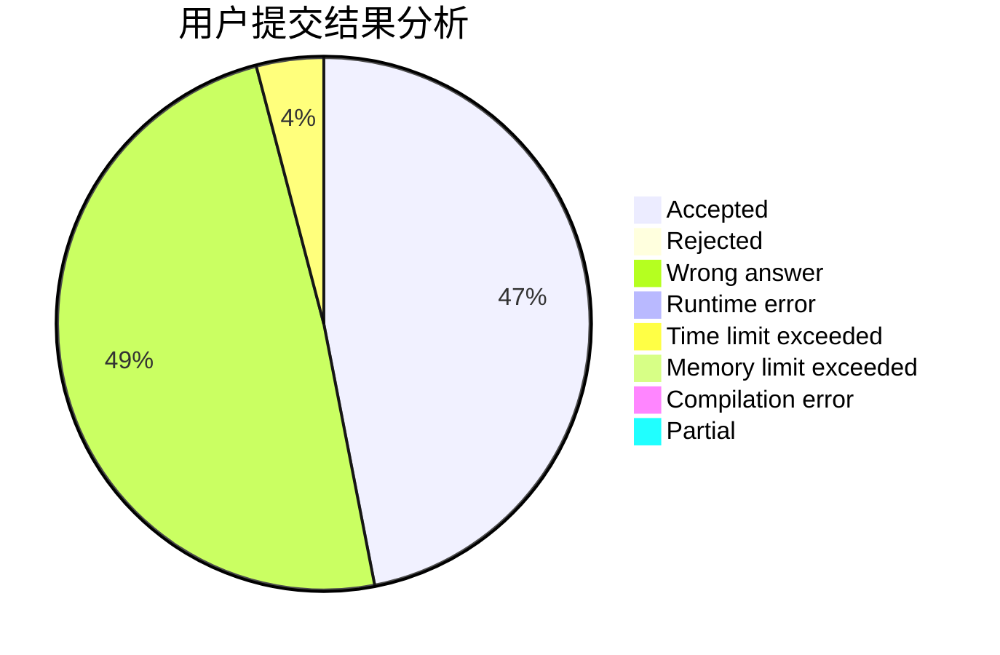
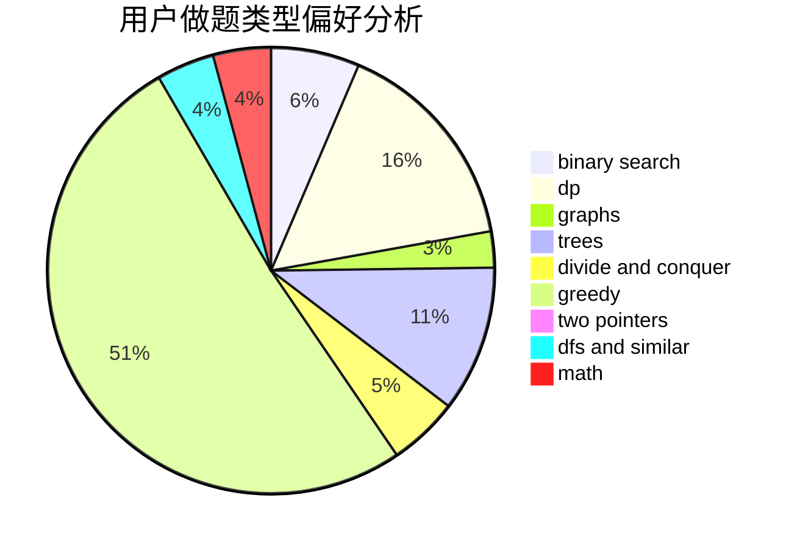

# Alice_foo_foo

<!-- tabs:start -->

#### **用户提交结果分析**

#### **用户做题类型偏好分析**

<!-- tabs:end -->
# 推荐题目
[286A](https://codeforces.com/contest/286/problem/A)
[292A](https://codeforces.com/contest/292/problem/A)
[289D](https://codeforces.com/contest/289/problem/D)
[28B](https://codeforces.com/contest/28/problem/B)
[293A](https://codeforces.com/contest/293/problem/A)
[285E](https://codeforces.com/contest/285/problem/E)
[288E](https://codeforces.com/contest/288/problem/E)
[290C](https://codeforces.com/contest/290/problem/C)
[286D](https://codeforces.com/contest/286/problem/D)
[1322D](https://codeforces.com/contest/1322/problem/D)
