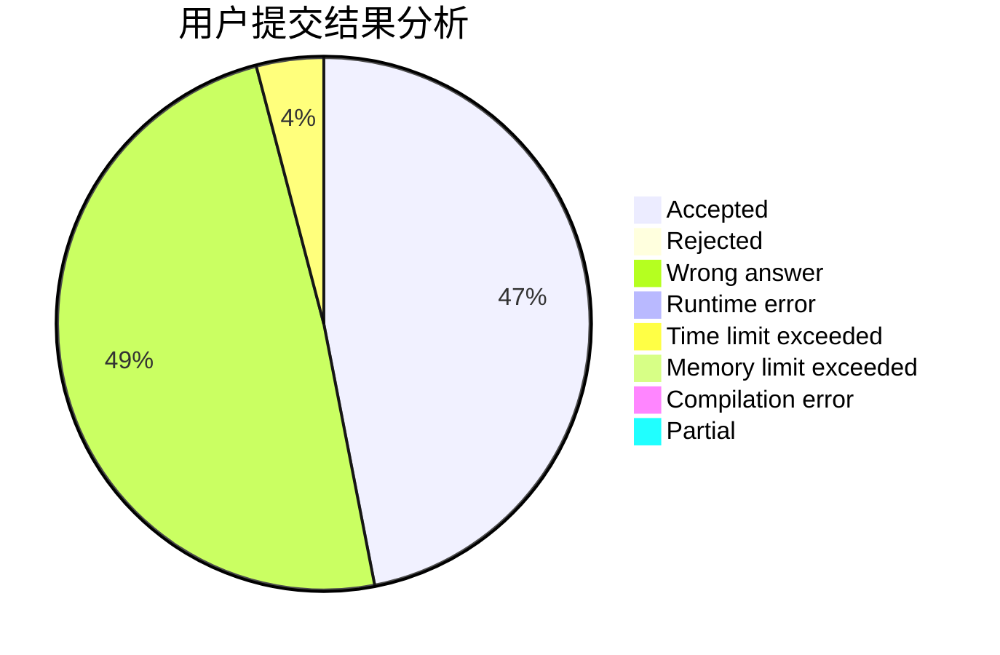
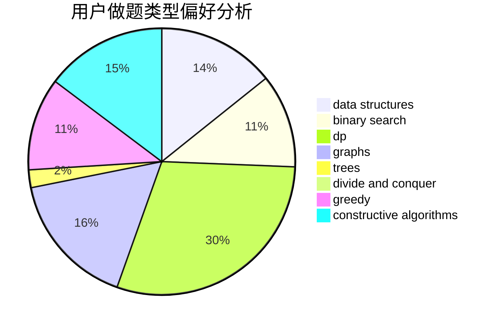
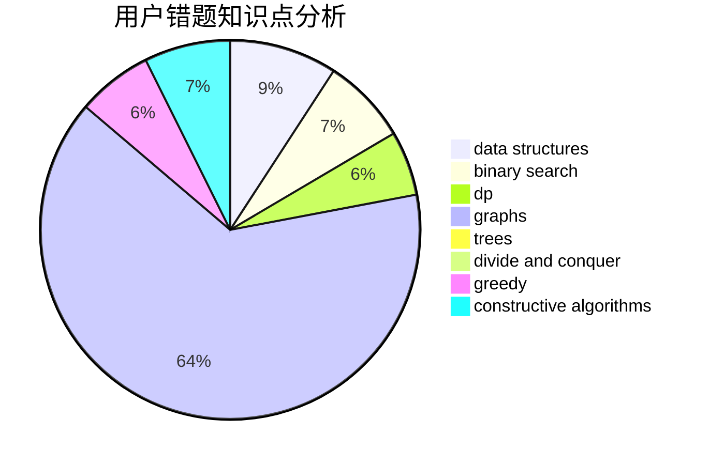

# Alice_foo_foo
<!-- tabs:start -->
#### **用户提交结果分析**

#### **用户做题类型偏好分析**

#### **用户错题知识点分析**

<!-- tabs:end -->
# 推荐题目
[Greenhouse Effect](http://codeforces.com/problemset/problem/269/B)		dp		  
[Dima and Horses](http://codeforces.com/problemset/problem/272/E)		combinatorics,
                        constructive algorithms,
                        graphs		  
[Marbles](http://codeforces.com/problemset/problem/1215/E)		bitmasks,
                        dp		  
[The Last Hole!](http://codeforces.com/problemset/problem/274/C)		brute force,
                        geometry		  
[String Theory](http://codeforces.com/problemset/problem/269/E)		nan		  
[Binary Tree on Plane](http://codeforces.com/problemset/problem/277/E)		flows,
                        trees		  
[Set of Points](http://codeforces.com/problemset/problem/277/B)		constructive algorithms,
                        geometry		  
[Maximum Waterfall](http://codeforces.com/problemset/problem/269/D)		data structures,
                        dp,
                        graphs,
                        sortings		  
[Little Girl and Maximum Sum](http://codeforces.com/problemset/problem/276/C)		data structures,
                        greedy,
                        implementation,
                        sortings		  
[Buttons](http://codeforces.com/problemset/problem/268/B)		implementation,
                        math		  
<!-- tabs:start -->
#### **data structures**
[Greenhouse Effect](http://codeforces.com/problemset/problem/269/D)		data structures,
                        dp,
                        graphs,
                        sortings		  
[Dima and Horses](http://codeforces.com/problemset/problem/276/C)		data structures,
                        greedy,
                        implementation,
                        sortings		  
[Marbles](http://codeforces.com/problemset/problem/1119/F)		data structures,
                        dp,
                        trees		  
[The Last Hole!](http://codeforces.com/problemset/problem/276/E)		data structures,
                        graphs,
                        trees		  
[String Theory](http://codeforces.com/problemset/problem/271/D)		data structures,
                        strings		  
[Binary Tree on Plane](http://codeforces.com/problemset/problem/274/E)		data structures,
                        implementation		  
[Set of Points](http://codeforces.com/problemset/problem/1214/C)		data structures,
                        greedy		  
[Maximum Waterfall](http://codeforces.com/problemset/problem/156/B)		constructive algorithms,
                        data structures,
                        implementation		  
[Little Girl and Maximum Sum](https://codeforces.com/contest/1321/problem/B)		data structures,
                        dp,
                        greedy,
                        math,
                        sortings		  
[Buttons](http://codeforces.com/problemset/problem/1492/C)		binary search,
                        data structures,
                        dp,
                        greedy,
                        two pointers		  
#### **binary search**
[Greenhouse Effect](http://codeforces.com/problemset/problem/1263/C)		binary search,
                        math,
                        meet-in-the-middle,
                        number theory		  
[Dima and Horses](http://codeforces.com/problemset/problem/274/A)		binary search,
                        greedy,
                        sortings		  
[Marbles](http://codeforces.com/problemset/problem/1354/B)		binary search,
                        dp,
                        implementation,
                        two pointers		  
[The Last Hole!](http://codeforces.com/problemset/problem/1359/C)		binary search,
                        math		  
[String Theory](http://codeforces.com/problemset/problem/1131/C)		binary search,
                        greedy,
                        sortings		  
[Binary Tree on Plane](http://codeforces.com/problemset/problem/1492/C)		binary search,
                        data structures,
                        dp,
                        greedy,
                        two pointers		  
[Set of Points](http://codeforces.com/problemset/problem/1463/D)		binary search,
                        constructive algorithms,
                        greedy,
                        two pointers		  
[Maximum Waterfall](http://codeforces.com/problemset/problem/1490/G)		binary search,
                        data structures,
                        math		  
[Little Girl and Maximum Sum](http://codeforces.com/problemset/problem/1479/D)		binary search,
                        bitmasks,
                        brute force,
                        data structures,
                        probabilities,
                        trees		  
[Buttons](http://codeforces.com/problemset/problem/1436/E)		binary search,
                        data structures,
                        two pointers		  
#### **dp**
[Greenhouse Effect](http://codeforces.com/problemset/problem/269/B)		dp		  
[Dima and Horses](http://codeforces.com/problemset/problem/1215/E)		bitmasks,
                        dp		  
[Marbles](http://codeforces.com/problemset/problem/269/D)		data structures,
                        dp,
                        graphs,
                        sortings		  
[The Last Hole!](http://codeforces.com/problemset/problem/273/E)		dp,
                        games		  
[String Theory](http://codeforces.com/problemset/problem/1119/F)		data structures,
                        dp,
                        trees		  
[Binary Tree on Plane](http://codeforces.com/problemset/problem/276/D)		bitmasks,
                        dp,
                        greedy,
                        implementation,
                        math		  
[Set of Points](http://codeforces.com/problemset/problem/277/D)		dp,
                        probabilities		  
[Maximum Waterfall](http://codeforces.com/problemset/problem/268/D)		dp		  
[Little Girl and Maximum Sum](http://codeforces.com/problemset/problem/274/B)		dfs and similar,
                        dp,
                        greedy,
                        trees		  
[Buttons](http://codeforces.com/problemset/problem/1354/B)		binary search,
                        dp,
                        implementation,
                        two pointers		  
#### **graph**
[Greenhouse Effect](http://codeforces.com/problemset/problem/272/E)		combinatorics,
                        constructive algorithms,
                        graphs		  
[Dima and Horses](http://codeforces.com/problemset/problem/269/D)		data structures,
                        dp,
                        graphs,
                        sortings		  
[Marbles](http://codeforces.com/problemset/problem/276/E)		data structures,
                        graphs,
                        trees		  
[The Last Hole!](http://codeforces.com/problemset/problem/274/D)		dfs and similar,
                        graphs,
                        greedy,
                        sortings		  
[String Theory](http://codeforces.com/problemset/problem/269/C)		constructive algorithms,
                        flows,
                        graphs,
                        greedy		  
[Binary Tree on Plane](http://codeforces.com/problemset/problem/120/H)		graph matchings		  
[Set of Points](http://codeforces.com/problemset/problem/1264/E)		constructive algorithms,
                        flows,
                        graph matchings		  
[Maximum Waterfall](http://codeforces.com/problemset/problem/223/E)		flows,
                        geometry,
                        graphs		  
[Little Girl and Maximum Sum](http://codeforces.com/problemset/problem/1487/C)		brute force,
                        constructive algorithms,
                        dfs and similar,
                        graphs,
                        greedy,
                        implementation,
                        math		  
[Buttons](http://codeforces.com/problemset/problem/1437/C)		dp,
                        flows,
                        graph matchings,
                        greedy,
                        math,
                        sortings		  
#### **trees**
[Greenhouse Effect](http://codeforces.com/problemset/problem/277/E)		flows,
                        trees		  
[Dima and Horses](http://codeforces.com/problemset/problem/1119/F)		data structures,
                        dp,
                        trees		  
[Marbles](http://codeforces.com/problemset/problem/276/E)		data structures,
                        graphs,
                        trees		  
[The Last Hole!](http://codeforces.com/problemset/problem/274/B)		dfs and similar,
                        dp,
                        greedy,
                        trees		  
[String Theory](http://codeforces.com/problemset/problem/1479/D)		binary search,
                        bitmasks,
                        brute force,
                        data structures,
                        probabilities,
                        trees		  
[Binary Tree on Plane](http://codeforces.com/problemset/problem/1511/C)		brute force,
                        data structures,
                        implementation,
                        trees		  
[Set of Points](http://codeforces.com/problemset/problem/1499/F)		combinatorics,
                        dfs and similar,
                        dp,
                        trees		  
[Maximum Waterfall](http://codeforces.com/problemset/problem/1491/E)		brute force,
                        dfs and similar,
                        divide and conquer,
                        number theory,
                        trees		  
[Little Girl and Maximum Sum](http://codeforces.com/problemset/problem/1466/D)		data structures,
                        greedy,
                        sortings,
                        trees		  
[Buttons](http://codeforces.com/problemset/problem/1495/D)		combinatorics,
                        dfs and similar,
                        graphs,
                        math,
                        shortest paths,
                        trees		  
#### **divide and conquer**
[Greenhouse Effect](http://codeforces.com/problemset/problem/120/J)		divide and conquer,
                        geometry,
                        sortings		  
[Dima and Horses](http://codeforces.com/problemset/problem/1461/D)		binary search,
                        brute force,
                        data structures,
                        divide and conquer,
                        implementation,
                        sortings		  
[Marbles](http://codeforces.com/problemset/problem/1466/G)		combinatorics,
                        divide and conquer,
                        hashing,
                        math,
                        string suffix structures,
                        strings		  
[The Last Hole!](http://codeforces.com/problemset/problem/1490/D)		dfs and similar,
                        divide and conquer,
                        implementation		  
[String Theory](https://codeforces.com/contest/1483/problem/C)		data structures,
                        divide and conquer,
                        dp		  
[Binary Tree on Plane](http://codeforces.com/problemset/problem/1491/E)		brute force,
                        dfs and similar,
                        divide and conquer,
                        number theory,
                        trees		  
[Set of Points](http://codeforces.com/problemset/problem/1303/G)		data structures,
                        divide and conquer,
                        geometry,
                        trees		  
[Maximum Waterfall](http://codeforces.com/problemset/problem/1494/D)		constructive algorithms,
                        data structures,
                        dfs and similar,
                        divide and conquer,
                        dsu,
                        greedy,
                        sortings,
                        trees		  
[Little Girl and Maximum Sum](http://codeforces.com/problemset/problem/1482/E)		data structures,
                        divide and conquer,
                        dp		  
[Buttons](http://codeforces.com/problemset/problem/566/C)		dfs and similar,
                        divide and conquer,
                        trees		  
#### **greedy**
[Greenhouse Effect](http://codeforces.com/problemset/problem/276/C)		data structures,
                        greedy,
                        implementation,
                        sortings		  
[Dima and Horses](http://codeforces.com/problemset/problem/276/D)		bitmasks,
                        dp,
                        greedy,
                        implementation,
                        math		  
[Marbles](http://codeforces.com/problemset/problem/274/D)		dfs and similar,
                        graphs,
                        greedy,
                        sortings		  
[The Last Hole!](http://codeforces.com/problemset/problem/269/C)		constructive algorithms,
                        flows,
                        graphs,
                        greedy		  
[String Theory](http://codeforces.com/problemset/problem/1183/D)		greedy,
                        sortings		  
[Binary Tree on Plane](http://codeforces.com/problemset/problem/246/A)		constructive algorithms,
                        greedy,
                        sortings		  
[Set of Points](http://codeforces.com/problemset/problem/1313/A)		brute force,
                        greedy,
                        implementation		  
[Maximum Waterfall](http://codeforces.com/problemset/problem/274/B)		dfs and similar,
                        dp,
                        greedy,
                        trees		  
[Little Girl and Maximum Sum](http://codeforces.com/problemset/problem/274/A)		binary search,
                        greedy,
                        sortings		  
[Buttons](http://codeforces.com/problemset/problem/1271/B)		greedy,
                        math		  
#### **constructive algorithms**
[Greenhouse Effect](http://codeforces.com/problemset/problem/272/E)		combinatorics,
                        constructive algorithms,
                        graphs		  
[Dima and Horses](http://codeforces.com/problemset/problem/277/B)		constructive algorithms,
                        geometry		  
[Marbles](http://codeforces.com/problemset/problem/275/B)		constructive algorithms,
                        implementation		  
[The Last Hole!](http://codeforces.com/problemset/problem/271/E)		constructive algorithms,
                        math,
                        number theory		  
[String Theory](https://codeforces.com/contest/1159/problem/D)		constructive algorithms,
                        math,
                        strings		  
[Binary Tree on Plane](http://codeforces.com/problemset/problem/269/C)		constructive algorithms,
                        flows,
                        graphs,
                        greedy		  
[Set of Points](http://codeforces.com/problemset/problem/246/A)		constructive algorithms,
                        greedy,
                        sortings		  
[Maximum Waterfall](http://codeforces.com/problemset/problem/268/C)		constructive algorithms,
                        implementation		  
[Little Girl and Maximum Sum](http://codeforces.com/problemset/problem/1264/E)		constructive algorithms,
                        flows,
                        graph matchings		  
[Buttons](http://codeforces.com/problemset/problem/156/B)		constructive algorithms,
                        data structures,
                        implementation		  
#### **sortings**
[Greenhouse Effect](http://codeforces.com/problemset/problem/269/D)		data structures,
                        dp,
                        graphs,
                        sortings		  
[Dima and Horses](http://codeforces.com/problemset/problem/276/C)		data structures,
                        greedy,
                        implementation,
                        sortings		  
[Marbles](http://codeforces.com/problemset/problem/272/D)		combinatorics,
                        math,
                        sortings		  
[The Last Hole!](http://codeforces.com/problemset/problem/274/D)		dfs and similar,
                        graphs,
                        greedy,
                        sortings		  
[String Theory](http://codeforces.com/problemset/problem/1183/D)		greedy,
                        sortings		  
[Binary Tree on Plane](http://codeforces.com/problemset/problem/246/A)		constructive algorithms,
                        greedy,
                        sortings		  
[Set of Points](http://codeforces.com/problemset/problem/274/A)		binary search,
                        greedy,
                        sortings		  
[Maximum Waterfall](http://codeforces.com/problemset/problem/120/J)		divide and conquer,
                        geometry,
                        sortings		  
[Little Girl and Maximum Sum](http://codeforces.com/problemset/problem/1110/B)		greedy,
                        sortings		  
[Buttons](https://codeforces.com/contest/1321/problem/B)		data structures,
                        dp,
                        greedy,
                        math,
                        sortings		  
<!-- tabs:end -->
