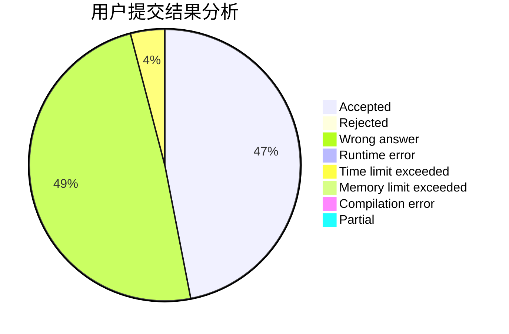
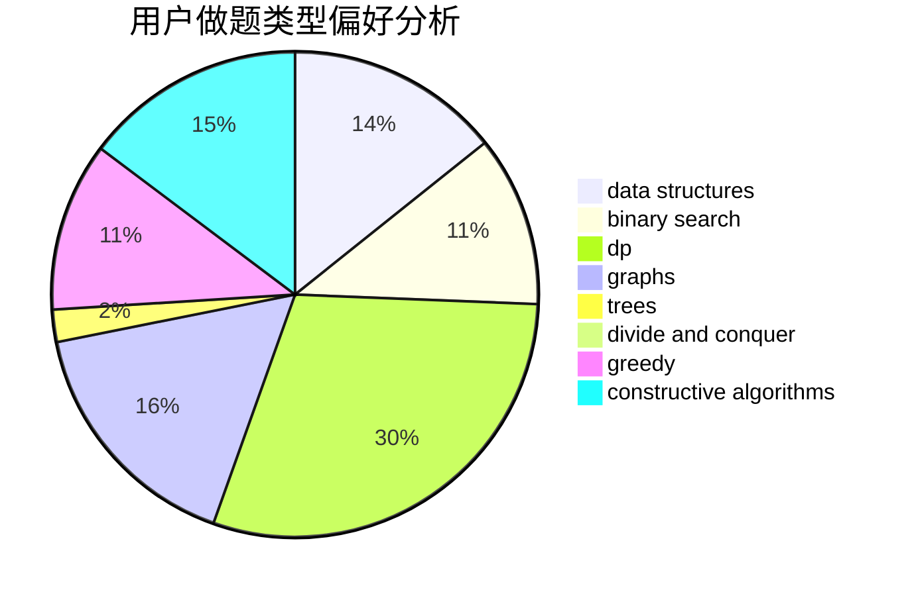
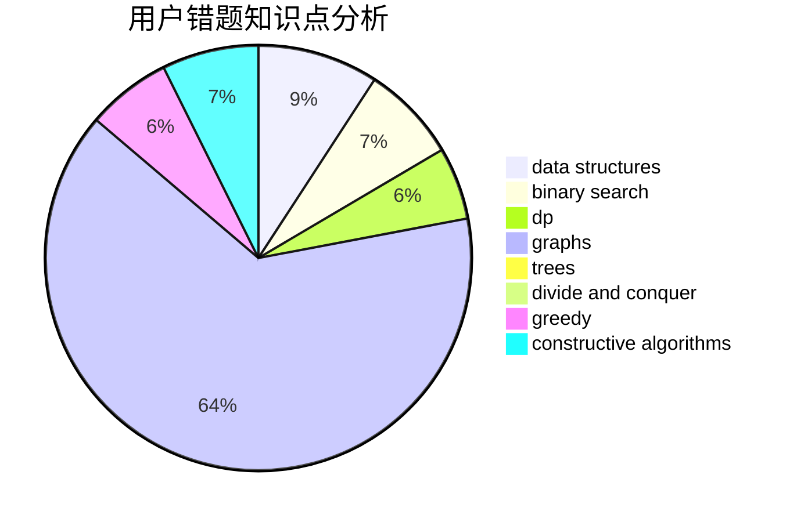

# Alice_foo_foo

<!-- tabs:start -->

#### **用户提交结果分析**

#### **用户做题类型偏好分析**

#### **用户错题知识点分析**

<!-- tabs:end -->
# 推荐题目
[269E](https://codeforces.com/contest/269/problem/E)		nan		  
[277B](https://codeforces.com/contest/277/problem/B)		constructive algorithms,
                        geometry		  
[273E](https://codeforces.com/contest/273/problem/E)		dp,
                        games		  
[274C](https://codeforces.com/contest/274/problem/C)		brute force,
                        geometry		  
[277E](https://codeforces.com/contest/277/problem/E)		flows,
                        trees		  
[269D](https://codeforces.com/contest/269/problem/D)		data structures,
                        dp,
                        graphs,
                        sortings		  
[272E](https://codeforces.com/contest/272/problem/E)		combinatorics,
                        constructive algorithms,
                        graphs		  
[276C](https://codeforces.com/contest/276/problem/C)		data structures,
                        greedy,
                        implementation,
                        sortings		  
[26D](https://codeforces.com/contest/26/problem/D)		combinatorics,
                        math,
                        probabilities		  
[1313A](https://codeforces.com/contest/1313/problem/A)		brute force,
                        greedy,
                        implementation		  
