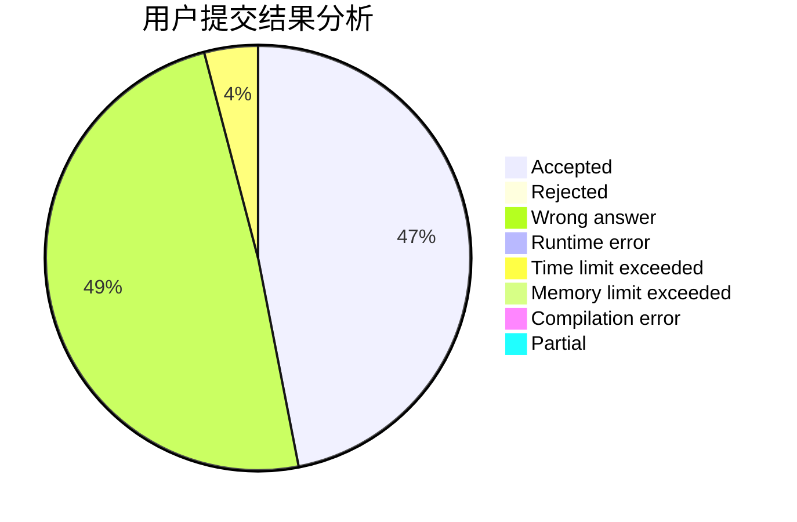
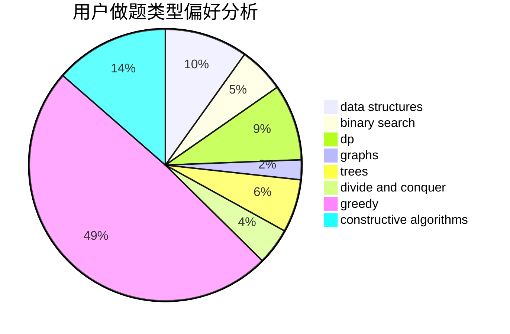
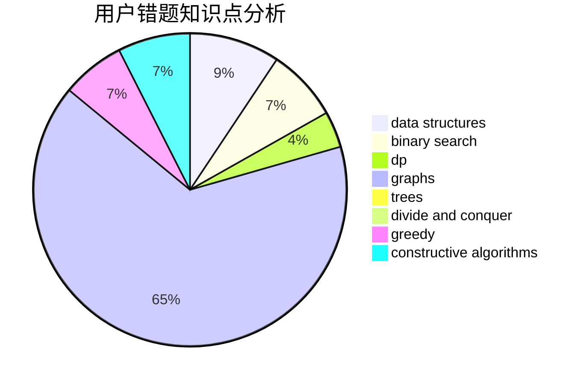

# Alice_foo_foo

<!-- tabs:start -->

#### **用户提交结果分析**

#### **用户做题类型偏好分析**

#### **用户错题知识点分析**

<!-- tabs:end -->
# 推荐题目
[286A](https://codeforces.com/contest/286/problem/A)		constructive algorithms,
                        math		  
[292A](https://codeforces.com/contest/292/problem/A)		implementation		  
[289D](https://codeforces.com/contest/289/problem/D)		dsu,graphs,sortings,trees		  
[28B](https://codeforces.com/contest/28/problem/B)		dfs and similar,
                        dsu,
                        graphs		  
[293A](https://codeforces.com/contest/293/problem/A)		games,
                        greedy		  
[285E](https://codeforces.com/contest/285/problem/E)		combinatorics,
                        dp,
                        math		  
[288E](https://codeforces.com/contest/288/problem/E)		dp,
                        implementation,
                        math		  
[290C](https://codeforces.com/contest/290/problem/C)		*special problem,
                        graph matchings,
                        implementation,
                        trees		  
[286D](https://codeforces.com/contest/286/problem/D)		data structures,
                        sortings		  
[1322D](https://codeforces.com/contest/1322/problem/D)		bitmasks,
                        dp		  
