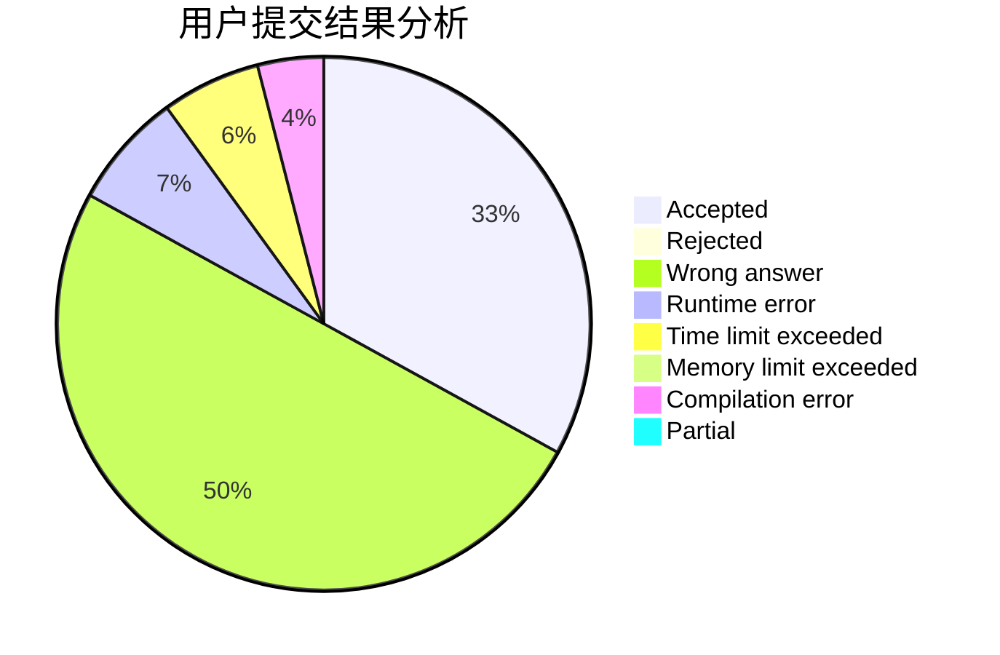
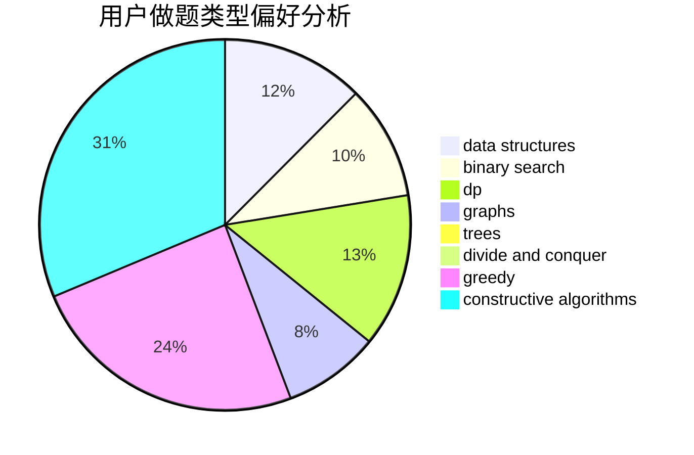
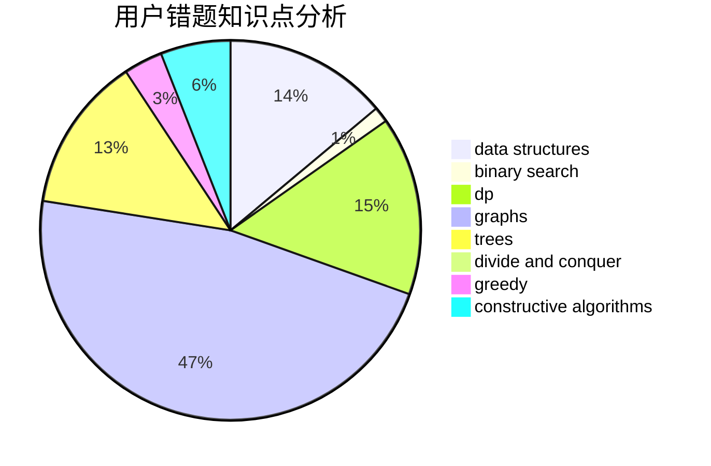

# Zhu_Jiu

<!-- tabs:start -->

#### **用户提交结果分析**

#### **用户做题类型偏好分析**

#### **用户错题知识点分析**

<!-- tabs:end -->
# 推荐题目
[1312G](https://codeforces.com/contest/1312/problem/G)		data structures,
                        dfs and similar,
                        dp		  
[1090D](https://codeforces.com/contest/1090/problem/D)		constructive algorithms		  
[653C](https://codeforces.com/contest/653/problem/C)		brute force,
                        implementation		  
[88A](https://codeforces.com/contest/88/problem/A)		brute force,
                        implementation		  
[962F](https://codeforces.com/contest/962/problem/F)		dfs and similar,
                        graphs,
                        trees		  
[903D](https://codeforces.com/contest/903/problem/D)		data structures,
                        math		  
[1140C](https://codeforces.com/contest/1140/problem/C)		brute force,
                        data structures,
                        sortings		  
[1280C](https://codeforces.com/contest/1280/problem/C)		dfs and similar,
                        graphs,
                        greedy,
                        trees		  
[703B](https://codeforces.com/contest/703/problem/B)		implementation,
                        math		  
[279B](https://codeforces.com/contest/279/problem/B)		binary search,
                        brute force,
                        implementation,
                        two pointers		  
