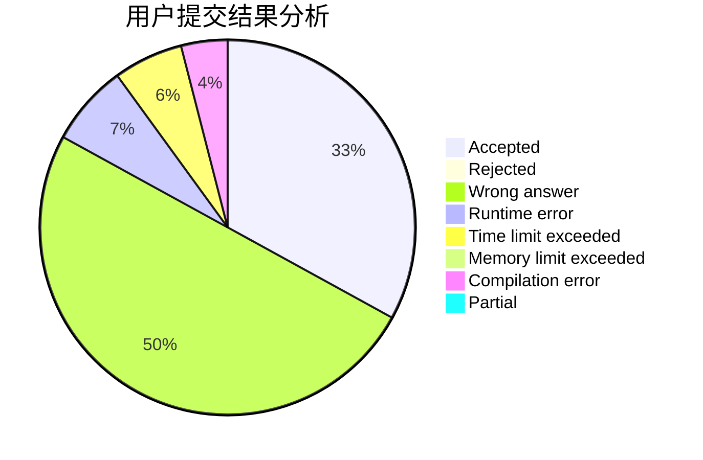
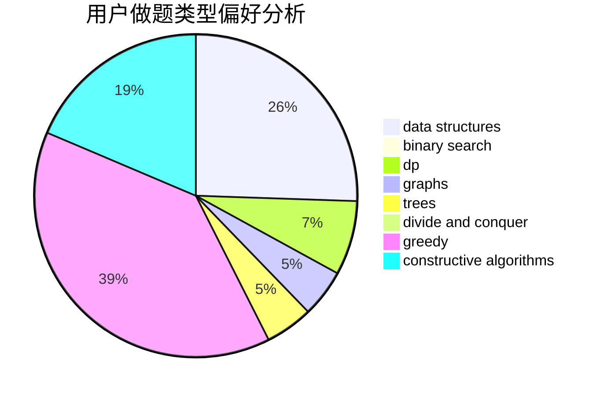
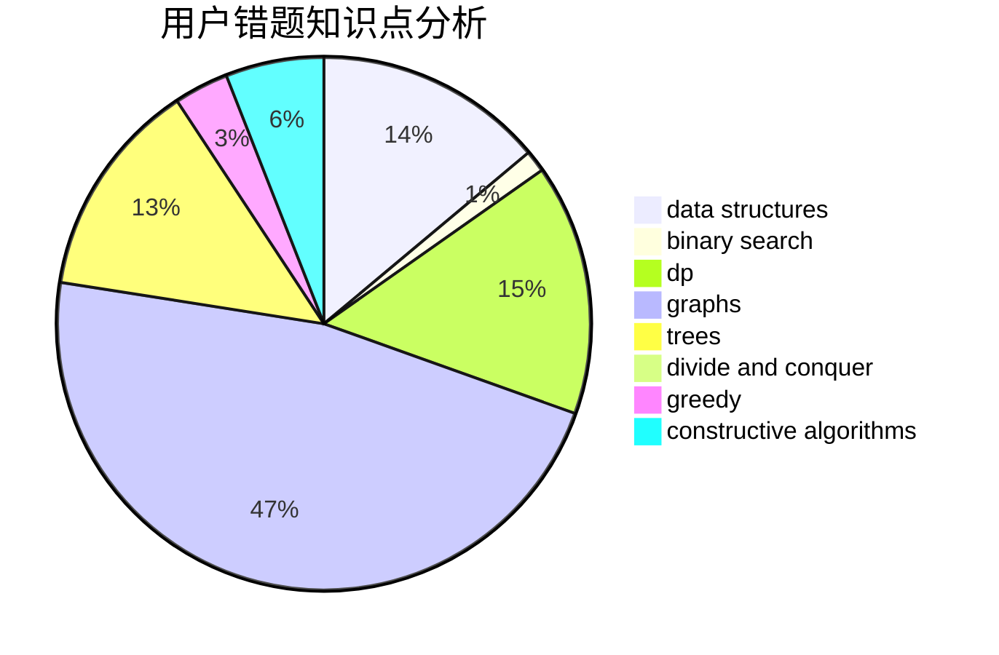

# Zhu_Jiu

<!-- tabs:start -->

#### **用户提交结果分析**

#### **用户做题类型偏好分析**

#### **用户错题知识点分析**

<!-- tabs:end -->
# 推荐题目
[1322C](https://codeforces.com/contest/1322/problem/C)		graphs,
                        hashing,
                        math,
                        number theory		  
[1091A](https://codeforces.com/contest/1091/problem/A)		brute force,
                        implementation,
                        math		  
[677C](https://codeforces.com/contest/677/problem/C)		bitmasks,
                        combinatorics,
                        implementation,
                        strings		  
[909A](https://codeforces.com/contest/909/problem/A)		brute force,
                        greedy,
                        sortings		  
[985D](https://codeforces.com/contest/985/problem/D)		binary search,
                        constructive algorithms,
                        math		  
[919D](https://codeforces.com/contest/919/problem/D)		dfs and similar,
                        dp,
                        graphs		  
[1142A](https://codeforces.com/contest/1142/problem/A)		brute force,
                        math		  
[1286D](https://codeforces.com/contest/1286/problem/D)		data structures,
                        math,
                        matrices,
                        probabilities		  
[722C](https://codeforces.com/contest/722/problem/C)		data structures,
                        dsu		  
[294B](https://codeforces.com/contest/294/problem/B)		dp,
                        greedy		  
