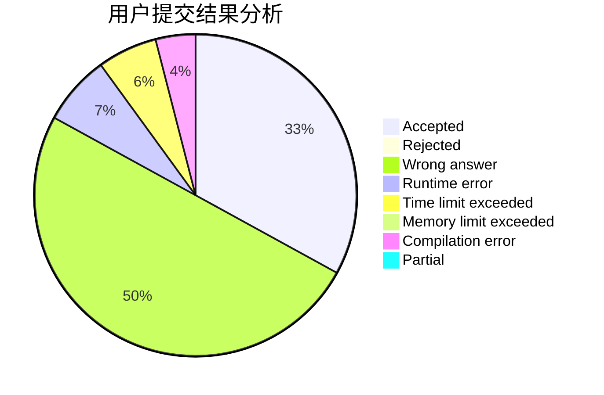
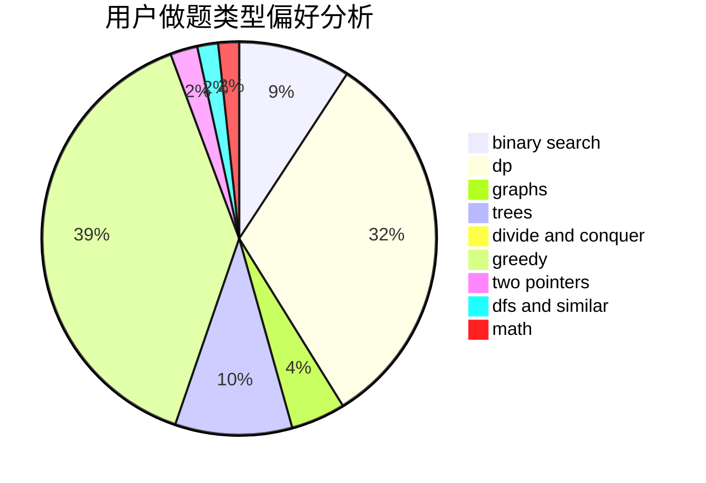

# Zhu_Jiu

<!-- tabs:start -->

#### **用户提交结果分析**

#### **用户做题类型偏好分析**

<!-- tabs:end -->
# 推荐题目
[1322C](https://codeforces.com/contest/1322/problem/C)
[1091A](https://codeforces.com/contest/1091/problem/A)
[677C](https://codeforces.com/contest/677/problem/C)
[909A](https://codeforces.com/contest/909/problem/A)
[985D](https://codeforces.com/contest/985/problem/D)
[919D](https://codeforces.com/contest/919/problem/D)
[1142A](https://codeforces.com/contest/1142/problem/A)
[1286D](https://codeforces.com/contest/1286/problem/D)
[722C](https://codeforces.com/contest/722/problem/C)
[294B](https://codeforces.com/contest/294/problem/B)
