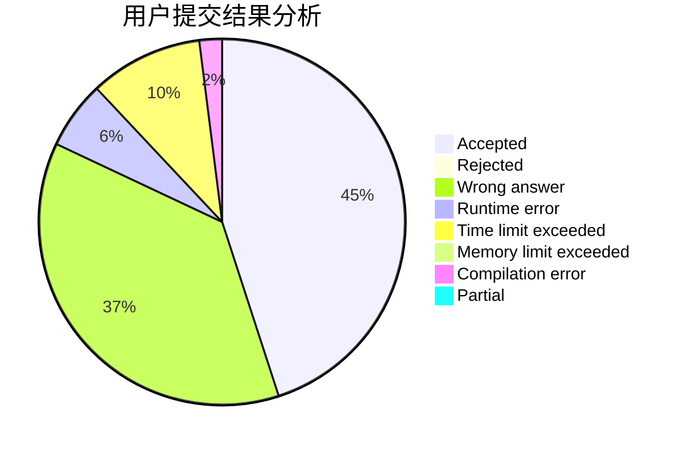
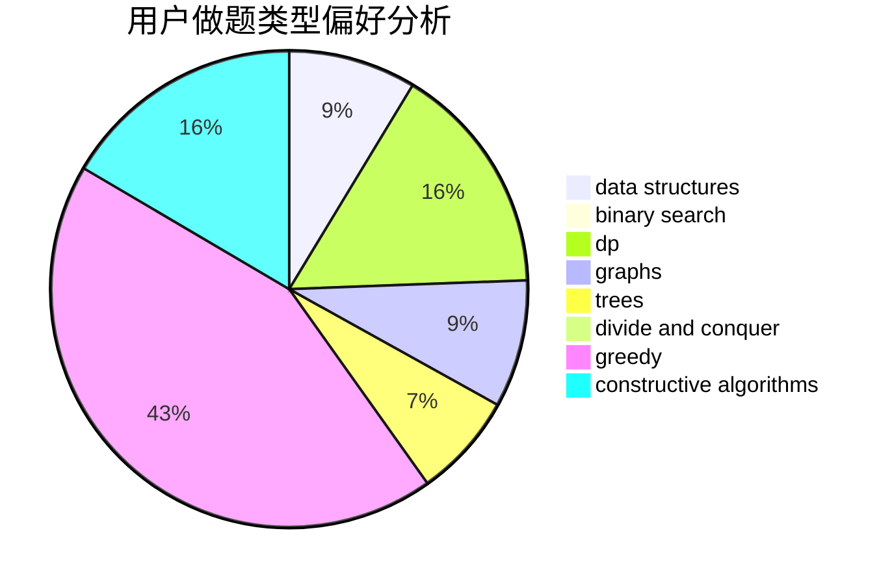
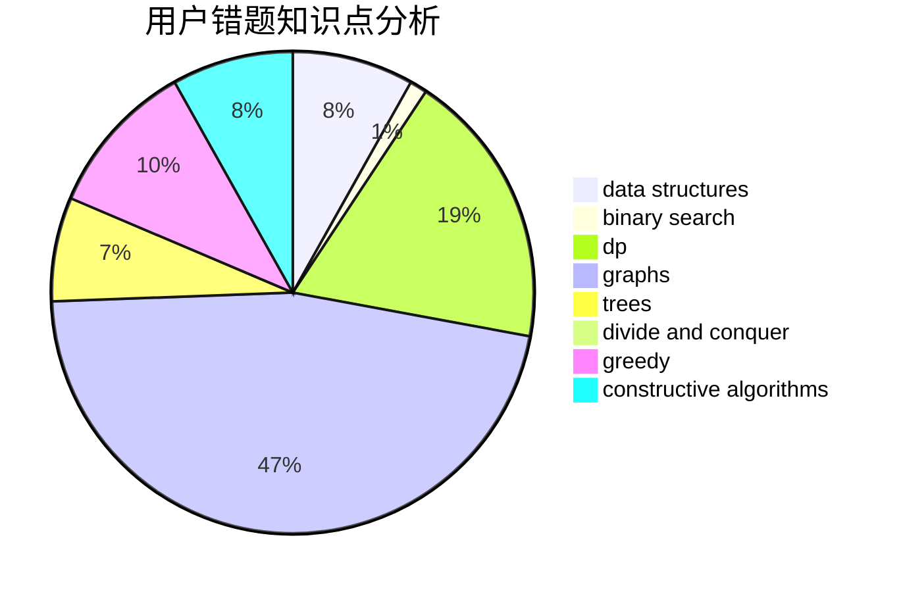

# Zhu_Xiangyu

<!-- tabs:start -->

#### **用户提交结果分析**

#### **用户做题类型偏好分析**

#### **用户错题知识点分析**

<!-- tabs:end -->
# 推荐题目
[1099A](https://codeforces.com/contest/1099/problem/A)		implementation		  
[318A](https://codeforces.com/contest/318/problem/A)		math		  
[854C](https://codeforces.com/contest/854/problem/C)		dsu,graphs,sortings,trees		  
[413E](https://codeforces.com/contest/413/problem/E)		data structures,
                        divide and conquer		  
[437A](https://codeforces.com/contest/437/problem/A)		implementation		  
[1459E](https://codeforces.com/contest/1459/problem/E)		dsu,graphs,sortings,trees		  
[1499G](https://codeforces.com/contest/1499/problem/G)		data structures,
                        graphs,
                        interactive		  
[865B](https://codeforces.com/contest/865/problem/B)		binary search,
                        sortings,
                        ternary search		  
[1265E](https://codeforces.com/contest/1265/problem/E)		data structures,
                        dp,
                        math,
                        probabilities		  
[1256D](https://codeforces.com/contest/1256/problem/D)		greedy		  
