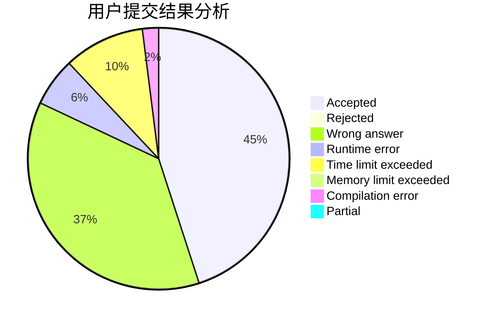
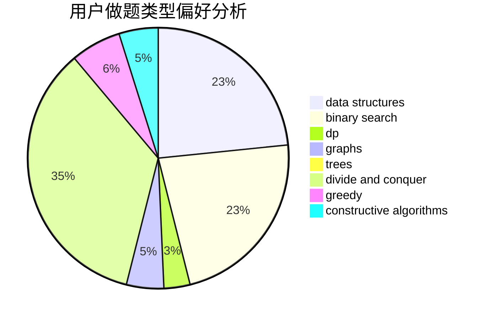
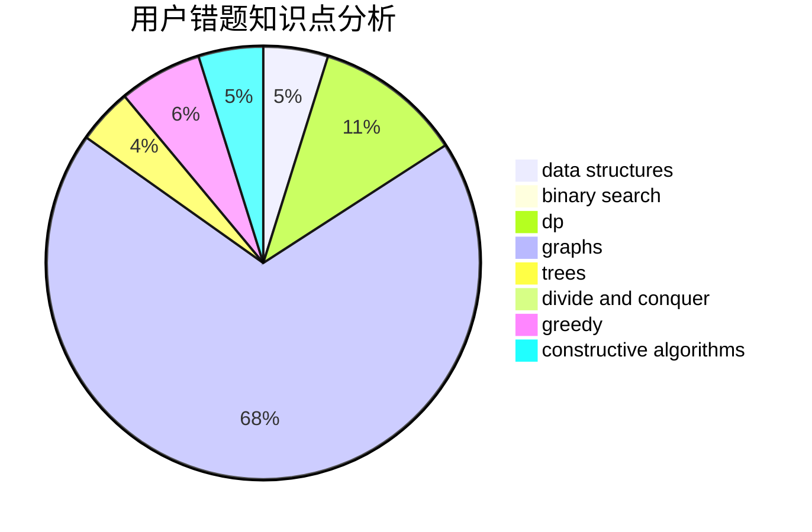

# Zhu_Xiangyu

<!-- tabs:start -->

#### **用户提交结果分析**

#### **用户做题类型偏好分析**

#### **用户错题知识点分析**

<!-- tabs:end -->
# 推荐题目
[1098D](https://codeforces.com/contest/1098/problem/D)		data structures		  
[2B](https://codeforces.com/contest/2/problem/B)		dp,
                        math		  
[837C](https://codeforces.com/contest/837/problem/C)		brute force,
                        implementation		  
[382E](https://codeforces.com/contest/382/problem/E)		combinatorics,
                        dp		  
[409G](https://codeforces.com/contest/409/problem/G)		*special problem,
                        geometry		  
[1450H1](https://codeforces.com/contest/1450H/problem/1)		combinatorics,
                        fft,
                        math		  
[1491A](https://codeforces.com/contest/1491/problem/A)		brute force,
                        greedy,
                        implementation		  
[847B](https://codeforces.com/contest/847/problem/B)		binary search,
                        data structures		  
[125E](https://codeforces.com/contest/125/problem/E)		binary search,
                        graphs		  
[1251C](https://codeforces.com/contest/1251/problem/C)		greedy,
                        two pointers		  
