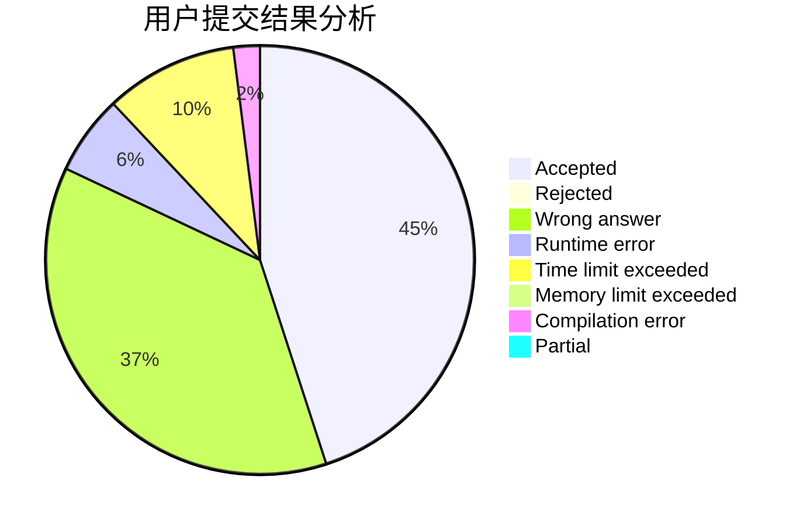
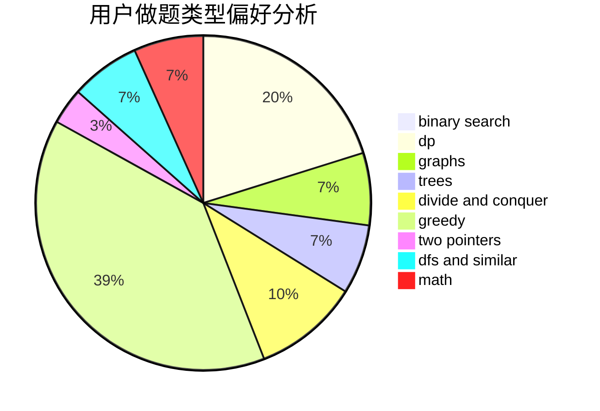

# Zhu_Xiangyu

<!-- tabs:start -->

#### **用户提交结果分析**

#### **用户做题类型偏好分析**

<!-- tabs:end -->
# 推荐题目
[1099A](https://codeforces.com/contest/1099/problem/A)
[318A](https://codeforces.com/contest/318/problem/A)
[854C](https://codeforces.com/contest/854/problem/C)
[413E](https://codeforces.com/contest/413/problem/E)
[437A](https://codeforces.com/contest/437/problem/A)
[1459E](https://codeforces.com/contest/1459/problem/E)
[1499G](https://codeforces.com/contest/1499/problem/G)
[865B](https://codeforces.com/contest/865/problem/B)
[1265E](https://codeforces.com/contest/1265/problem/E)
[1256D](https://codeforces.com/contest/1256/problem/D)
