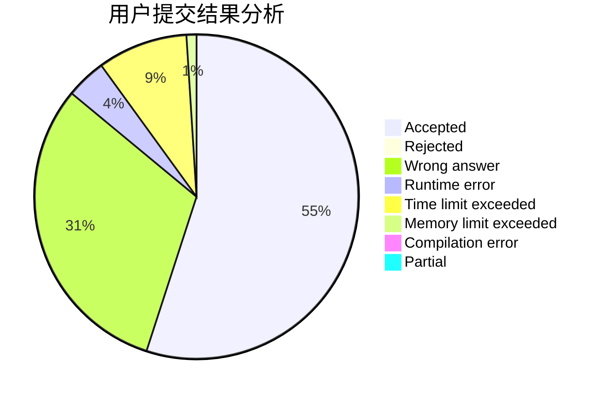
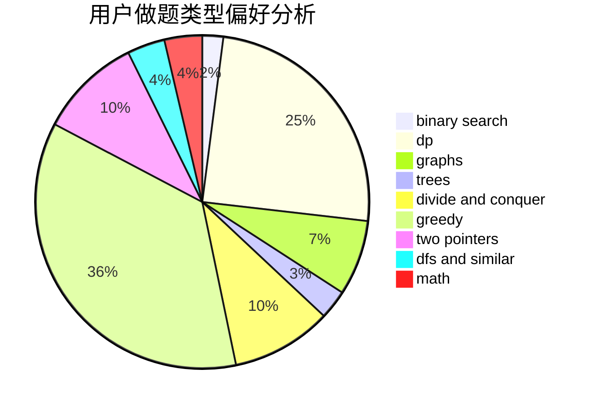

# ZhuaBa

<!-- tabs:start -->

#### **用户提交结果分析**

#### **用户做题类型偏好分析**

<!-- tabs:end -->
# 推荐题目
[788D](https://codeforces.com/contest/788/problem/D)
[794G](https://codeforces.com/contest/794/problem/G)
[452C](https://codeforces.com/contest/452/problem/C)
[1156D](https://codeforces.com/contest/1156/problem/D)
[772C](https://codeforces.com/contest/772/problem/C)
[834C](https://codeforces.com/contest/834/problem/C)
[1310D](https://codeforces.com/contest/1310/problem/D)
[733B](https://codeforces.com/contest/733/problem/B)
[1432D](https://codeforces.com/contest/1432/problem/D)
[437A](https://codeforces.com/contest/437/problem/A)
