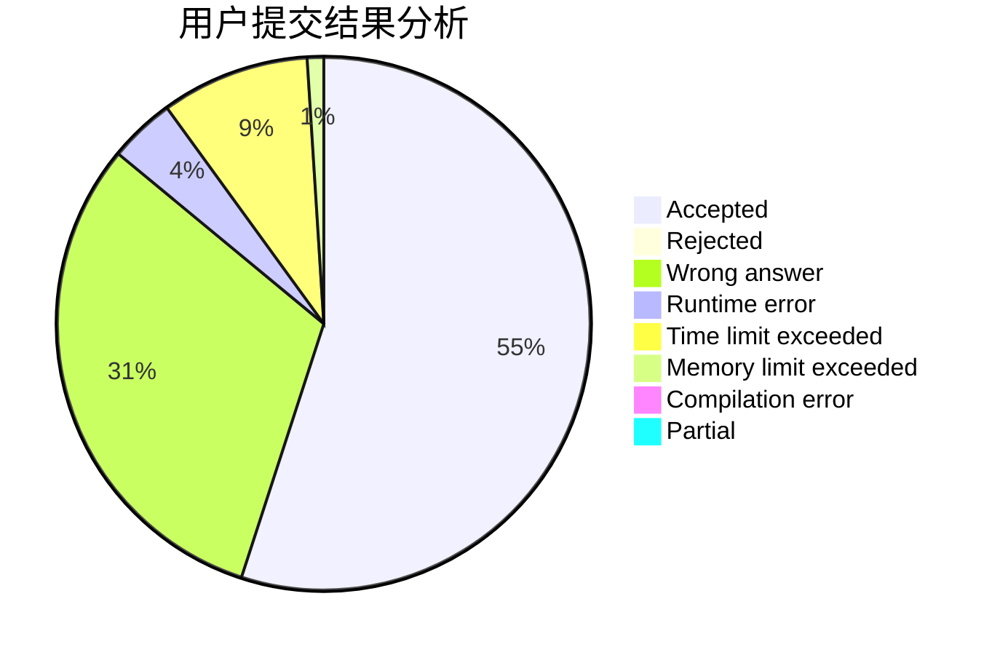
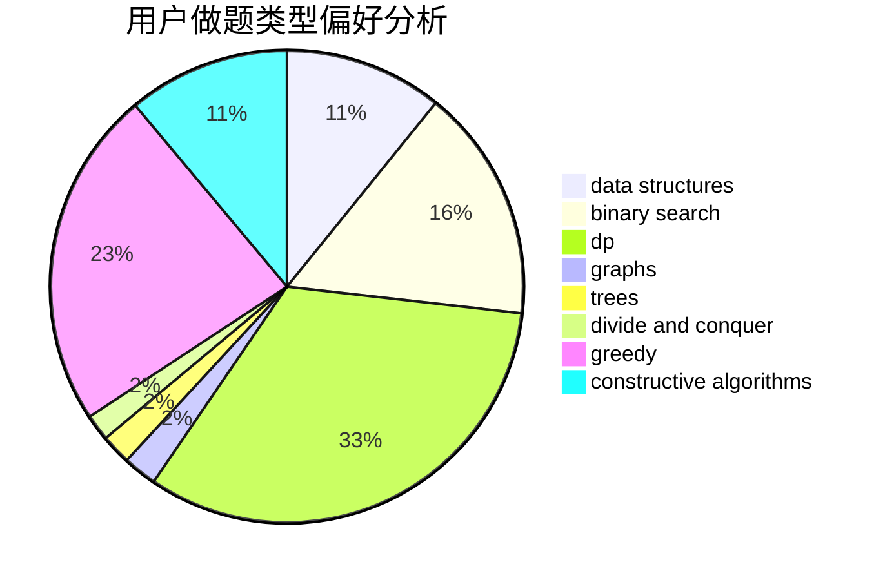
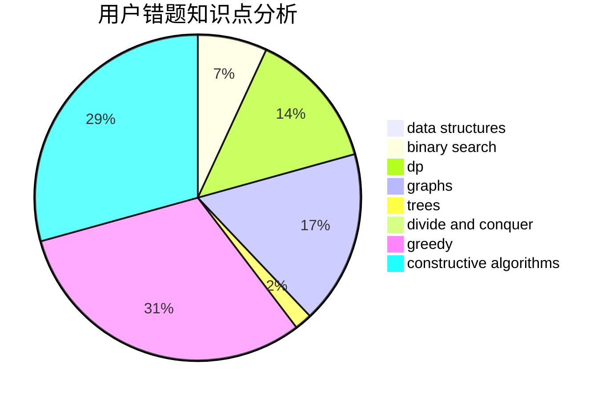

# ZhuaBa

<!-- tabs:start -->

#### **用户提交结果分析**

#### **用户做题类型偏好分析**

#### **用户错题知识点分析**

<!-- tabs:end -->
# 推荐题目
[768E](https://codeforces.com/contest/768/problem/E)		bitmasks,
                        dp,
                        games		  
[777A](https://codeforces.com/contest/777/problem/A)		constructive algorithms,
                        implementation,
                        math		  
[430B](https://codeforces.com/contest/430/problem/B)		brute force,
                        two pointers		  
[1154D](https://codeforces.com/contest/1154/problem/D)		greedy		  
[754B](https://codeforces.com/contest/754/problem/B)		brute force,
                        implementation		  
[815C](https://codeforces.com/contest/815/problem/C)		brute force,
                        dp,
                        trees		  
[1301A](https://codeforces.com/contest/1301/problem/A)		implementation,
                        strings		  
[714E](https://codeforces.com/contest/714/problem/E)		dsu,graphs,sortings,trees		  
[1423N](https://codeforces.com/contest/1423/problem/N)		nan		  
[409G](https://codeforces.com/contest/409/problem/G)		*special problem,
                        geometry		  
