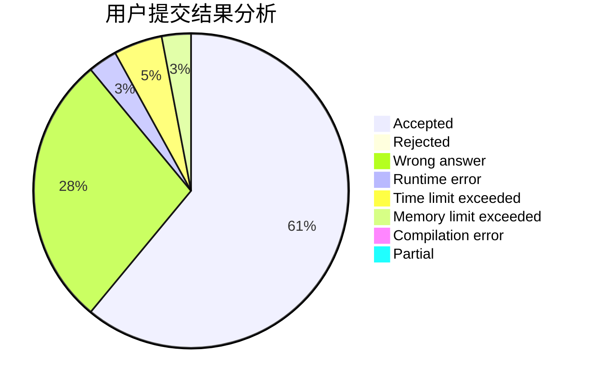
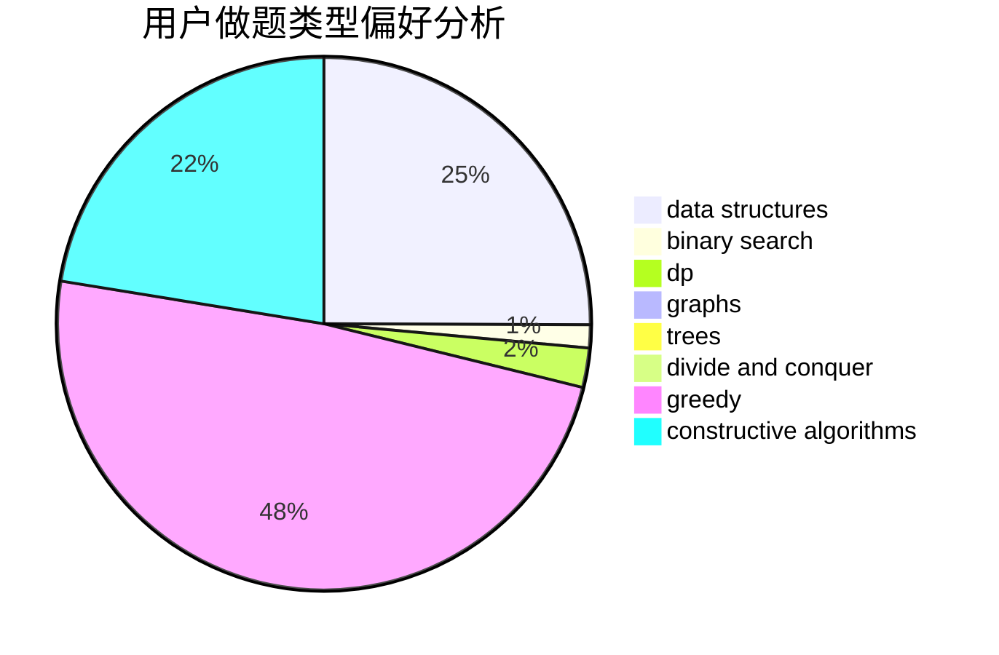

# Zi_yu

<!-- tabs:start -->

#### **用户提交结果分析**

#### **用户做题类型偏好分析**

#### **用户错题知识点分析**

<!-- tabs:end -->
# 推荐题目
[1383A](https://codeforces.com/contest/1383/problem/A)		dsu,
                        graphs,
                        greedy,
                        sortings,
                        strings,
                        trees,
                        two pointers		  
[1336A](https://codeforces.com/contest/1336/problem/A)		dfs and similar,
                        dp,
                        greedy,
                        sortings,
                        trees		  
[792C](https://codeforces.com/contest/792/problem/C)		dp,
                        greedy,
                        math,
                        number theory		  
[1343E](https://codeforces.com/contest/1343/problem/E)		brute force,
                        graphs,
                        greedy,
                        shortest paths,
                        sortings		  
[869B](https://codeforces.com/contest/869/problem/B)		math		  
[1191A](https://codeforces.com/contest/1191/problem/A)		brute force		  
[370A](https://codeforces.com/contest/370/problem/A)		graphs,
                        math,
                        shortest paths		  
[13563](https://codeforces.com/contest/1356/problem/3)		dsu,graphs,sortings,trees		  
[166A](https://codeforces.com/contest/166/problem/A)		binary search,
                        implementation,
                        sortings		  
[1091H](https://codeforces.com/contest/1091/problem/H)		games		  
