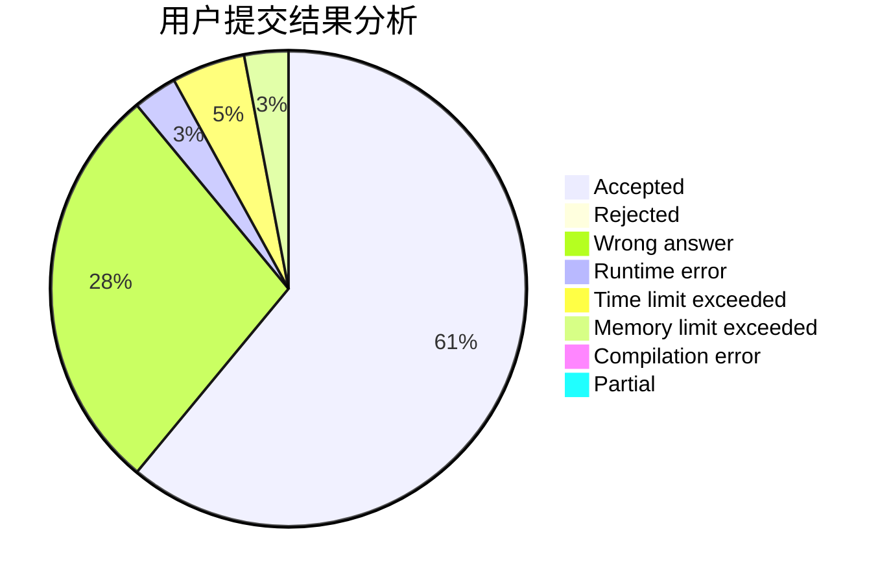
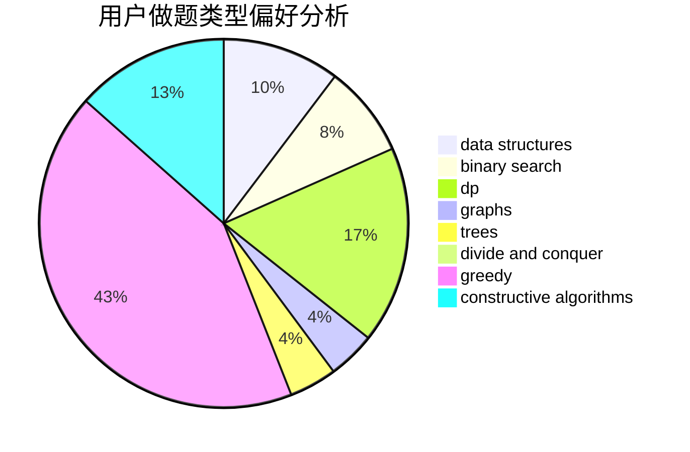

# Zi_yu

<!-- tabs:start -->

#### **用户提交结果分析**

#### **用户做题类型偏好分析**

#### **用户错题知识点分析**

<!-- tabs:end -->
# 推荐题目
[1374B](https://codeforces.com/contest/1374/problem/B)		math		  
[1330A](https://codeforces.com/contest/1330/problem/A)		implementation		  
[772E](https://codeforces.com/contest/772/problem/E)		binary search,
                        divide and conquer,
                        interactive,
                        trees		  
[1336D](https://codeforces.com/contest/1336/problem/D)		constructive algorithms,
                        interactive		  
[850C](https://codeforces.com/contest/850/problem/C)		bitmasks,
                        dp,
                        games		  
[1187D](https://codeforces.com/contest/1187/problem/D)		data structures,
                        sortings		  
[343E](https://codeforces.com/contest/343/problem/E)		brute force,
                        dfs and similar,
                        divide and conquer,
                        flows,
                        graphs,
                        greedy,
                        trees		  
[1349E](https://codeforces.com/contest/1349/problem/E)		constructive algorithms,
                        dp,
                        greedy		  
[1510I](https://codeforces.com/contest/1510/problem/I)		greedy,
                        interactive,
                        math,
                        probabilities		  
[1091E](https://codeforces.com/contest/1091/problem/E)		binary search,
                        data structures,
                        graphs,
                        greedy,
                        implementation,
                        math,
                        sortings		  
