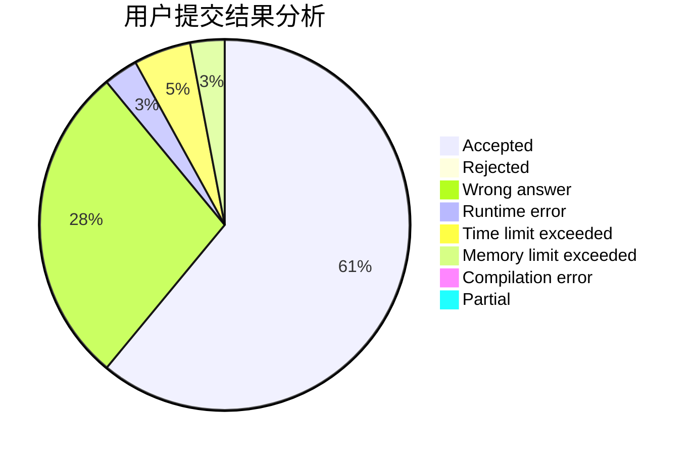
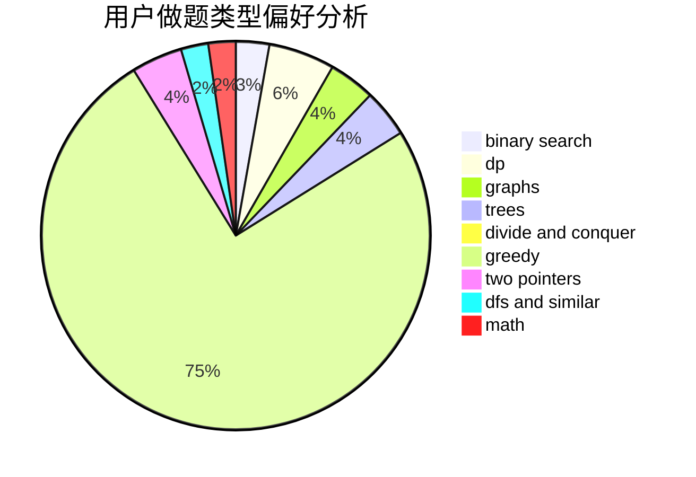

# Zi_yu

<!-- tabs:start -->

#### **用户提交结果分析**

#### **用户做题类型偏好分析**

<!-- tabs:end -->
# 推荐题目
[1383A](https://codeforces.com/contest/1383/problem/A)
[1336A](https://codeforces.com/contest/1336/problem/A)
[792C](https://codeforces.com/contest/792/problem/C)
[1343E](https://codeforces.com/contest/1343/problem/E)
[869B](https://codeforces.com/contest/869/problem/B)
[1191A](https://codeforces.com/contest/1191/problem/A)
[370A](https://codeforces.com/contest/370/problem/A)
[13563](https://codeforces.com/contest/1356/problem/3)
[166A](https://codeforces.com/contest/166/problem/A)
[1091H](https://codeforces.com/contest/1091/problem/H)
