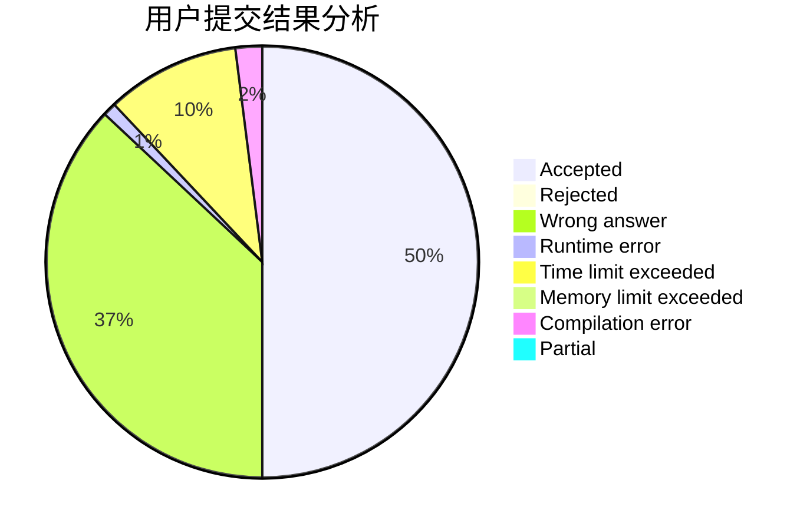
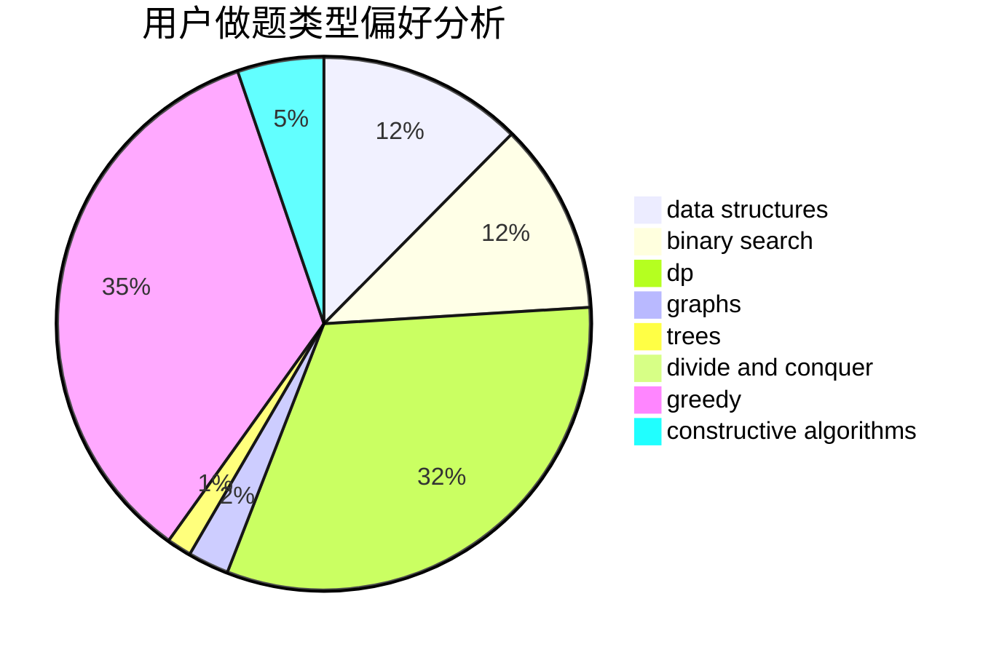
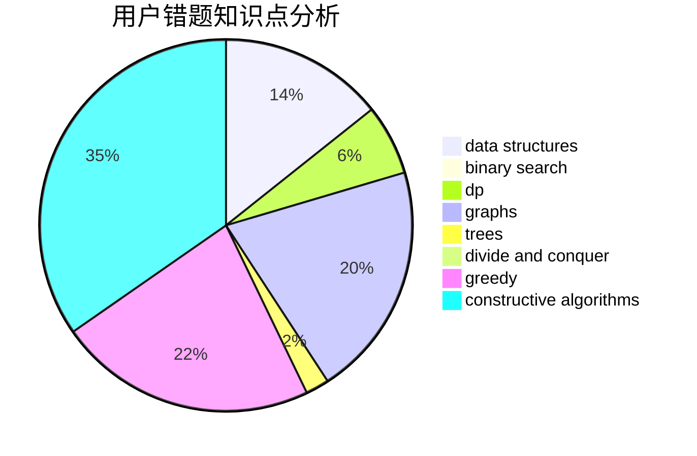

# ZigZagK

<!-- tabs:start -->

#### **用户提交结果分析**

#### **用户做题类型偏好分析**

#### **用户错题知识点分析**

<!-- tabs:end -->
# 推荐题目
[300C](https://codeforces.com/contest/300/problem/C)		brute force,
                        combinatorics		  
[557B](https://codeforces.com/contest/557/problem/B)		constructive algorithms,
                        implementation,
                        math,
                        sortings		  
[28C](https://codeforces.com/contest/28/problem/C)		combinatorics,
                        dp,
                        probabilities		  
[633B](https://codeforces.com/contest/633/problem/B)		brute force,
                        constructive algorithms,
                        math,
                        number theory		  
[1009B](https://codeforces.com/contest/1009/problem/B)		greedy,
                        implementation		  
[666E](https://codeforces.com/contest/666/problem/E)		data structures,
                        string suffix structures		  
[1031D](https://codeforces.com/contest/1031/problem/D)		greedy		  
[394C](https://codeforces.com/contest/394/problem/C)		constructive algorithms,
                        greedy		  
[770B](https://codeforces.com/contest/770/problem/B)		*special problem,
                        implementation,
                        math		  
[1310D](https://codeforces.com/contest/1310/problem/D)		dp,
                        graphs,
                        probabilities		  
