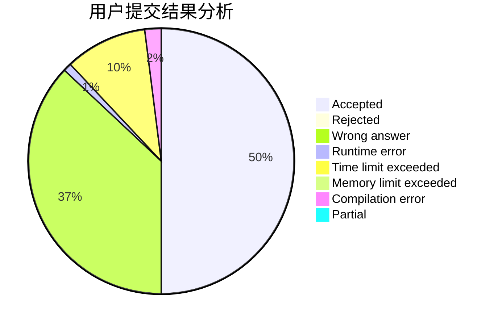
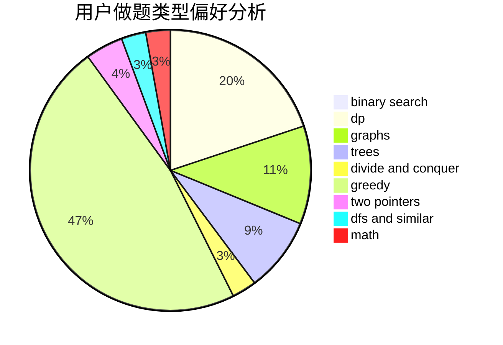

# ZigZagK

<!-- tabs:start -->

#### **用户提交结果分析**

#### **用户做题类型偏好分析**

<!-- tabs:end -->
# 推荐题目
[319A](https://codeforces.com/contest/319/problem/A)
[580C](https://codeforces.com/contest/580/problem/C)
[304C](https://codeforces.com/contest/304/problem/C)
[665D](https://codeforces.com/contest/665/problem/D)
[1009E](https://codeforces.com/contest/1009/problem/E)
[688D](https://codeforces.com/contest/688/problem/D)
[1032F](https://codeforces.com/contest/1032/problem/F)
[424A](https://codeforces.com/contest/424/problem/A)
[790A](https://codeforces.com/contest/790/problem/A)
[131A](https://codeforces.com/contest/131/problem/A)
