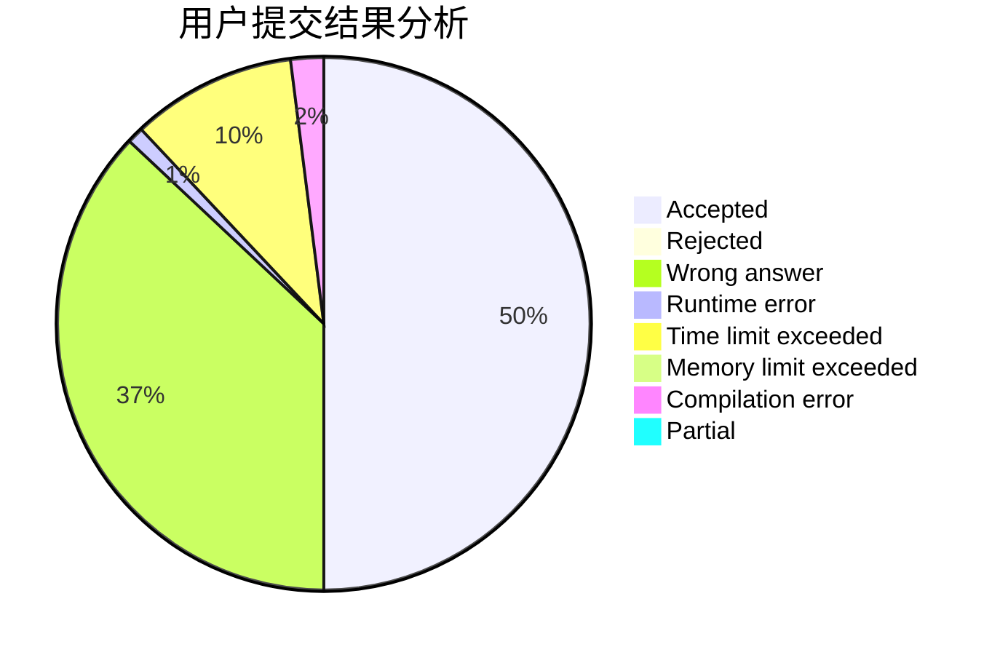
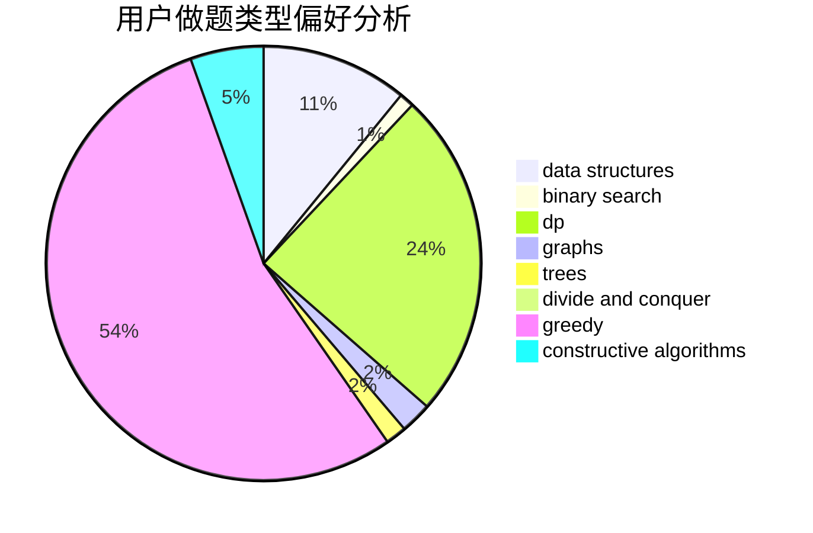
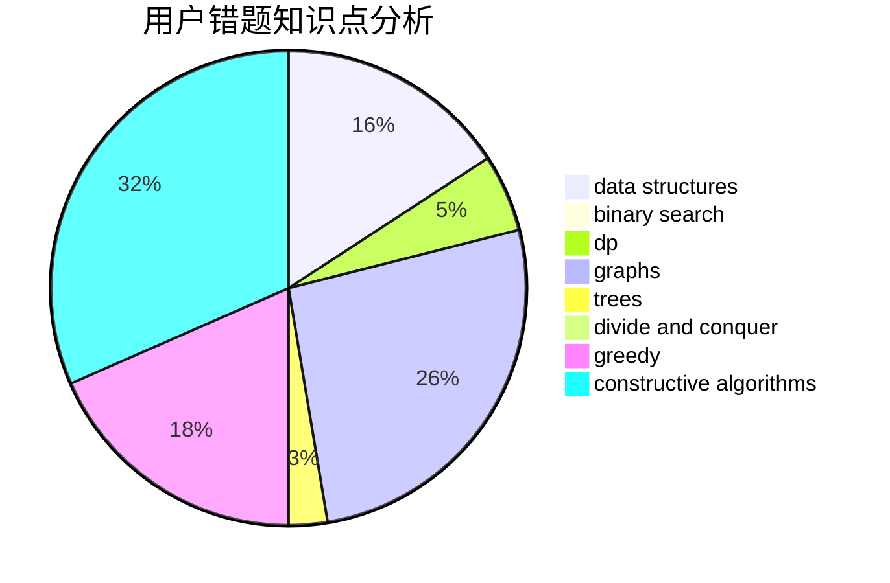

# ZigZagK

<!-- tabs:start -->

#### **用户提交结果分析**

#### **用户做题类型偏好分析**

#### **用户错题知识点分析**

<!-- tabs:end -->
# 推荐题目
[319A](https://codeforces.com/contest/319/problem/A)		combinatorics,
                        math		  
[580C](https://codeforces.com/contest/580/problem/C)		dfs and similar,
                        graphs,
                        trees		  
[304C](https://codeforces.com/contest/304/problem/C)		dsu,graphs,sortings,trees		  
[665D](https://codeforces.com/contest/665/problem/D)		constructive algorithms,
                        greedy,
                        number theory		  
[1009E](https://codeforces.com/contest/1009/problem/E)		combinatorics,
                        math,
                        probabilities		  
[688D](https://codeforces.com/contest/688/problem/D)		dsu,graphs,sortings,trees		  
[1032F](https://codeforces.com/contest/1032/problem/F)		dp,
                        trees		  
[424A](https://codeforces.com/contest/424/problem/A)		implementation		  
[790A](https://codeforces.com/contest/790/problem/A)		dsu,graphs,sortings,trees		  
[131A](https://codeforces.com/contest/131/problem/A)		implementation,
                        strings		  
