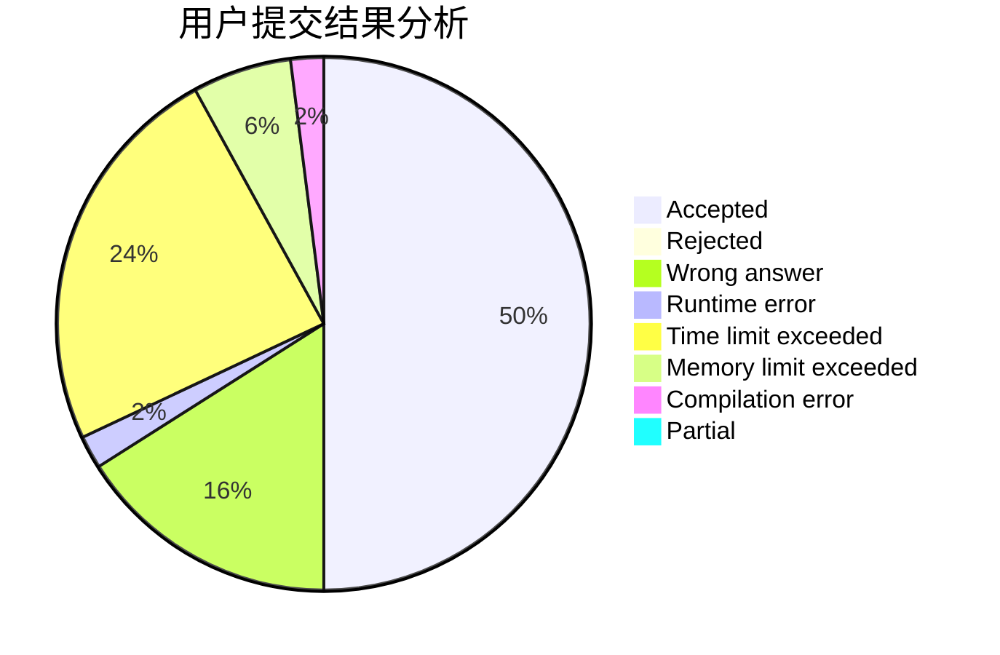
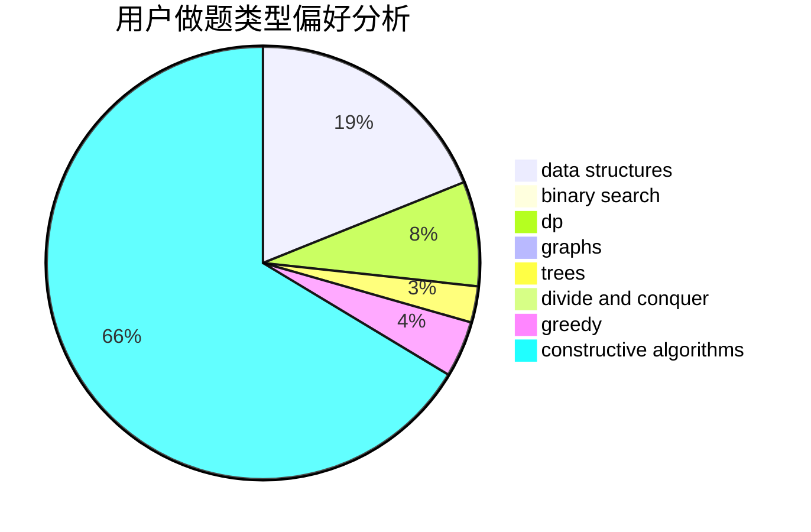
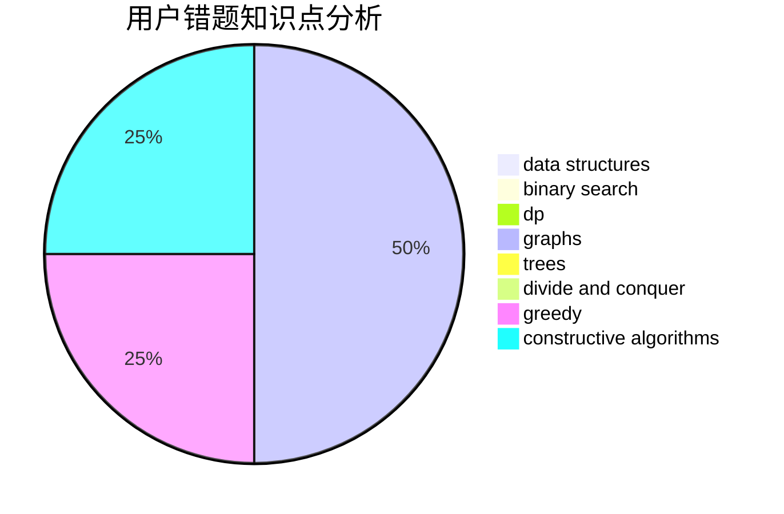

# ZoeCUR

<!-- tabs:start -->

#### **用户提交结果分析**

#### **用户做题类型偏好分析**

#### **用户错题知识点分析**

<!-- tabs:end -->
# 推荐题目
[1371E2](https://codeforces.com/contest/1371E/problem/2)		binary search,
                        combinatorics,
                        dp,
                        math,
                        number theory,
                        sortings		  
[1132A](https://codeforces.com/contest/1132/problem/A)		greedy,
                        implementation		  
[1372B](https://codeforces.com/contest/1372/problem/B)		greedy,
                        math,
                        number theory		  
[1088B](https://codeforces.com/contest/1088/problem/B)		implementation,
                        sortings		  
[1312E](https://codeforces.com/contest/1312/problem/E)		dp,
                        greedy		  
[1083D](https://codeforces.com/contest/1083/problem/D)		data structures,
                        implementation		  
[1025B](https://codeforces.com/contest/1025/problem/B)		brute force,
                        greedy,
                        number theory		  
[1261D2](https://codeforces.com/contest/1261D/problem/2)		dsu,graphs,sortings,trees		  
[411A](https://codeforces.com/contest/411/problem/A)		*special problem,
                        implementation		  
[1028B](https://codeforces.com/contest/1028/problem/B)		constructive algorithms,
                        math		  
