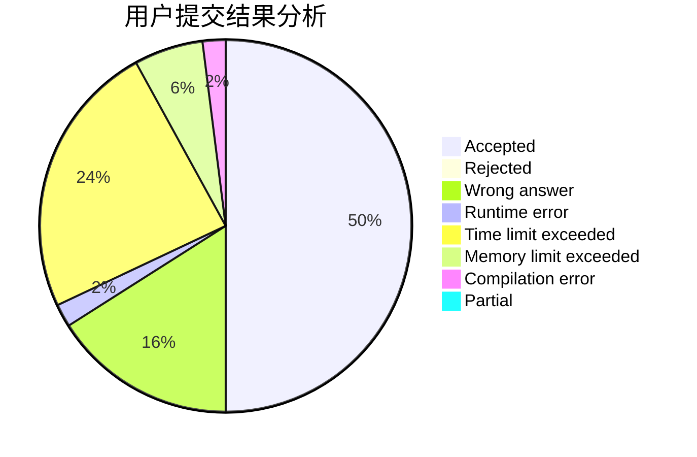
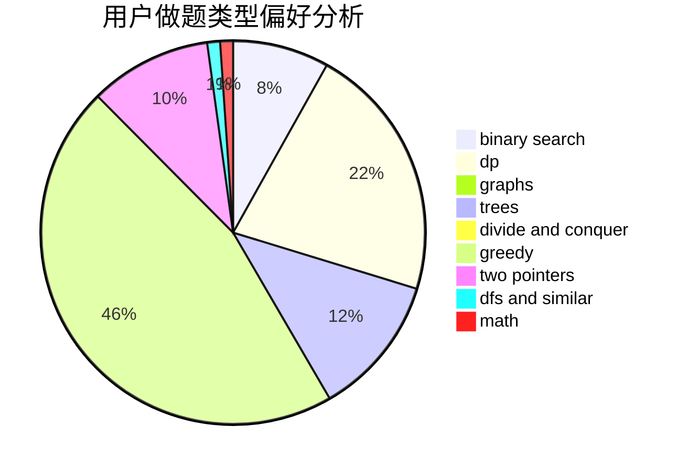

# ZoeCUR

<!-- tabs:start -->

#### **用户提交结果分析**

#### **用户做题类型偏好分析**

<!-- tabs:end -->
# 推荐题目
[1380D](https://codeforces.com/contest/1380/problem/D)
[1133E](https://codeforces.com/contest/1133/problem/E)
[1380G](https://codeforces.com/contest/1380/problem/G)
[1088E](https://codeforces.com/contest/1088/problem/E)
[1322A](https://codeforces.com/contest/1322/problem/A)
[1084B](https://codeforces.com/contest/1084/problem/B)
[1025E](https://codeforces.com/contest/1025/problem/E)
[1267E](https://codeforces.com/contest/1267/problem/E)
[438A](https://codeforces.com/contest/438/problem/A)
[1028E](https://codeforces.com/contest/1028/problem/E)
