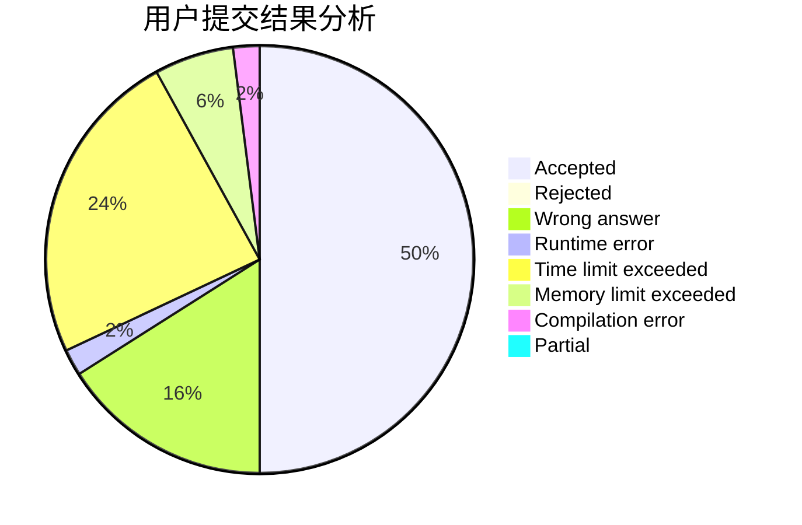
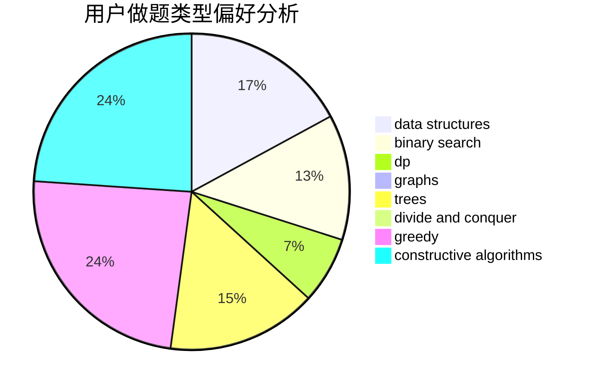
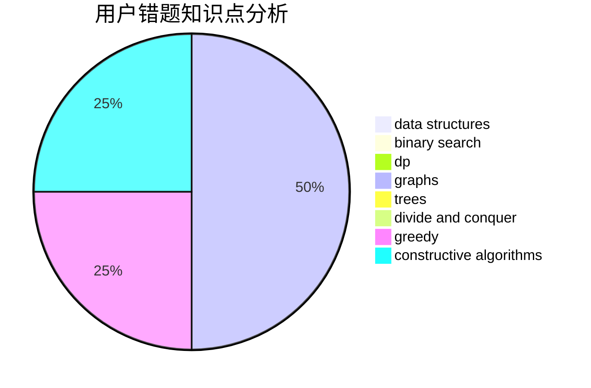

# ZoeCUR

<!-- tabs:start -->

#### **用户提交结果分析**

#### **用户做题类型偏好分析**

#### **用户错题知识点分析**

<!-- tabs:end -->
# 推荐题目
[1380D](https://codeforces.com/contest/1380/problem/D)		constructive algorithms,
                        greedy,
                        implementation,
                        math,
                        two pointers		  
[1133E](https://codeforces.com/contest/1133/problem/E)		dp,
                        sortings,
                        two pointers		  
[1380G](https://codeforces.com/contest/1380/problem/G)		greedy,
                        math,
                        probabilities		  
[1088E](https://codeforces.com/contest/1088/problem/E)		dp,
                        greedy,
                        math,
                        trees		  
[1322A](https://codeforces.com/contest/1322/problem/A)		greedy		  
[1084B](https://codeforces.com/contest/1084/problem/B)		greedy,
                        implementation		  
[1025E](https://codeforces.com/contest/1025/problem/E)		constructive algorithms,
                        implementation,
                        matrices		  
[1267E](https://codeforces.com/contest/1267/problem/E)		greedy		  
[438A](https://codeforces.com/contest/438/problem/A)		dsu,graphs,sortings,trees		  
[1028E](https://codeforces.com/contest/1028/problem/E)		constructive algorithms		  
