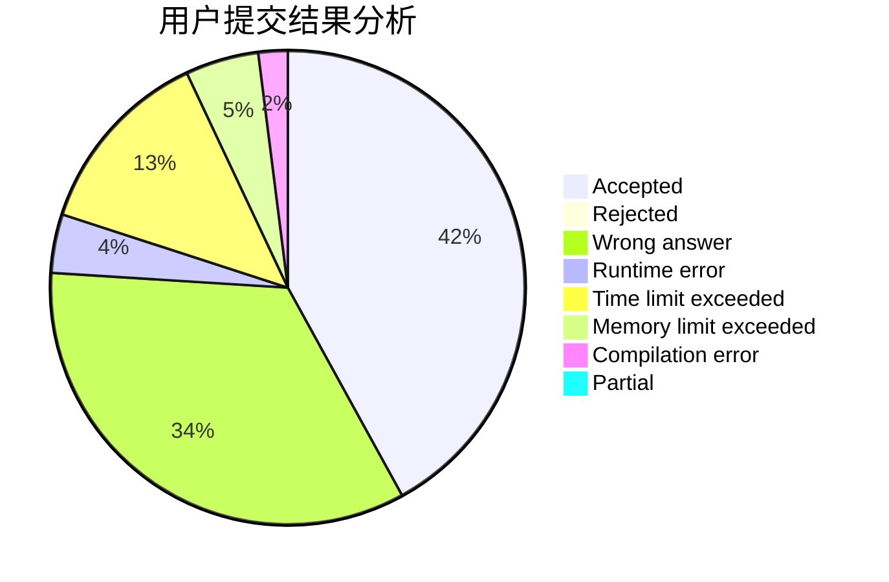
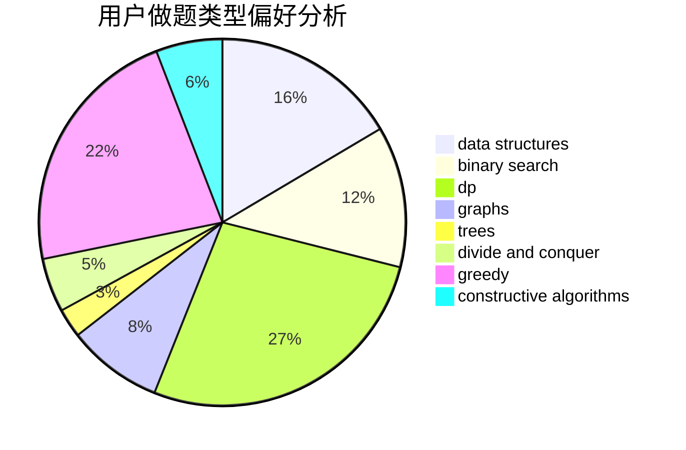
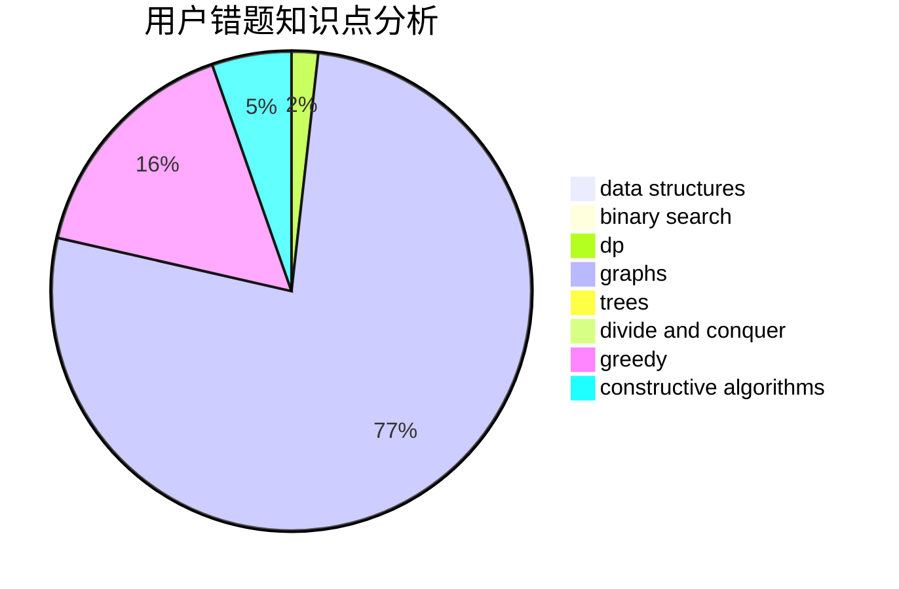

# ZzQf

<!-- tabs:start -->

#### **用户提交结果分析**

#### **用户做题类型偏好分析**

#### **用户错题知识点分析**

<!-- tabs:end -->
# 推荐题目
[1029C](https://codeforces.com/contest/1029/problem/C)		greedy,
                        math,
                        sortings		  
[208A](https://codeforces.com/contest/208/problem/A)		strings		  
[980D](https://codeforces.com/contest/980/problem/D)		dp,
                        math,
                        number theory		  
[785D](https://codeforces.com/contest/785/problem/D)		combinatorics,
                        dp,
                        math,
                        number theory		  
[12482](https://codeforces.com/contest/1248/problem/2)		dsu,graphs,sortings,trees		  
[659B](https://codeforces.com/contest/659/problem/B)		constructive algorithms,
                        sortings		  
[203B](https://codeforces.com/contest/203/problem/B)		brute force,
                        implementation		  
[997E](https://codeforces.com/contest/997/problem/E)		data structures		  
[800C](https://codeforces.com/contest/800/problem/C)		dsu,graphs,sortings,trees		  
[660B](https://codeforces.com/contest/660/problem/B)		implementation		  
