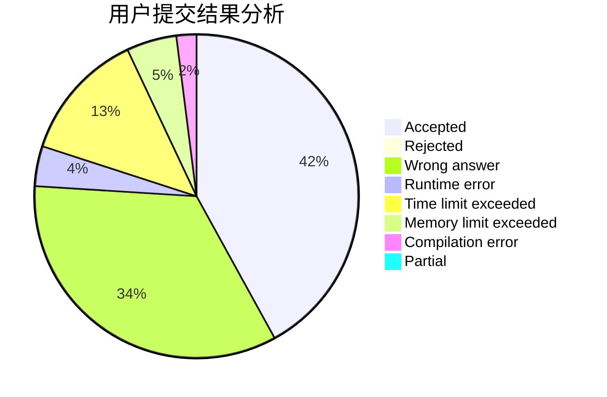
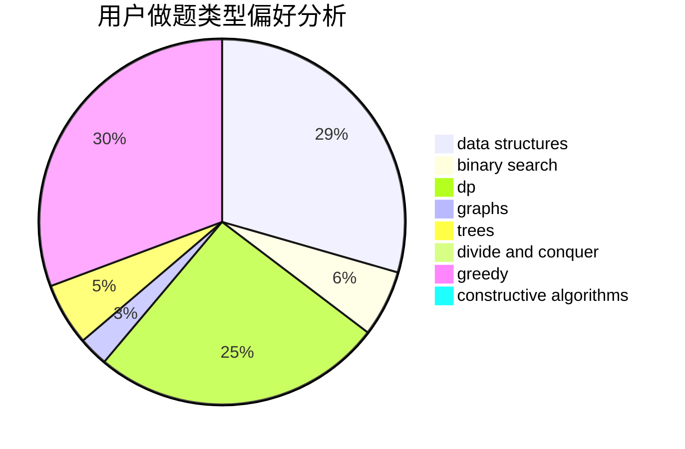
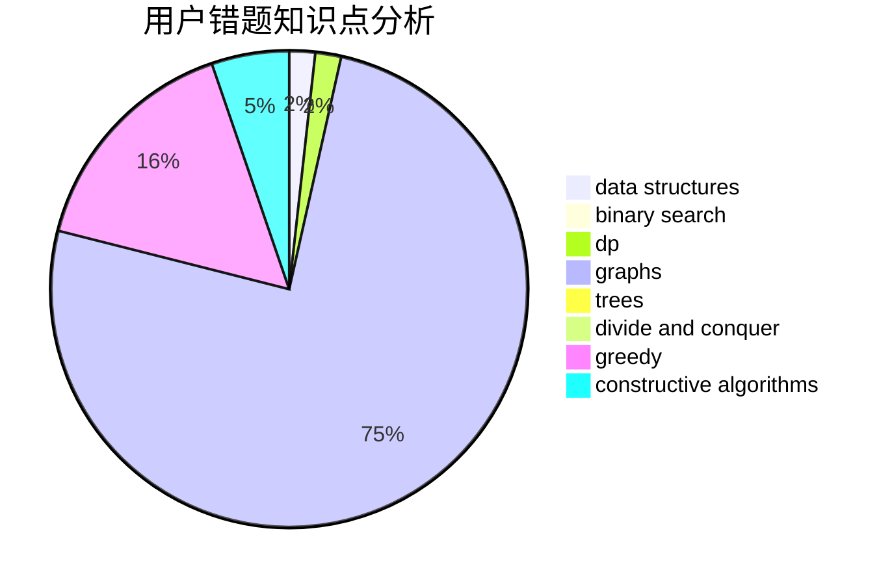

# ZzQf

<!-- tabs:start -->

#### **用户提交结果分析**

#### **用户做题类型偏好分析**

#### **用户错题知识点分析**

<!-- tabs:end -->
# 推荐题目
[1028H](https://codeforces.com/contest/1028/problem/H)		math		  
[180D](https://codeforces.com/contest/180/problem/D)		greedy,
                        strings		  
[958F3](https://codeforces.com/contest/958F/problem/3)		fft		  
[766B](https://codeforces.com/contest/766/problem/B)		constructive algorithms,
                        geometry,
                        greedy,
                        math,
                        number theory,
                        sortings		  
[1243A](https://codeforces.com/contest/1243/problem/A)		implementation		  
[629C](https://codeforces.com/contest/629/problem/C)		dp,
                        strings		  
[177A2](https://codeforces.com/contest/177A/problem/2)		implementation		  
[982B](https://codeforces.com/contest/982/problem/B)		data structures,
                        greedy,
                        implementation		  
[782D](https://codeforces.com/contest/782/problem/D)		dsu,graphs,sortings,trees		  
[630F](https://codeforces.com/contest/630/problem/F)		combinatorics,
                        math		  
