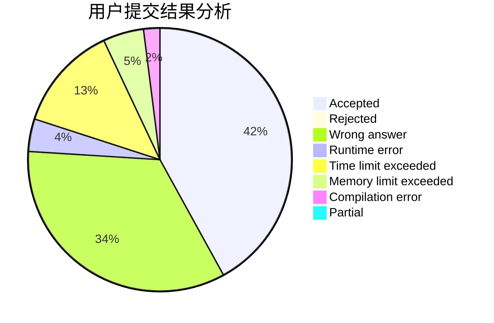
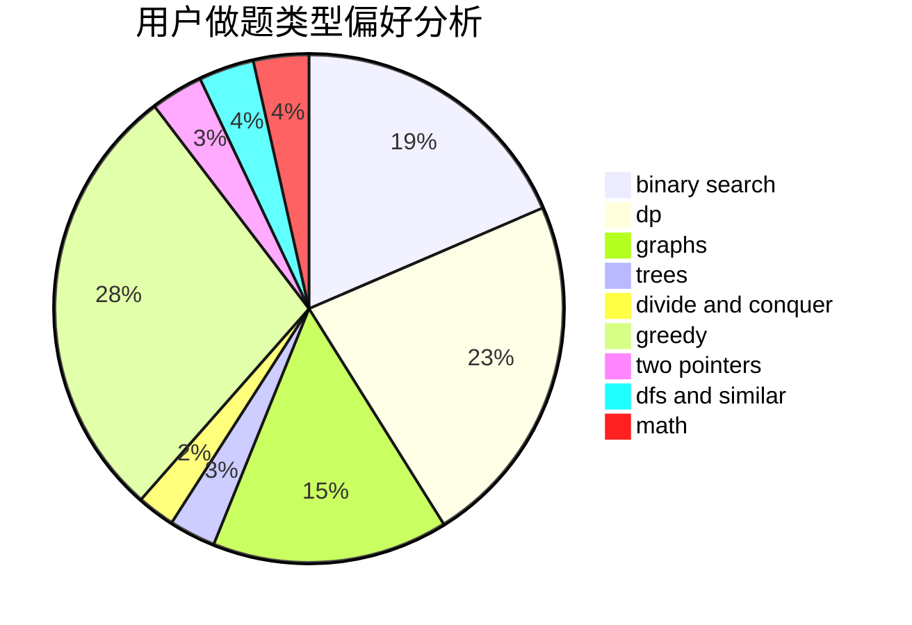

# ZzQf

<!-- tabs:start -->

#### **用户提交结果分析**

#### **用户做题类型偏好分析**

<!-- tabs:end -->
# 推荐题目
[1029C](https://codeforces.com/contest/1029/problem/C)
[208A](https://codeforces.com/contest/208/problem/A)
[980D](https://codeforces.com/contest/980/problem/D)
[785D](https://codeforces.com/contest/785/problem/D)
[12482](https://codeforces.com/contest/1248/problem/2)
[659B](https://codeforces.com/contest/659/problem/B)
[203B](https://codeforces.com/contest/203/problem/B)
[997E](https://codeforces.com/contest/997/problem/E)
[800C](https://codeforces.com/contest/800/problem/C)
[660B](https://codeforces.com/contest/660/problem/B)
