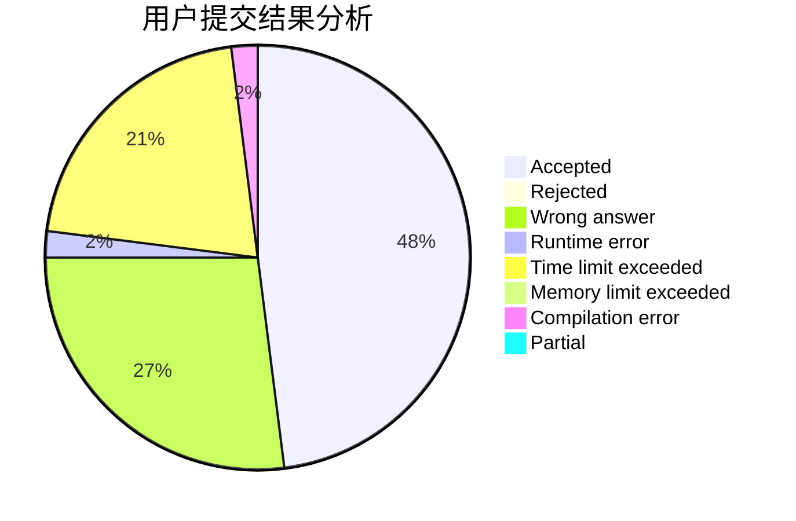
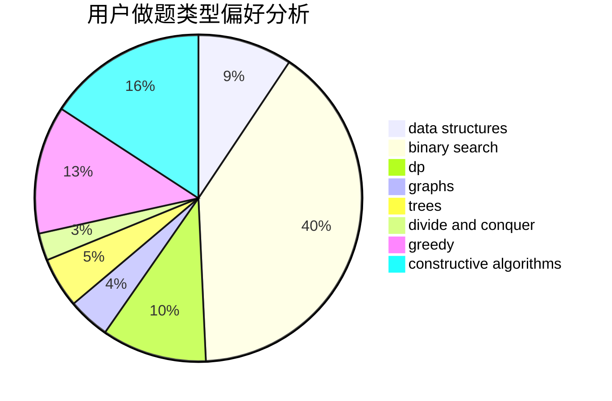
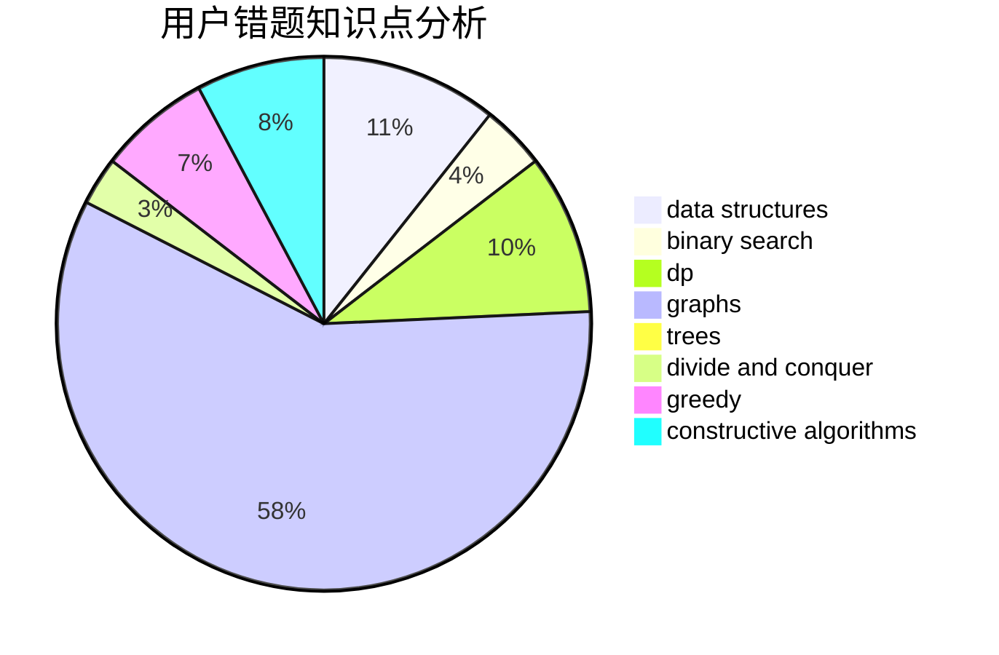

# Zztrans

<!-- tabs:start -->

#### **用户提交结果分析**

#### **用户做题类型偏好分析**

#### **用户错题知识点分析**

<!-- tabs:end -->
# 推荐题目
[370A](https://codeforces.com/contest/370/problem/A)		graphs,
                        math,
                        shortest paths		  
[674G](https://codeforces.com/contest/674/problem/G)		dsu,graphs,sortings,trees		  
[707B](https://codeforces.com/contest/707/problem/B)		graphs		  
[346E](https://codeforces.com/contest/346/problem/E)		math,
                        number theory		  
[1057B](https://codeforces.com/contest/1057/problem/B)		*special problem,
                        brute force		  
[742E](https://codeforces.com/contest/742/problem/E)		dsu,graphs,sortings,trees		  
[1150C](https://codeforces.com/contest/1150/problem/C)		dsu,graphs,sortings,trees		  
[1208G](https://codeforces.com/contest/1208/problem/G)		greedy,
                        math,
                        number theory		  
[315A](https://codeforces.com/contest/315/problem/A)		brute force		  
[769A](https://codeforces.com/contest/769/problem/A)		*special problem,
                        implementation,
                        sortings		  
