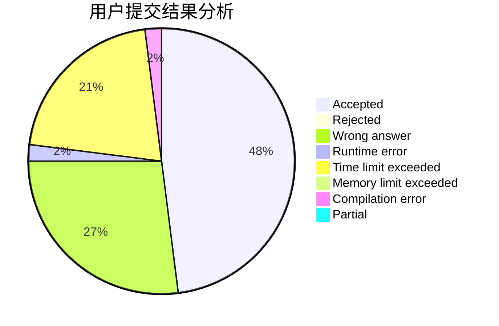
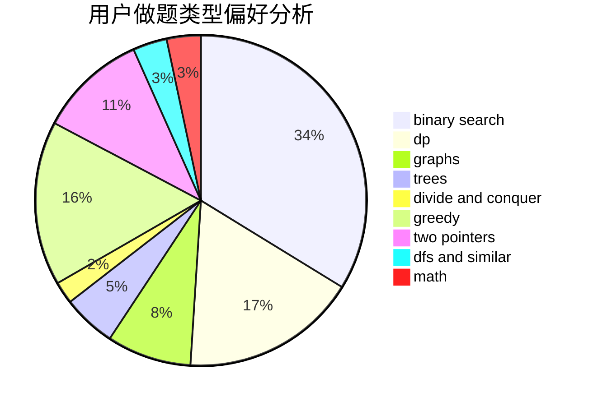

# Zztrans

<!-- tabs:start -->

#### **用户提交结果分析**

#### **用户做题类型偏好分析**

<!-- tabs:end -->
# 推荐题目
[370A](https://codeforces.com/contest/370/problem/A)
[674G](https://codeforces.com/contest/674/problem/G)
[707B](https://codeforces.com/contest/707/problem/B)
[346E](https://codeforces.com/contest/346/problem/E)
[1057B](https://codeforces.com/contest/1057/problem/B)
[742E](https://codeforces.com/contest/742/problem/E)
[1150C](https://codeforces.com/contest/1150/problem/C)
[1208G](https://codeforces.com/contest/1208/problem/G)
[315A](https://codeforces.com/contest/315/problem/A)
[769A](https://codeforces.com/contest/769/problem/A)
