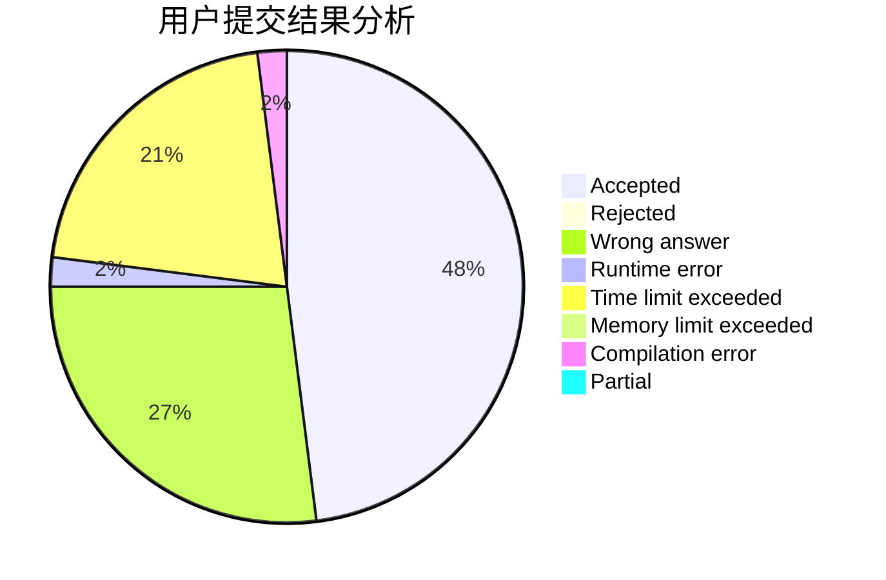
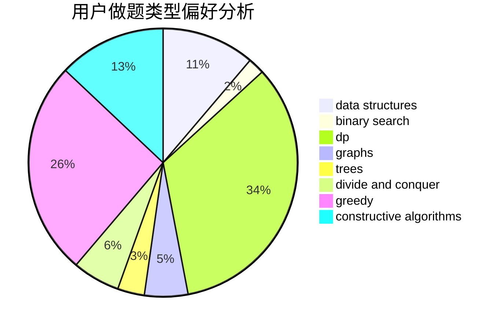
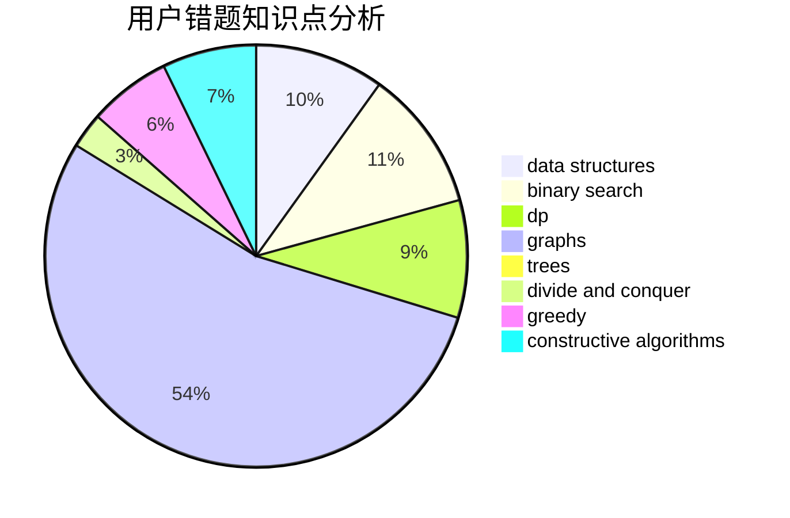

# Zztrans

<!-- tabs:start -->

#### **用户提交结果分析**

#### **用户做题类型偏好分析**

#### **用户错题知识点分析**

<!-- tabs:end -->
# 推荐题目
[343E](https://codeforces.com/contest/343/problem/E)		brute force,
                        dfs and similar,
                        divide and conquer,
                        flows,
                        graphs,
                        greedy,
                        trees		  
[650E](https://codeforces.com/contest/650/problem/E)		data structures,
                        dfs and similar,
                        dsu,
                        greedy,
                        trees		  
[683A](https://codeforces.com/contest/683/problem/A)		*special problem,
                        geometry		  
[317C](https://codeforces.com/contest/317/problem/C)		constructive algorithms,
                        dfs and similar,
                        graphs,
                        trees		  
[1056F](https://codeforces.com/contest/1056/problem/F)		binary search,
                        dp,
                        math		  
[725A](https://codeforces.com/contest/725/problem/A)		implementation		  
[1148H](https://codeforces.com/contest/1148/problem/H)		data structures		  
[1204B](https://codeforces.com/contest/1204/problem/B)		greedy,
                        math		  
[297E](https://codeforces.com/contest/297/problem/E)		data structures		  
[74B](https://codeforces.com/contest/74/problem/B)		dp,
                        games,
                        greedy		  
