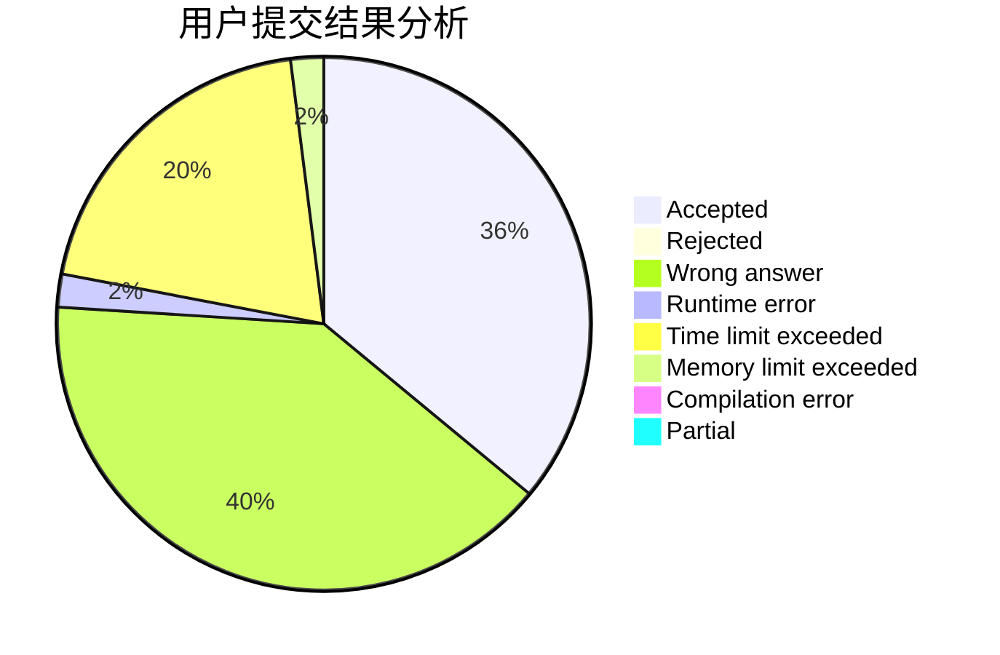
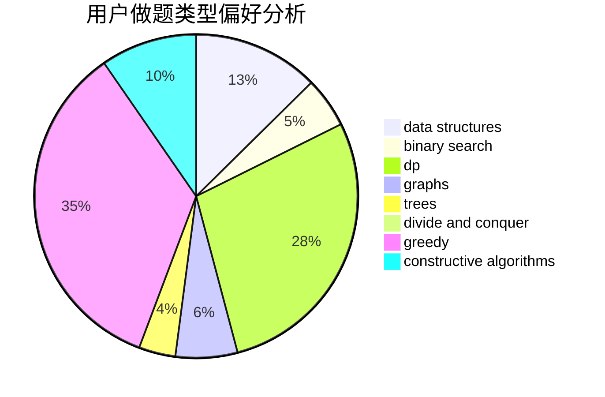
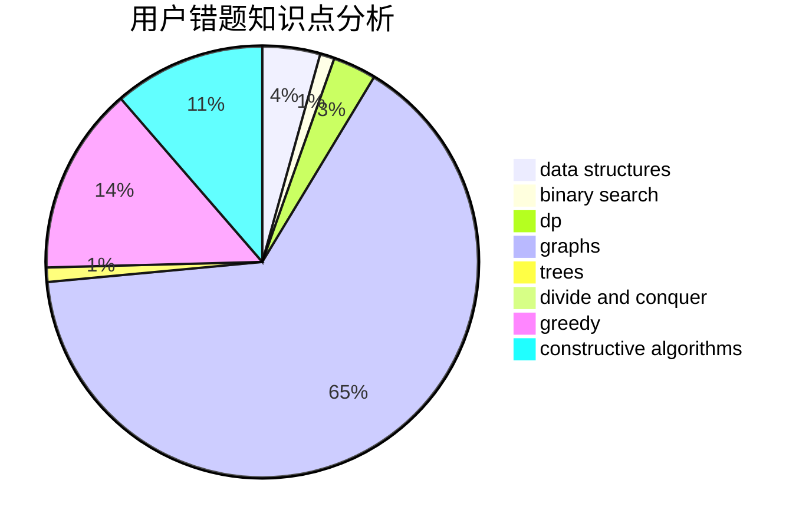

# _Andromeda

<!-- tabs:start -->

#### **用户提交结果分析**

#### **用户做题类型偏好分析**

#### **用户错题知识点分析**

<!-- tabs:end -->
# 推荐题目
[913A](https://codeforces.com/contest/913/problem/A)		implementation,
                        math		  
[14621](https://codeforces.com/contest/1462/problem/1)		dsu,graphs,sortings,trees		  
[940A](https://codeforces.com/contest/940/problem/A)		brute force,
                        greedy,
                        sortings		  
[1302F](https://codeforces.com/contest/1302/problem/F)		bitmasks,
                        brute force,
                        expression parsing		  
[13932](https://codeforces.com/contest/1393/problem/2)		dsu,graphs,sortings,trees		  
[11162](https://codeforces.com/contest/1116/problem/2)		dsu,graphs,sortings,trees		  
[939E](https://codeforces.com/contest/939/problem/E)		binary search,
                        greedy,
                        ternary search,
                        two pointers		  
[908A](https://codeforces.com/contest/908/problem/A)		brute force,
                        implementation		  
[300B](https://codeforces.com/contest/300/problem/B)		brute force,
                        dfs and similar,
                        graphs		  
[1437F](https://codeforces.com/contest/1437/problem/F)		combinatorics,
                        dp,
                        math,
                        two pointers		  
