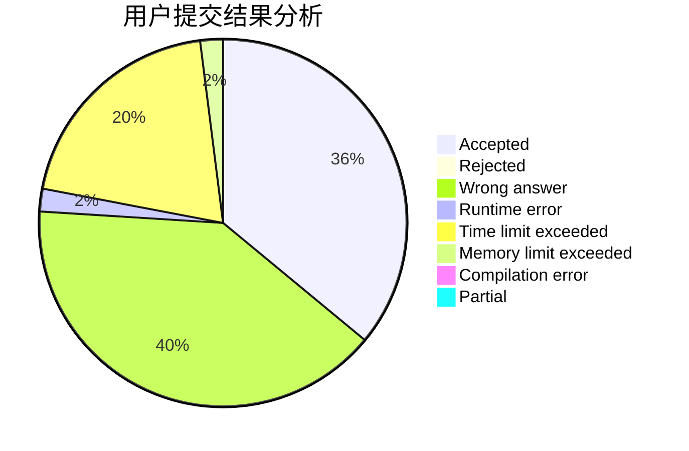
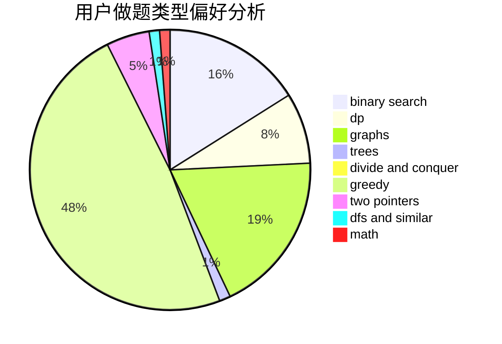

# _Andromeda

<!-- tabs:start -->

#### **用户提交结果分析**

#### **用户做题类型偏好分析**

<!-- tabs:end -->
# 推荐题目
[913A](https://codeforces.com/contest/913/problem/A)
[14621](https://codeforces.com/contest/1462/problem/1)
[940A](https://codeforces.com/contest/940/problem/A)
[1302F](https://codeforces.com/contest/1302/problem/F)
[13932](https://codeforces.com/contest/1393/problem/2)
[11162](https://codeforces.com/contest/1116/problem/2)
[939E](https://codeforces.com/contest/939/problem/E)
[908A](https://codeforces.com/contest/908/problem/A)
[300B](https://codeforces.com/contest/300/problem/B)
[1437F](https://codeforces.com/contest/1437/problem/F)
