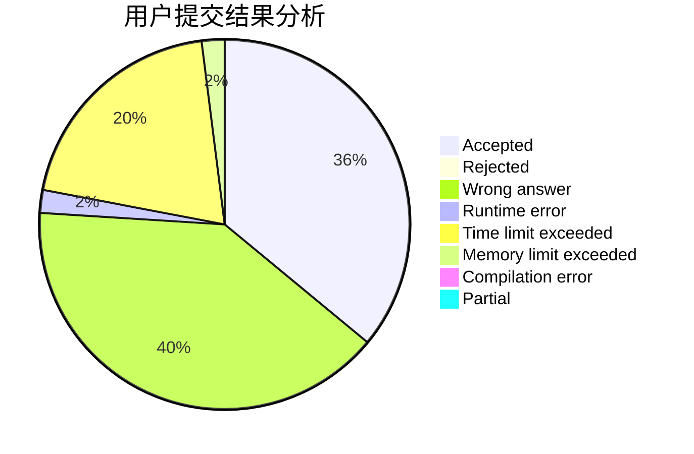
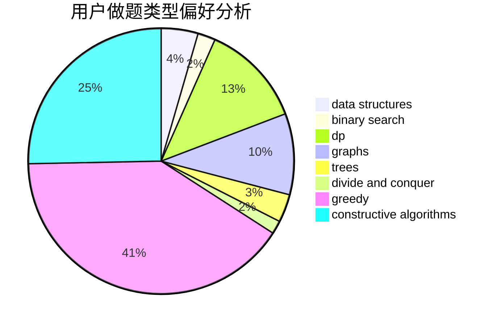
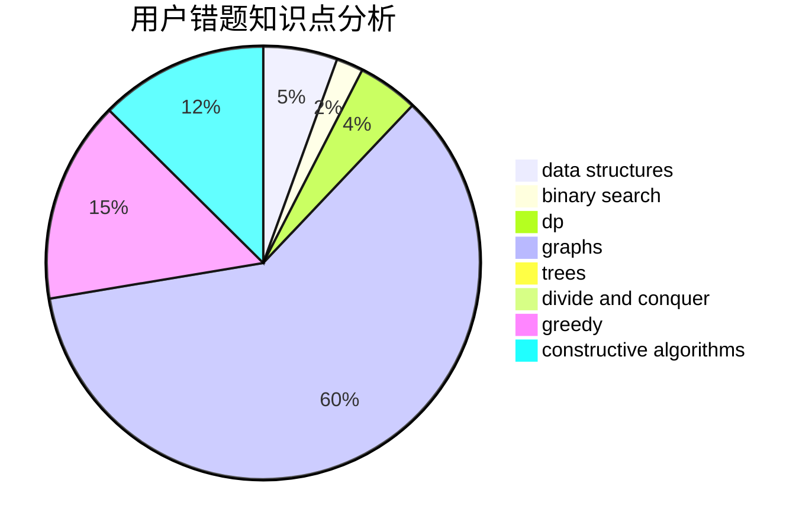

# _Andromeda
<!-- tabs:start -->
#### **用户提交结果分析**

#### **用户做题类型偏好分析**

#### **用户错题知识点分析**

<!-- tabs:end -->
# 推荐题目
[Square Subsets](http://codeforces.com/problemset/problem/895/C)		bitmasks,
                        combinatorics,
                        dp,
                        math		  
[Water The Garden](http://codeforces.com/problemset/problem/920/A)		implementation		  
[Distance Matching](http://codeforces.com/problemset/problem/1396/E)		constructive algorithms,
                        dfs and similar,
                        trees		  
[Sweets Eating](http://codeforces.com/problemset/problem/1253/C)		dp,
                        greedy,
                        math,
                        sortings		  
[Fibonacci-ish II](http://codeforces.com/problemset/problem/633/H)		data structures,
                        implementation		  
[K-Dominant Character](http://codeforces.com/problemset/problem/888/C)		binary search,
                        implementation,
                        two pointers		  
[Pokermon League challenge](http://codeforces.com/problemset/problem/717/H)		math,
                        probabilities		  
[Carousel](http://codeforces.com/problemset/problem/1328/D)		constructive algorithms,
                        dp,
                        graphs,
                        greedy,
                        math		  
[OR oracle](http://codeforces.com/problemset/problem/1115/G2)		*special problem		  
[New Game with a Chess Piece](http://codeforces.com/problemset/problem/36/D)		games		  
<!-- tabs:start -->
#### **data structures**
[Square Subsets](http://codeforces.com/problemset/problem/633/H)		data structures,
                        implementation		  
[Water The Garden](https://codeforces.com/contest/1053/problem/C)		data structures		  
[Distance Matching](http://codeforces.com/problemset/problem/1181/D)		binary search,
                        data structures,
                        implementation,
                        sortings,
                        trees,
                        two pointers		  
[Sweets Eating](http://codeforces.com/problemset/problem/243/D)		data structures,
                        dp,
                        geometry,
                        two pointers		  
[Fibonacci-ish II](http://codeforces.com/problemset/problem/845/C)		data structures,
                        greedy,
                        sortings		  
[K-Dominant Character](http://codeforces.com/problemset/problem/1418/G)		data structures,
                        divide and conquer,
                        hashing,
                        two pointers		  
[Pokermon League challenge](http://codeforces.com/problemset/problem/1109/F)		data structures,
                        trees		  
[Carousel](http://codeforces.com/problemset/problem/1374/E2)		data structures,
                        greedy,
                        implementation,
                        sortings,
                        ternary search,
                        two pointers		  
[OR oracle](https://codeforces.com/contest/1341/problem/C)		brute force,
                        data structures,
                        greedy,
                        implementation		  
[New Game with a Chess Piece](http://codeforces.com/problemset/problem/1466/I)		binary search,
                        data structures,
                        data structures,
                        interactive		  
#### **binary search**
[Square Subsets](http://codeforces.com/problemset/problem/888/C)		binary search,
                        implementation,
                        two pointers		  
[Water The Garden](http://codeforces.com/problemset/problem/1181/D)		binary search,
                        data structures,
                        implementation,
                        sortings,
                        trees,
                        two pointers		  
[Distance Matching](https://codeforces.com/contest/1020/problem/D)		binary search,
                        interactive		  
[Sweets Eating](http://codeforces.com/problemset/problem/760/B)		binary search,
                        greedy		  
[Fibonacci-ish II](http://codeforces.com/problemset/problem/1305/H)		binary search,
                        greedy		  
[K-Dominant Character](http://codeforces.com/problemset/problem/416/C)		binary search,
                        dp,
                        greedy,
                        implementation		  
[Pokermon League challenge](http://codeforces.com/problemset/problem/21/C)		binary search,
                        dp,
                        sortings		  
[Carousel](http://codeforces.com/problemset/problem/525/E)		binary search,
                        bitmasks,
                        brute force,
                        dp,
                        math,
                        meet-in-the-middle		  
[OR oracle](http://codeforces.com/problemset/problem/1466/I)		binary search,
                        data structures,
                        data structures,
                        interactive		  
[New Game with a Chess Piece](http://codeforces.com/problemset/problem/1428/F)		binary search,
                        data structures,
                        divide and conquer,
                        dp,
                        two pointers		  
#### **dp**
[Square Subsets](http://codeforces.com/problemset/problem/895/C)		bitmasks,
                        combinatorics,
                        dp,
                        math		  
[Water The Garden](http://codeforces.com/problemset/problem/1253/C)		dp,
                        greedy,
                        math,
                        sortings		  
[Distance Matching](http://codeforces.com/problemset/problem/1328/D)		constructive algorithms,
                        dp,
                        graphs,
                        greedy,
                        math		  
[Sweets Eating](http://codeforces.com/problemset/problem/567/F)		dp		  
[Fibonacci-ish II](http://codeforces.com/problemset/problem/1383/C)		bitmasks,
                        dp,
                        graphs,
                        trees		  
[K-Dominant Character](http://codeforces.com/problemset/problem/919/D)		dfs and similar,
                        dp,
                        graphs		  
[Pokermon League challenge](https://codeforces.com/contest/810/problem/E)		combinatorics,
                        divide and conquer,
                        dp		  
[Carousel](http://codeforces.com/problemset/problem/416/C)		binary search,
                        dp,
                        greedy,
                        implementation		  
[OR oracle](http://codeforces.com/problemset/problem/243/D)		data structures,
                        dp,
                        geometry,
                        two pointers		  
[New Game with a Chess Piece](http://codeforces.com/problemset/problem/21/C)		binary search,
                        dp,
                        sortings		  
#### **graph**
[Square Subsets](http://codeforces.com/problemset/problem/1328/D)		constructive algorithms,
                        dp,
                        graphs,
                        greedy,
                        math		  
[Water The Garden](http://codeforces.com/problemset/problem/1383/C)		bitmasks,
                        dp,
                        graphs,
                        trees		  
[Distance Matching](https://codeforces.com/contest/1496/problem/E)		constructive algorithms,
                        graphs		  
[Sweets Eating](http://codeforces.com/problemset/problem/919/D)		dfs and similar,
                        dp,
                        graphs		  
[Fibonacci-ish II](http://codeforces.com/problemset/problem/1147/D)		dfs and similar,
                        graphs		  
[K-Dominant Character](http://codeforces.com/problemset/problem/811/D)		constructive algorithms,
                        dfs and similar,
                        graphs,
                        interactive		  
[Pokermon League challenge](http://codeforces.com/problemset/problem/1106/D)		data structures,
                        dfs and similar,
                        graphs,
                        greedy,
                        shortest paths		  
[Carousel](http://codeforces.com/problemset/problem/1472/C)		dp,
                        graphs		  
[OR oracle](http://codeforces.com/problemset/problem/1487/C)		brute force,
                        constructive algorithms,
                        dfs and similar,
                        graphs,
                        greedy,
                        implementation,
                        math		  
[New Game with a Chess Piece](http://codeforces.com/problemset/problem/1437/C)		dp,
                        flows,
                        graph matchings,
                        greedy,
                        math,
                        sortings		  
#### **trees**
[Square Subsets](http://codeforces.com/problemset/problem/1396/E)		constructive algorithms,
                        dfs and similar,
                        trees		  
[Water The Garden](http://codeforces.com/problemset/problem/1383/C)		bitmasks,
                        dp,
                        graphs,
                        trees		  
[Distance Matching](http://codeforces.com/problemset/problem/886/C)		dsu,
                        greedy,
                        implementation,
                        trees		  
[Sweets Eating](http://codeforces.com/problemset/problem/1181/D)		binary search,
                        data structures,
                        implementation,
                        sortings,
                        trees,
                        two pointers		  
[Fibonacci-ish II](http://codeforces.com/problemset/problem/1338/D)		constructive algorithms,
                        dfs and similar,
                        dp,
                        math,
                        trees		  
[K-Dominant Character](http://codeforces.com/problemset/problem/1109/F)		data structures,
                        trees		  
[Pokermon League challenge](https://codeforces.com/contest/1087/problem/D)		constructive algorithms,
                        implementation,
                        trees		  
[Carousel](http://codeforces.com/problemset/problem/1479/D)		binary search,
                        bitmasks,
                        brute force,
                        data structures,
                        probabilities,
                        trees		  
[OR oracle](http://codeforces.com/problemset/problem/1511/C)		brute force,
                        data structures,
                        implementation,
                        trees		  
[New Game with a Chess Piece](http://codeforces.com/problemset/problem/1499/F)		combinatorics,
                        dfs and similar,
                        dp,
                        trees		  
#### **divide and conquer**
[Square Subsets](https://codeforces.com/contest/810/problem/E)		combinatorics,
                        divide and conquer,
                        dp		  
[Water The Garden](http://codeforces.com/problemset/problem/1418/G)		data structures,
                        divide and conquer,
                        hashing,
                        two pointers		  
[Distance Matching](http://codeforces.com/problemset/problem/1470/F)		divide and conquer		  
[Sweets Eating](http://codeforces.com/problemset/problem/1428/F)		binary search,
                        data structures,
                        divide and conquer,
                        dp,
                        two pointers		  
[Fibonacci-ish II](http://codeforces.com/problemset/problem/1461/D)		binary search,
                        brute force,
                        data structures,
                        divide and conquer,
                        implementation,
                        sortings		  
[K-Dominant Character](http://codeforces.com/problemset/problem/1466/G)		combinatorics,
                        divide and conquer,
                        hashing,
                        math,
                        string suffix structures,
                        strings		  
[Pokermon League challenge](http://codeforces.com/problemset/problem/1490/D)		dfs and similar,
                        divide and conquer,
                        implementation		  
[Carousel](https://codeforces.com/contest/1483/problem/C)		data structures,
                        divide and conquer,
                        dp		  
[OR oracle](http://codeforces.com/problemset/problem/1491/E)		brute force,
                        dfs and similar,
                        divide and conquer,
                        number theory,
                        trees		  
[New Game with a Chess Piece](http://codeforces.com/problemset/problem/1303/G)		data structures,
                        divide and conquer,
                        geometry,
                        trees		  
#### **greedy**
[Square Subsets](http://codeforces.com/problemset/problem/1253/C)		dp,
                        greedy,
                        math,
                        sortings		  
[Water The Garden](http://codeforces.com/problemset/problem/1328/D)		constructive algorithms,
                        dp,
                        graphs,
                        greedy,
                        math		  
[Distance Matching](http://codeforces.com/problemset/problem/886/C)		dsu,
                        greedy,
                        implementation,
                        trees		  
[Sweets Eating](http://codeforces.com/problemset/problem/760/B)		binary search,
                        greedy		  
[Fibonacci-ish II](http://codeforces.com/problemset/problem/1305/H)		binary search,
                        greedy		  
[K-Dominant Character](http://codeforces.com/problemset/problem/416/C)		binary search,
                        dp,
                        greedy,
                        implementation		  
[Pokermon League challenge](http://codeforces.com/problemset/problem/845/C)		data structures,
                        greedy,
                        sortings		  
[Carousel](http://codeforces.com/problemset/problem/1178/A)		greedy		  
[OR oracle](http://codeforces.com/problemset/problem/1374/E2)		data structures,
                        greedy,
                        implementation,
                        sortings,
                        ternary search,
                        two pointers		  
[New Game with a Chess Piece](https://codeforces.com/contest/1341/problem/C)		brute force,
                        data structures,
                        greedy,
                        implementation		  
#### **constructive algorithms**
[Square Subsets](http://codeforces.com/problemset/problem/1396/E)		constructive algorithms,
                        dfs and similar,
                        trees		  
[Water The Garden](http://codeforces.com/problemset/problem/1328/D)		constructive algorithms,
                        dp,
                        graphs,
                        greedy,
                        math		  
[Distance Matching](http://codeforces.com/problemset/problem/286/A)		constructive algorithms,
                        math		  
[Sweets Eating](https://codeforces.com/contest/1496/problem/E)		constructive algorithms,
                        graphs		  
[Fibonacci-ish II](http://codeforces.com/problemset/problem/932/A)		constructive algorithms		  
[K-Dominant Character](http://codeforces.com/problemset/problem/803/B)		constructive algorithms		  
[Pokermon League challenge](http://codeforces.com/problemset/problem/1338/D)		constructive algorithms,
                        dfs and similar,
                        dp,
                        math,
                        trees		  
[Carousel](https://codeforces.com/contest/1087/problem/D)		constructive algorithms,
                        implementation,
                        trees		  
[OR oracle](https://codeforces.com/contest/1293/problem/D)		brute force,
                        constructive algorithms,
                        geometry,
                        greedy,
                        implementation		  
[New Game with a Chess Piece](http://codeforces.com/problemset/problem/193/C)		constructive algorithms,
                        greedy,
                        math,
                        matrices		  
#### **sortings**
[Square Subsets](http://codeforces.com/problemset/problem/1253/C)		dp,
                        greedy,
                        math,
                        sortings		  
[Water The Garden](http://codeforces.com/problemset/problem/1181/D)		binary search,
                        data structures,
                        implementation,
                        sortings,
                        trees,
                        two pointers		  
[Distance Matching](http://codeforces.com/problemset/problem/845/C)		data structures,
                        greedy,
                        sortings		  
[Sweets Eating](http://codeforces.com/problemset/problem/21/C)		binary search,
                        dp,
                        sortings		  
[Fibonacci-ish II](http://codeforces.com/problemset/problem/811/B)		implementation,
                        sortings		  
[K-Dominant Character](http://codeforces.com/problemset/problem/1374/E2)		data structures,
                        greedy,
                        implementation,
                        sortings,
                        ternary search,
                        two pointers		  
[Pokermon League challenge](http://codeforces.com/problemset/problem/1477/C)		constructive algorithms,
                        geometry,
                        greedy,
                        math,
                        sortings		  
[Carousel](https://codeforces.com/contest/1496/problem/C)		geometry,
                        greedy,
                        math,
                        sortings		  
[OR oracle](http://codeforces.com/problemset/problem/1495/A)		geometry,
                        greedy,
                        math,
                        sortings		  
[New Game with a Chess Piece](http://codeforces.com/problemset/problem/1497/A)		brute force,
                        data structures,
                        greedy,
                        sortings		  
<!-- tabs:end -->
