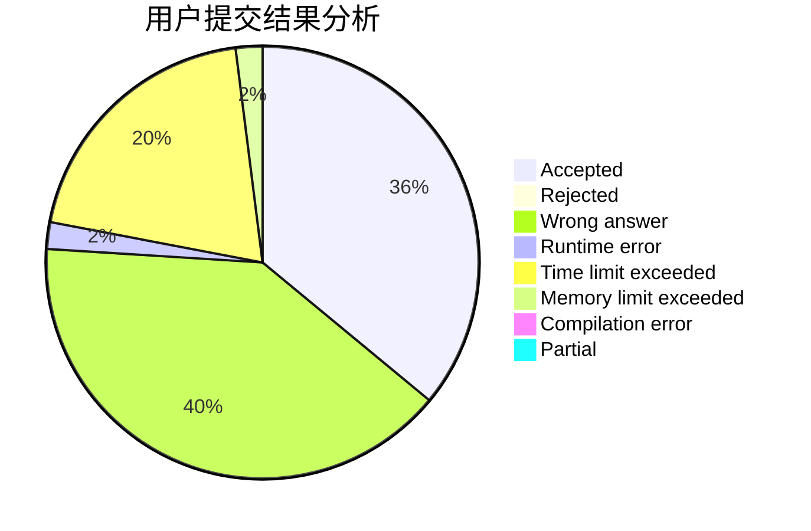
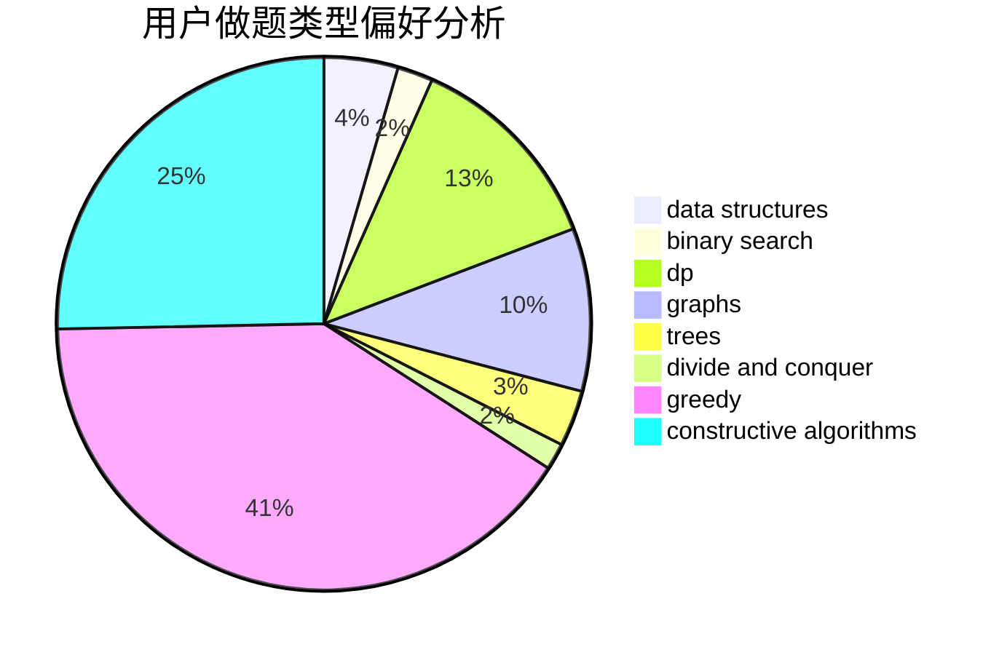
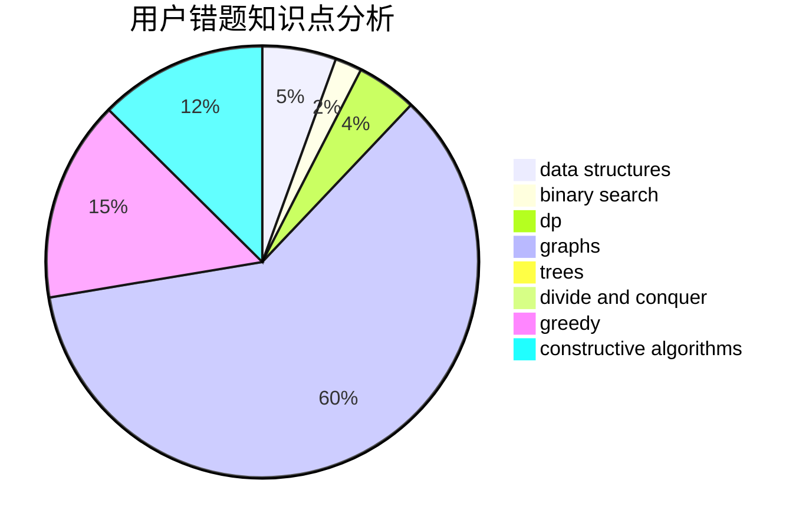

# _Andromeda

<!-- tabs:start -->

#### **用户提交结果分析**

#### **用户做题类型偏好分析**

#### **用户错题知识点分析**

<!-- tabs:end -->
# 推荐题目
[895C](https://codeforces.com/contest/895/problem/C)		bitmasks,
                        combinatorics,
                        dp,
                        math		  
[1452D](https://codeforces.com/contest/1452/problem/D)		combinatorics,
                        dp,
                        math		  
[920A](https://codeforces.com/contest/920/problem/A)		implementation		  
[1295D](https://codeforces.com/contest/1295/problem/D)		math,
                        number theory		  
[1383C](https://codeforces.com/contest/1383/problem/C)		bitmasks,
                        dp,
                        graphs,
                        trees		  
[1115G2](https://codeforces.com/contest/1115G/problem/2)		*special problem		  
[919D](https://codeforces.com/contest/919/problem/D)		dfs and similar,
                        dp,
                        graphs		  
[888C](https://codeforces.com/contest/888/problem/C)		binary search,
                        implementation,
                        two pointers		  
[286A](https://codeforces.com/contest/286/problem/A)		constructive algorithms,
                        math		  
[1428F](https://codeforces.com/contest/1428/problem/F)		binary search,
                        data structures,
                        divide and conquer,
                        dp,
                        two pointers		  
