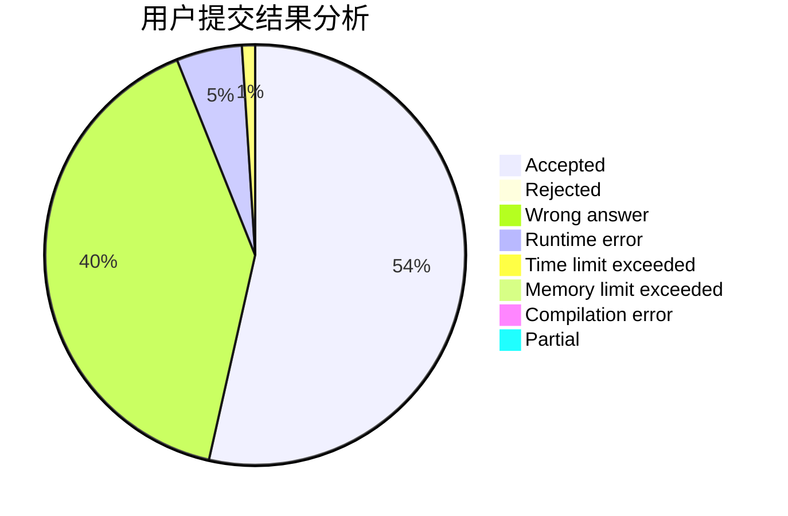
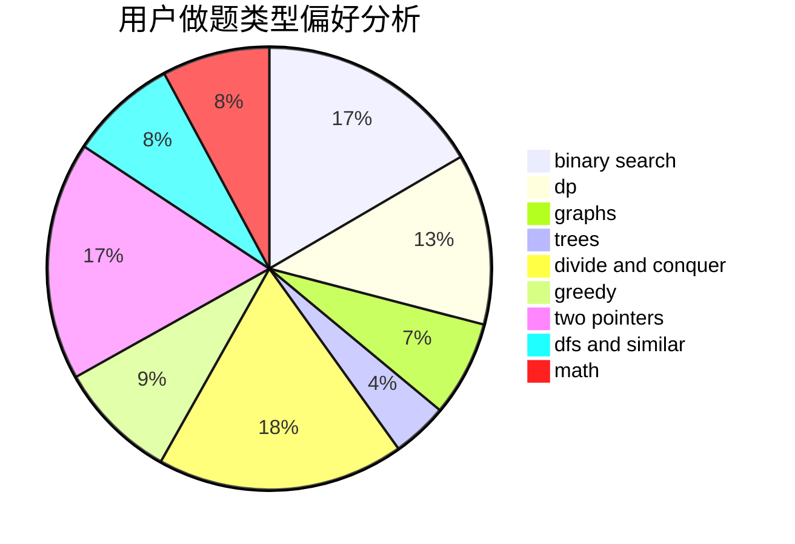

# _Backl1ght

<!-- tabs:start -->

#### **用户提交结果分析**

#### **用户做题类型偏好分析**

<!-- tabs:end -->
# 推荐题目
[51F](https://codeforces.com/contest/51/problem/F)
[174B](https://codeforces.com/contest/174/problem/B)
[52C](https://codeforces.com/contest/52/problem/C)
[841C](https://codeforces.com/contest/841/problem/C)
[732A](https://codeforces.com/contest/732/problem/A)
[650C](https://codeforces.com/contest/650/problem/C)
[1093G](https://codeforces.com/contest/1093/problem/G)
[1347B](https://codeforces.com/contest/1347/problem/B)
[261E](https://codeforces.com/contest/261/problem/E)
[343C](https://codeforces.com/contest/343/problem/C)
