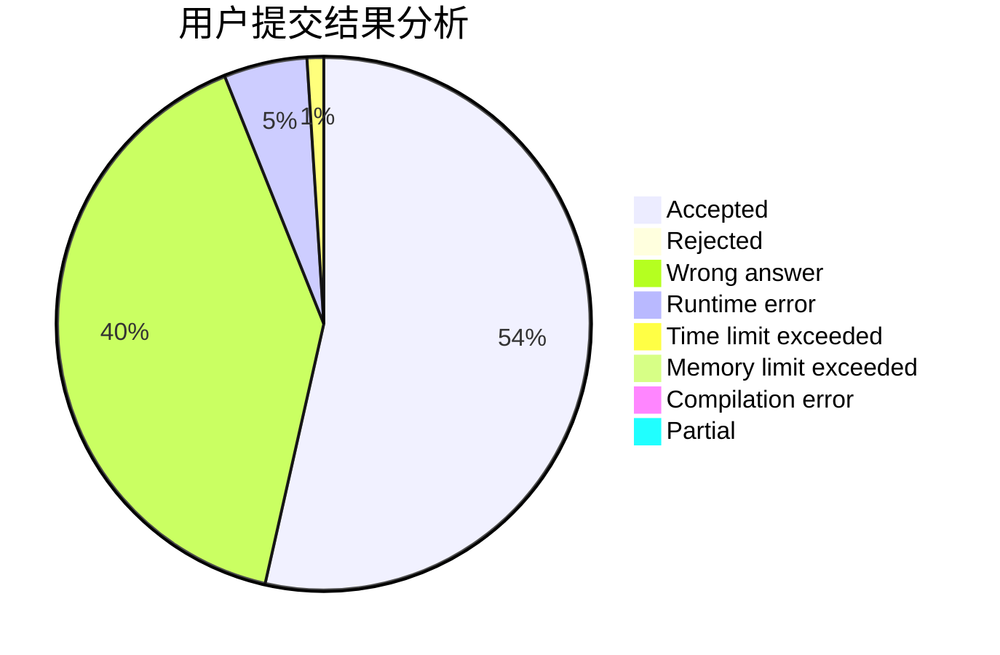
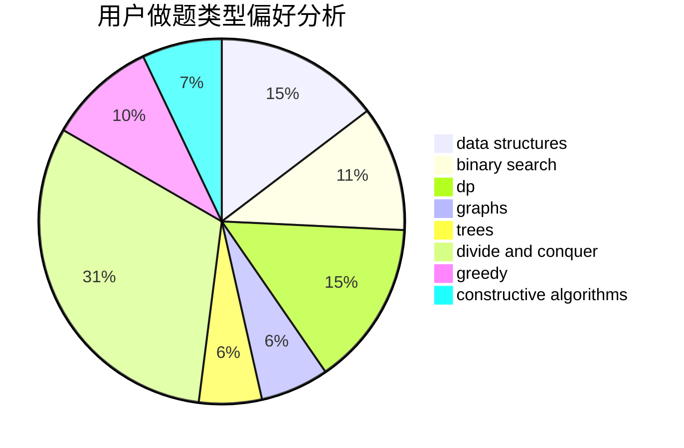
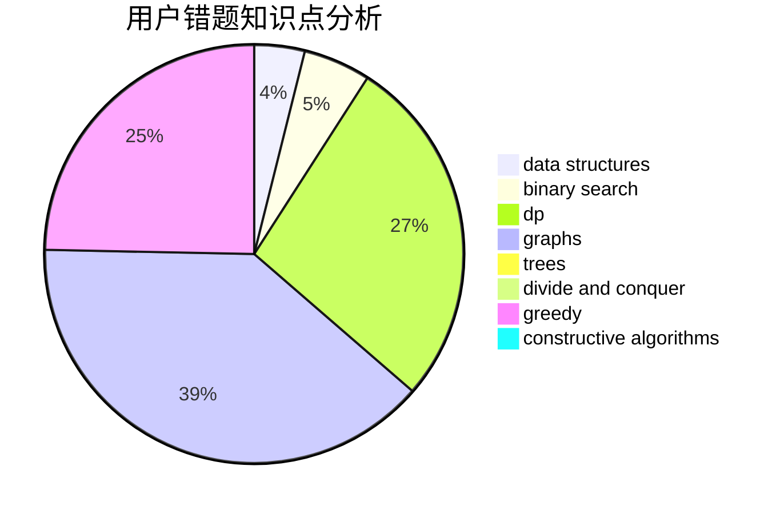

# _Backl1ght

<!-- tabs:start -->

#### **用户提交结果分析**

#### **用户做题类型偏好分析**

#### **用户错题知识点分析**

<!-- tabs:end -->
# 推荐题目
[51F](https://codeforces.com/contest/51/problem/F)		dfs and similar,
                        dp,
                        graphs,
                        trees		  
[174B](https://codeforces.com/contest/174/problem/B)		dp,
                        greedy,
                        implementation		  
[52C](https://codeforces.com/contest/52/problem/C)		data structures		  
[841C](https://codeforces.com/contest/841/problem/C)		dsu,graphs,sortings,trees		  
[732A](https://codeforces.com/contest/732/problem/A)		brute force,
                        constructive algorithms,
                        implementation,
                        math		  
[650C](https://codeforces.com/contest/650/problem/C)		dfs and similar,
                        dp,
                        dsu,
                        graphs,
                        greedy		  
[1093G](https://codeforces.com/contest/1093/problem/G)		bitmasks,
                        data structures		  
[1347B](https://codeforces.com/contest/1347/problem/B)		dsu,graphs,sortings,trees		  
[261E](https://codeforces.com/contest/261/problem/E)		brute force,
                        dp,
                        two pointers		  
[343C](https://codeforces.com/contest/343/problem/C)		binary search,
                        greedy,
                        two pointers		  
