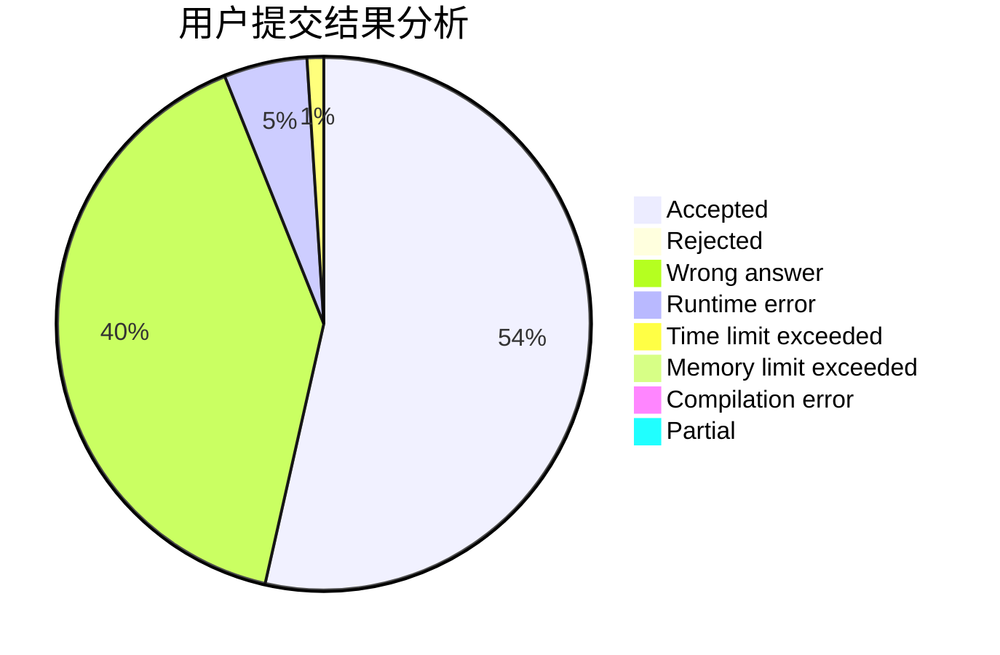
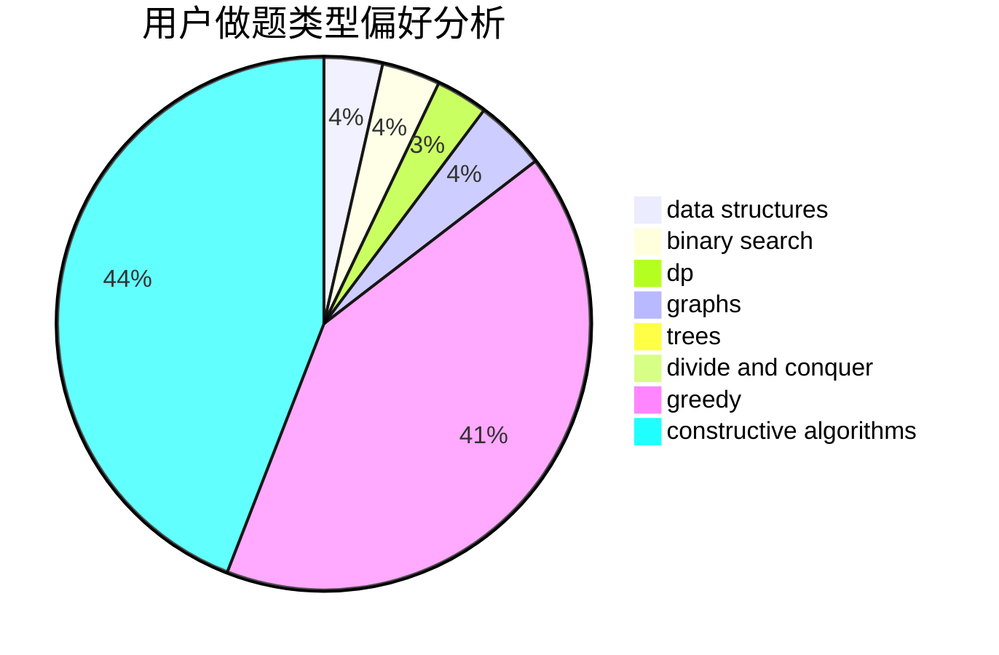
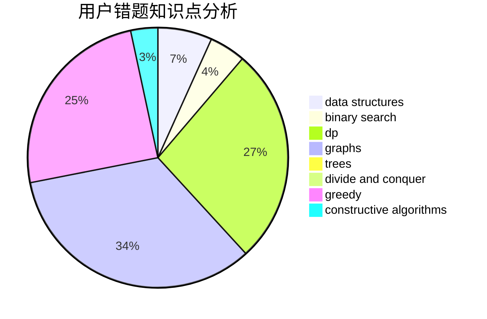

# _Backl1ght

<!-- tabs:start -->

#### **用户提交结果分析**

#### **用户做题类型偏好分析**

#### **用户错题知识点分析**

<!-- tabs:end -->
# 推荐题目
[49E](https://codeforces.com/contest/49/problem/E)		dp		  
[1513F](https://codeforces.com/contest/1513/problem/F)		brute force,
                        constructive algorithms,
                        data structures,
                        sortings		  
[509D](https://codeforces.com/contest/509/problem/D)		constructive algorithms,
                        math		  
[821D](https://codeforces.com/contest/821/problem/D)		dfs and similar,
                        graphs,
                        shortest paths		  
[712E](https://codeforces.com/contest/712/problem/E)		data structures,
                        math,
                        probabilities		  
[622C](https://codeforces.com/contest/622/problem/C)		data structures,
                        implementation		  
[1093D](https://codeforces.com/contest/1093/problem/D)		dfs and similar,
                        graphs		  
[1340C](https://codeforces.com/contest/1340/problem/C)		dfs and similar,
                        dp,
                        graphs,
                        shortest paths		  
[241B](https://codeforces.com/contest/241/problem/B)		binary search,
                        bitmasks,
                        data structures,
                        math		  
[316F1](https://codeforces.com/contest/316F/problem/1)		dfs and similar,
                        implementation		  
