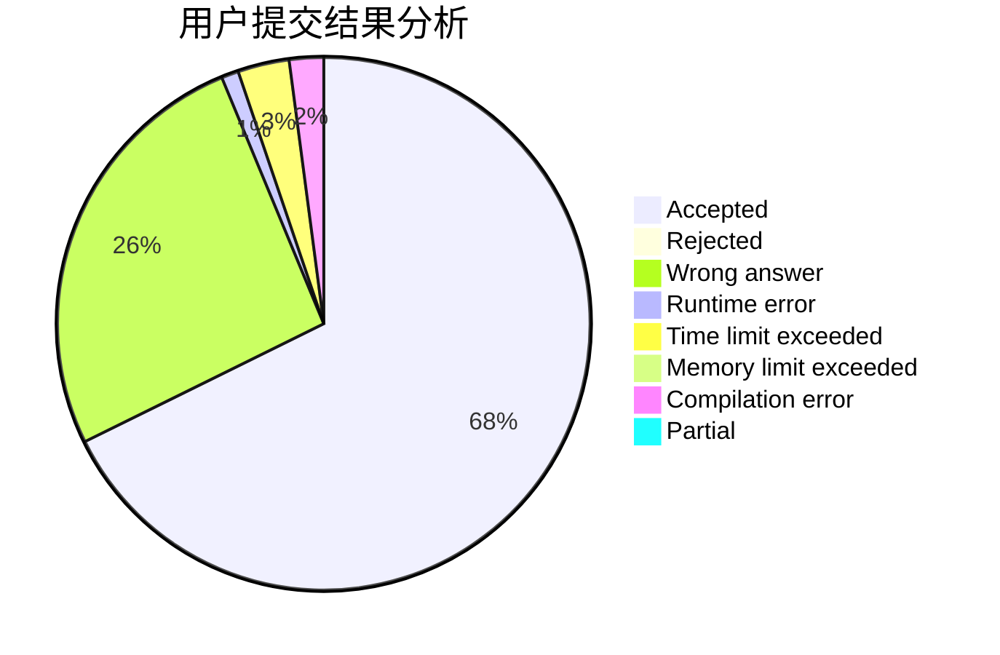
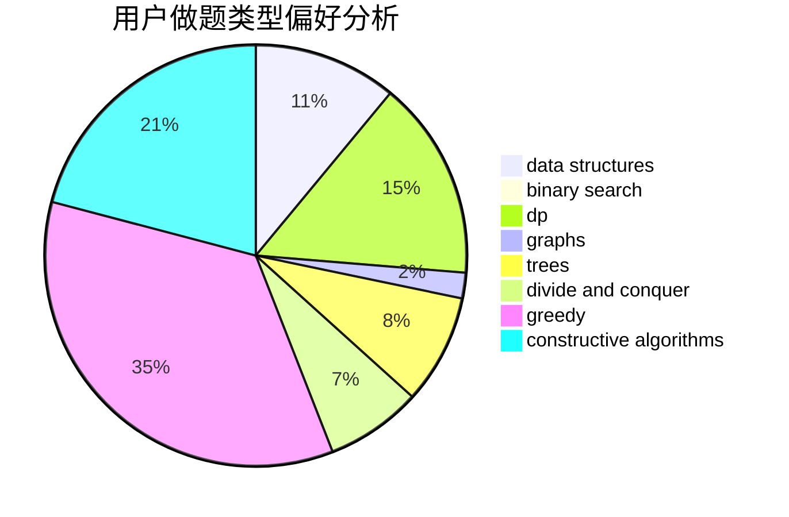
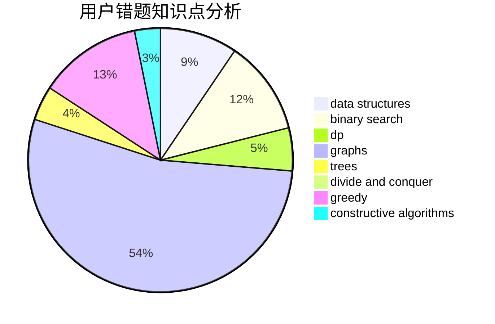

# Alif01

<!-- tabs:start -->

#### **用户提交结果分析**

#### **用户做题类型偏好分析**

#### **用户错题知识点分析**

<!-- tabs:end -->
# 推荐题目
[1455F](https://codeforces.com/contest/1455/problem/F)		dp,
                        greedy		  
[27C](https://codeforces.com/contest/27/problem/C)		constructive algorithms,
                        greedy		  
[27B](https://codeforces.com/contest/27/problem/B)		bitmasks,
                        brute force,
                        dfs and similar,
                        greedy		  
[1266E](https://codeforces.com/contest/1266/problem/E)		data structures,
                        greedy,
                        implementation		  
[279D](https://codeforces.com/contest/279/problem/D)		bitmasks,
                        dp		  
[1316A](https://codeforces.com/contest/1316/problem/A)		implementation		  
[280E](https://codeforces.com/contest/280/problem/E)		data structures,
                        dp,
                        implementation,
                        math		  
[27E](https://codeforces.com/contest/27/problem/E)		brute force,
                        dp,
                        number theory		  
[1034A](https://codeforces.com/contest/1034/problem/A)		number theory		  
[1184C3](https://codeforces.com/contest/1184C/problem/3)		nan		  
