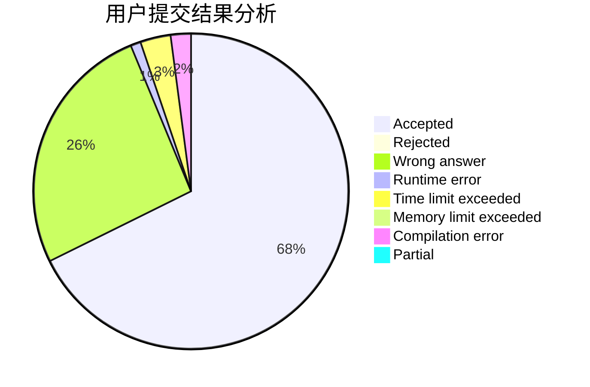
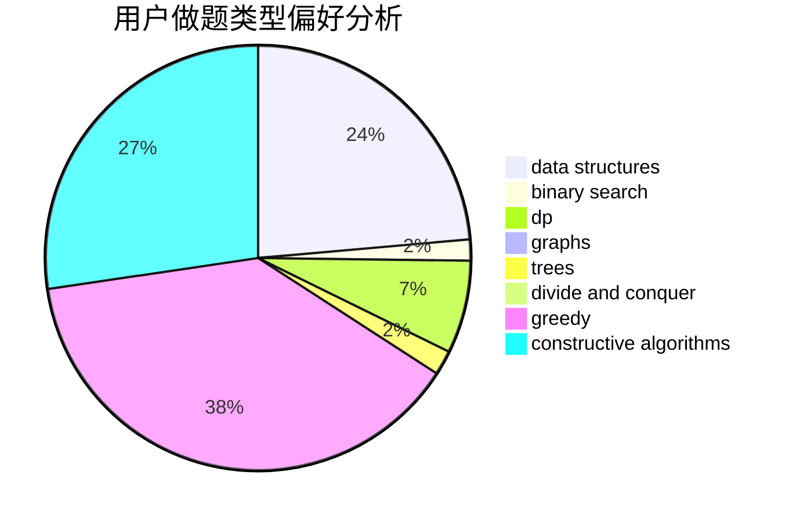
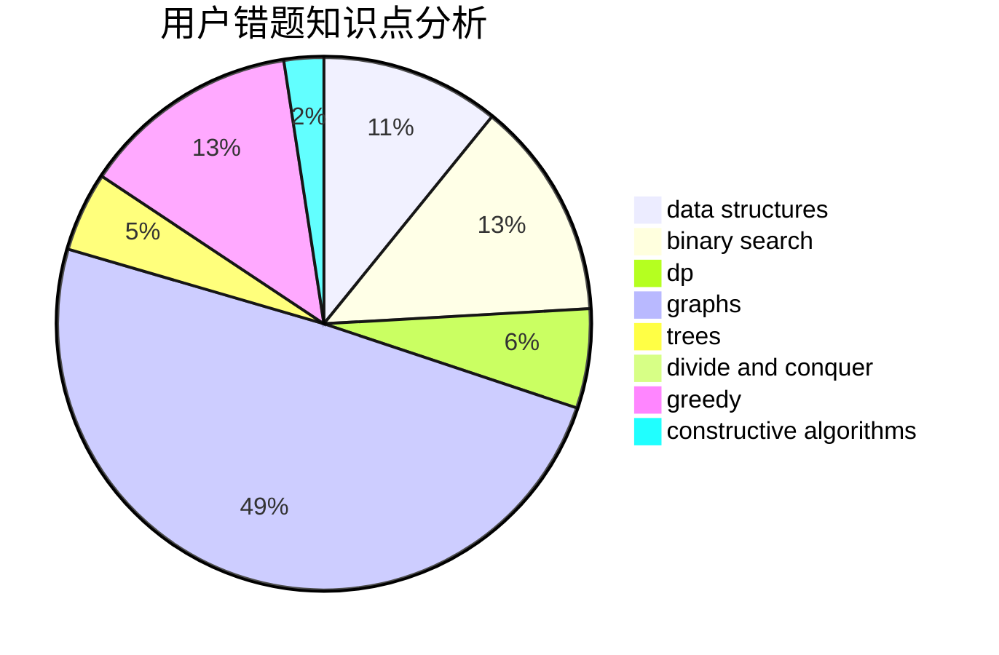

# Alif01

<!-- tabs:start -->

#### **用户提交结果分析**

#### **用户做题类型偏好分析**

#### **用户错题知识点分析**

<!-- tabs:end -->
# 推荐题目
[1465C](https://codeforces.com/contest/1465/problem/C)		dsu,graphs,sortings,trees		  
[295B](https://codeforces.com/contest/295/problem/B)		dp,
                        graphs,
                        shortest paths		  
[295A](https://codeforces.com/contest/295/problem/A)		data structures,
                        implementation		  
[1271F](https://codeforces.com/contest/1271/problem/F)		brute force		  
[294C](https://codeforces.com/contest/294/problem/C)		combinatorics,
                        number theory		  
[1325E](https://codeforces.com/contest/1325/problem/E)		brute force,
                        dfs and similar,
                        graphs,
                        number theory,
                        shortest paths		  
[297B](https://codeforces.com/contest/297/problem/B)		constructive algorithms,
                        greedy		  
[295D](https://codeforces.com/contest/295/problem/D)		combinatorics,
                        dp		  
[1034D](https://codeforces.com/contest/1034/problem/D)		binary search,
                        data structures,
                        two pointers		  
[11882](https://codeforces.com/contest/1188/problem/2)		dsu,graphs,sortings,trees		  
