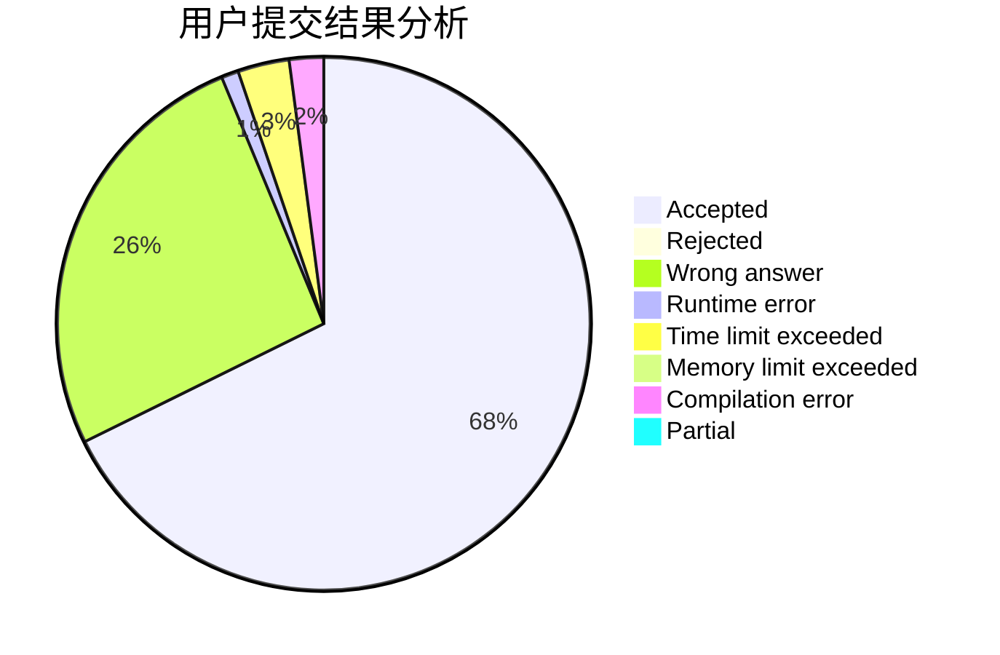
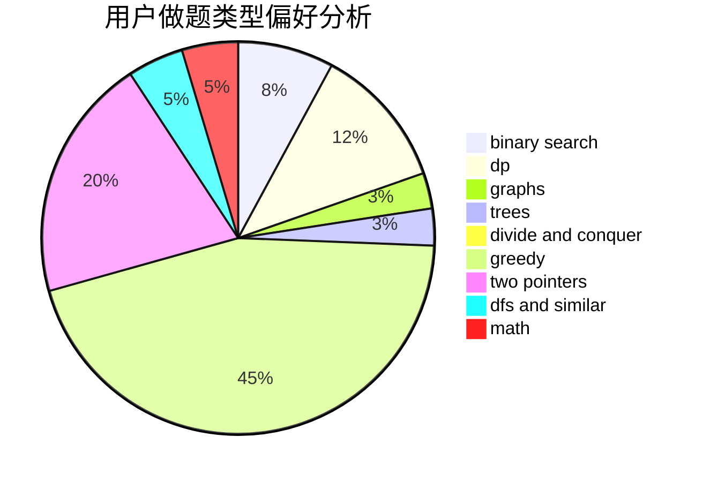

# Alif01

<!-- tabs:start -->

#### **用户提交结果分析**

#### **用户做题类型偏好分析**

<!-- tabs:end -->
# 推荐题目
[1465C](https://codeforces.com/contest/1465/problem/C)
[295B](https://codeforces.com/contest/295/problem/B)
[295A](https://codeforces.com/contest/295/problem/A)
[1271F](https://codeforces.com/contest/1271/problem/F)
[294C](https://codeforces.com/contest/294/problem/C)
[1325E](https://codeforces.com/contest/1325/problem/E)
[297B](https://codeforces.com/contest/297/problem/B)
[295D](https://codeforces.com/contest/295/problem/D)
[1034D](https://codeforces.com/contest/1034/problem/D)
[11882](https://codeforces.com/contest/1188/problem/2)
