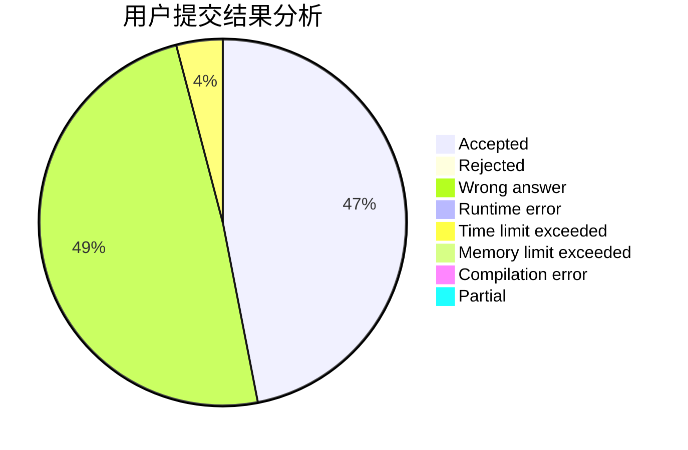
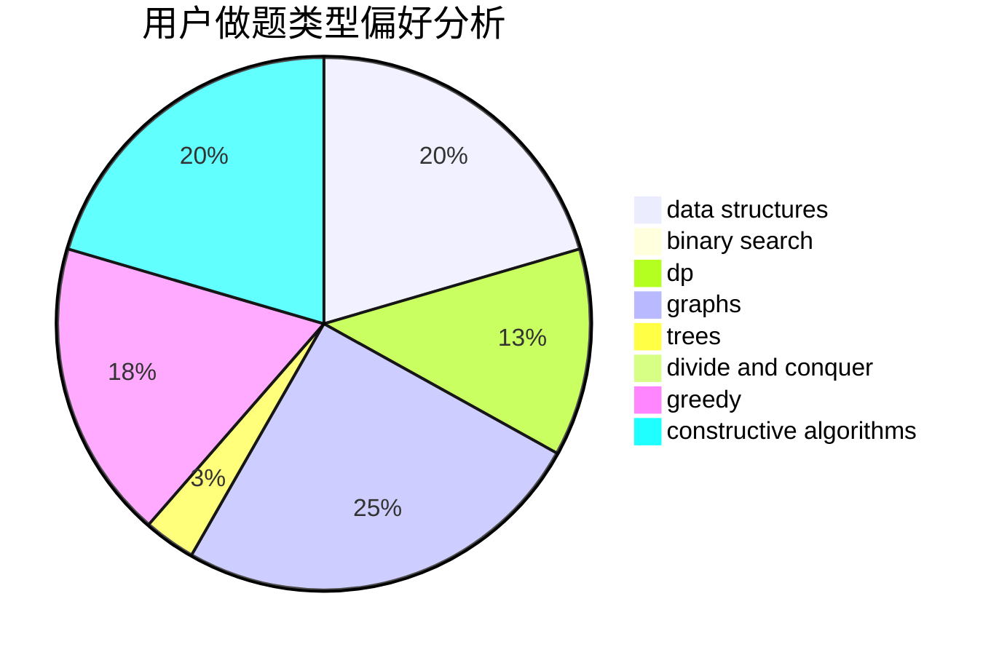
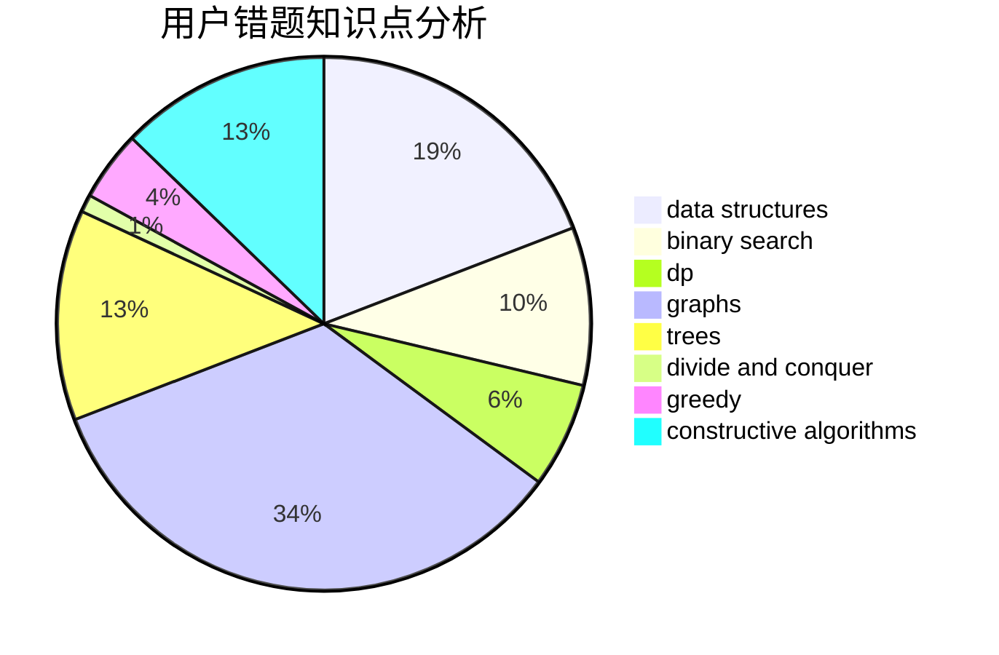

# _Chaser

<!-- tabs:start -->

#### **用户提交结果分析**

#### **用户做题类型偏好分析**

#### **用户错题知识点分析**

<!-- tabs:end -->
# 推荐题目
[1223E](https://codeforces.com/contest/1223/problem/E)		dp,
                        sortings,
                        trees		  
[1092E](https://codeforces.com/contest/1092/problem/E)		constructive algorithms,
                        dfs and similar,
                        greedy,
                        trees		  
[431E](https://codeforces.com/contest/431/problem/E)		binary search,
                        data structures,
                        ternary search		  
[1017G](https://codeforces.com/contest/1017/problem/G)		data structures		  
[7E](https://codeforces.com/contest/7/problem/E)		dp,
                        expression parsing,
                        implementation		  
[687A](https://codeforces.com/contest/687/problem/A)		dfs and similar,
                        graphs		  
[702B](https://codeforces.com/contest/702/problem/B)		brute force,
                        data structures,
                        implementation,
                        math		  
[1194A](https://codeforces.com/contest/1194/problem/A)		math		  
[544C](https://codeforces.com/contest/544/problem/C)		dsu,graphs,sortings,trees		  
[496A](https://codeforces.com/contest/496/problem/A)		brute force,
                        implementation,
                        math		  
