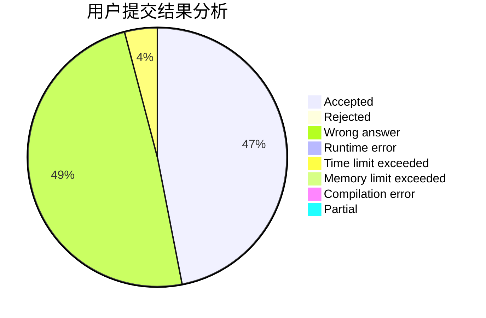
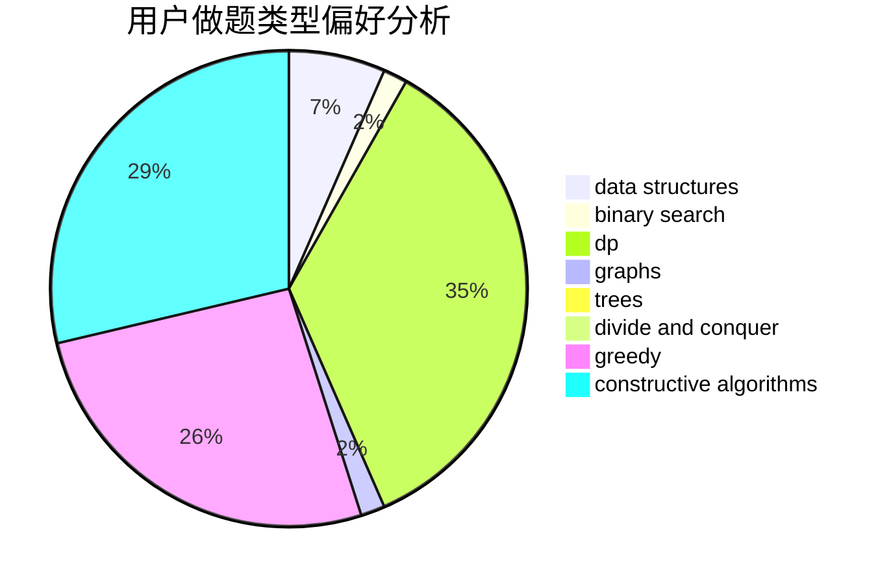
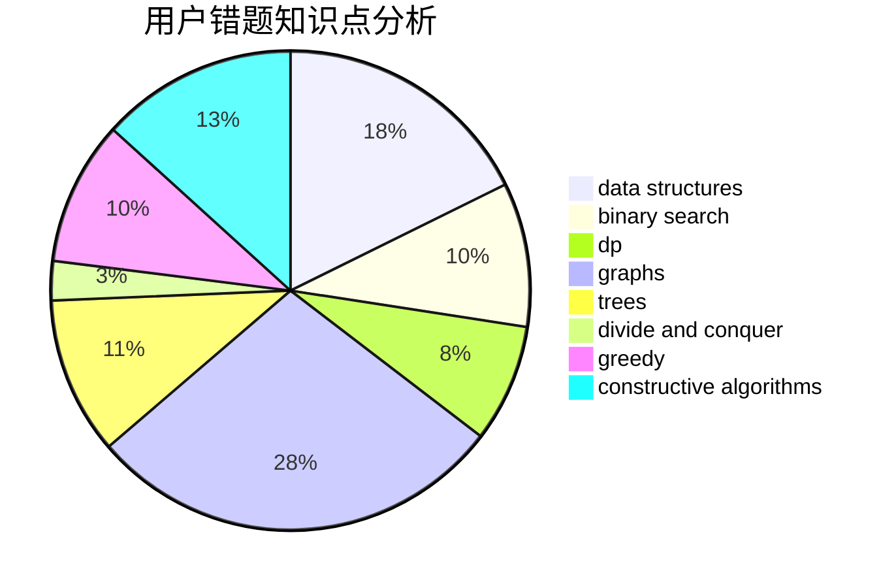

# _Chaser

<!-- tabs:start -->

#### **用户提交结果分析**

#### **用户做题类型偏好分析**

#### **用户错题知识点分析**

<!-- tabs:end -->
# 推荐题目
[1217A](https://codeforces.com/contest/1217/problem/A)		binary search,
                        math		  
[1092B](https://codeforces.com/contest/1092/problem/B)		sortings		  
[403E](https://codeforces.com/contest/403/problem/E)		data structures,
                        implementation,
                        trees		  
[1017D](https://codeforces.com/contest/1017/problem/D)		bitmasks,
                        brute force,
                        data structures		  
[782A](https://codeforces.com/contest/782/problem/A)		dsu,graphs,sortings,trees		  
[666A](https://codeforces.com/contest/666/problem/A)		dp,
                        implementation,
                        strings		  
[678D](https://codeforces.com/contest/678/problem/D)		math,
                        number theory		  
[1188D](https://codeforces.com/contest/1188/problem/D)		dp		  
[518F](https://codeforces.com/contest/518/problem/F)		binary search,
                        brute force,
                        combinatorics,
                        dp,
                        implementation		  
[476C](https://codeforces.com/contest/476/problem/C)		math		  
