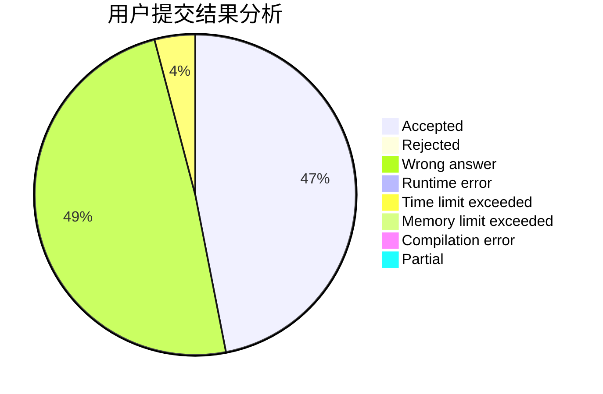
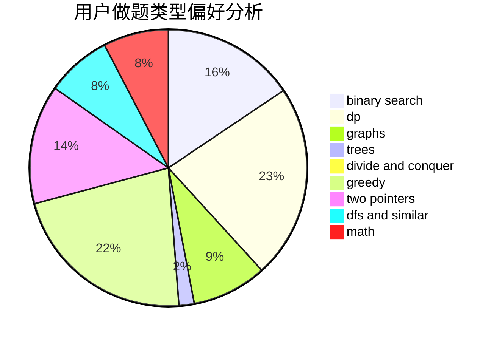

# _Chaser

<!-- tabs:start -->

#### **用户提交结果分析**

#### **用户做题类型偏好分析**

<!-- tabs:end -->
# 推荐题目
[1223E](https://codeforces.com/contest/1223/problem/E)
[1092E](https://codeforces.com/contest/1092/problem/E)
[431E](https://codeforces.com/contest/431/problem/E)
[1017G](https://codeforces.com/contest/1017/problem/G)
[7E](https://codeforces.com/contest/7/problem/E)
[687A](https://codeforces.com/contest/687/problem/A)
[702B](https://codeforces.com/contest/702/problem/B)
[1194A](https://codeforces.com/contest/1194/problem/A)
[544C](https://codeforces.com/contest/544/problem/C)
[496A](https://codeforces.com/contest/496/problem/A)
