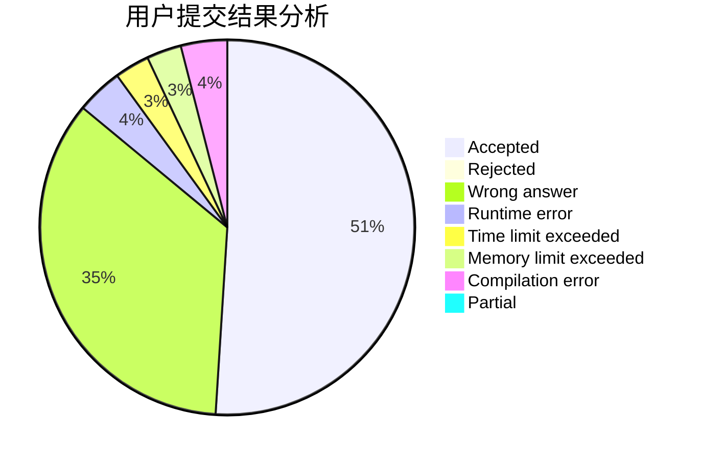
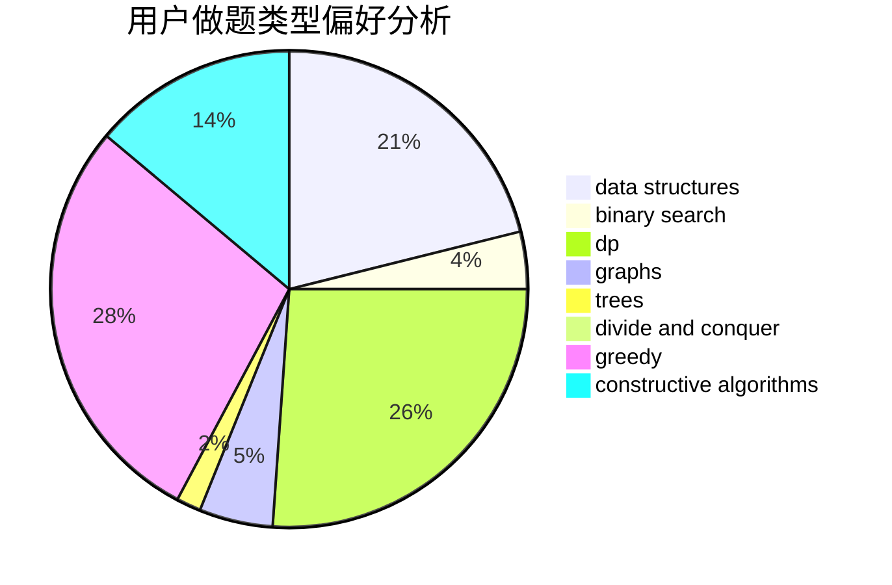
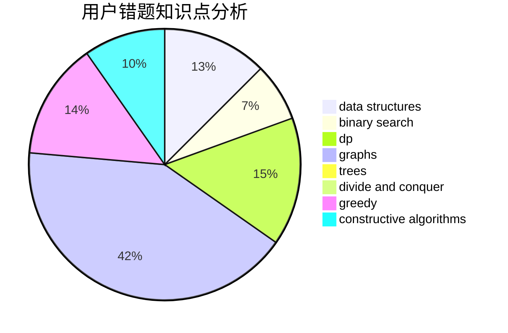

# _Clouder

<!-- tabs:start -->

#### **用户提交结果分析**

#### **用户做题类型偏好分析**

#### **用户错题知识点分析**

<!-- tabs:end -->
# 推荐题目
[1496E](https://codeforces.com/contest/1496/problem/E)		dsu,graphs,sortings,trees		  
[1119G](https://codeforces.com/contest/1119/problem/G)		constructive algorithms,
                        implementation		  
[290C](https://codeforces.com/contest/290/problem/C)		*special problem,
                        graph matchings,
                        implementation,
                        trees		  
[277D](https://codeforces.com/contest/277/problem/D)		dp,
                        probabilities		  
[166C](https://codeforces.com/contest/166/problem/C)		greedy,
                        math,
                        sortings		  
[861C](https://codeforces.com/contest/861/problem/C)		dsu,graphs,sortings,trees		  
[670B](https://codeforces.com/contest/670/problem/B)		implementation		  
[218C](https://codeforces.com/contest/218/problem/C)		dsu,graphs,sortings,trees		  
[820D](https://codeforces.com/contest/820/problem/D)		dsu,graphs,sortings,trees		  
[1180C](https://codeforces.com/contest/1180/problem/C)		dsu,graphs,sortings,trees		  
