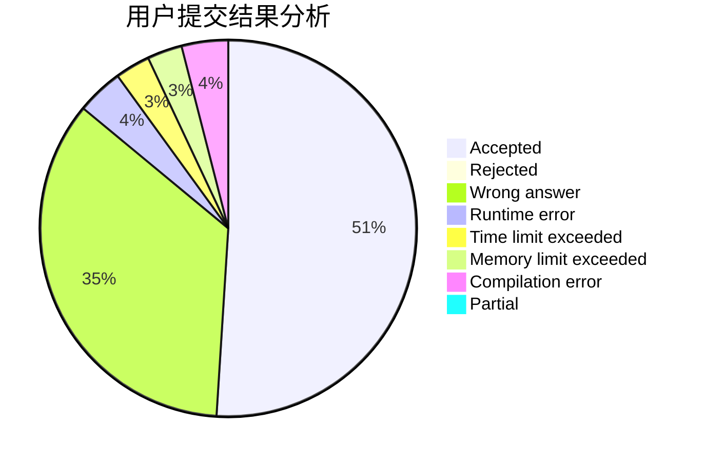
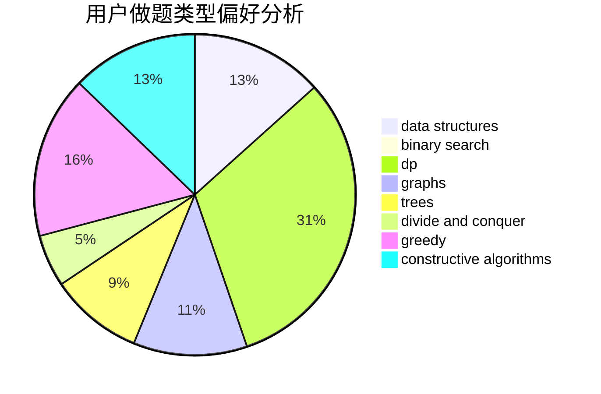
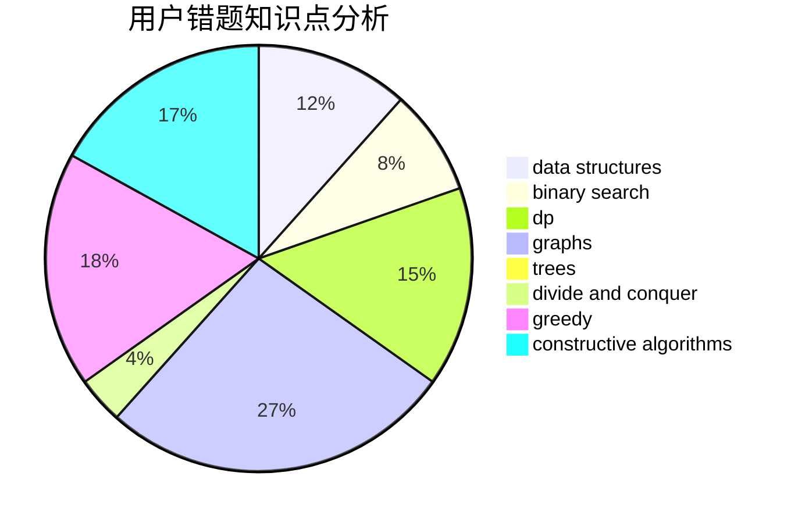

# _Clouder

<!-- tabs:start -->

#### **用户提交结果分析**

#### **用户做题类型偏好分析**

#### **用户错题知识点分析**

<!-- tabs:end -->
# 推荐题目
[1488G](https://codeforces.com/contest/1488/problem/G)		*special problem,
                        data structures,
                        greedy,
                        number theory		  
[1118B](https://codeforces.com/contest/1118/problem/B)		implementation		  
[276C](https://codeforces.com/contest/276/problem/C)		data structures,
                        greedy,
                        implementation,
                        sortings		  
[25D](https://codeforces.com/contest/25/problem/D)		dsu,
                        graphs,
                        trees		  
[1510J](https://codeforces.com/contest/1510/problem/J)		constructive algorithms,
                        math		  
[842D](https://codeforces.com/contest/842/problem/D)		binary search,
                        data structures		  
[643D](https://codeforces.com/contest/643/problem/D)		nan		  
[195C](https://codeforces.com/contest/195/problem/C)		expression parsing,
                        implementation		  
[804E](https://codeforces.com/contest/804/problem/E)		constructive algorithms		  
[1178D](https://codeforces.com/contest/1178/problem/D)		constructive algorithms,
                        greedy,
                        math,
                        number theory		  
