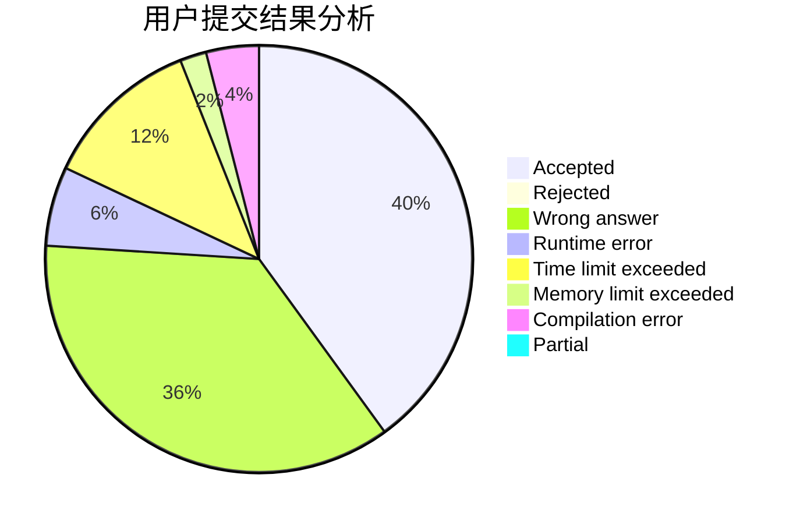
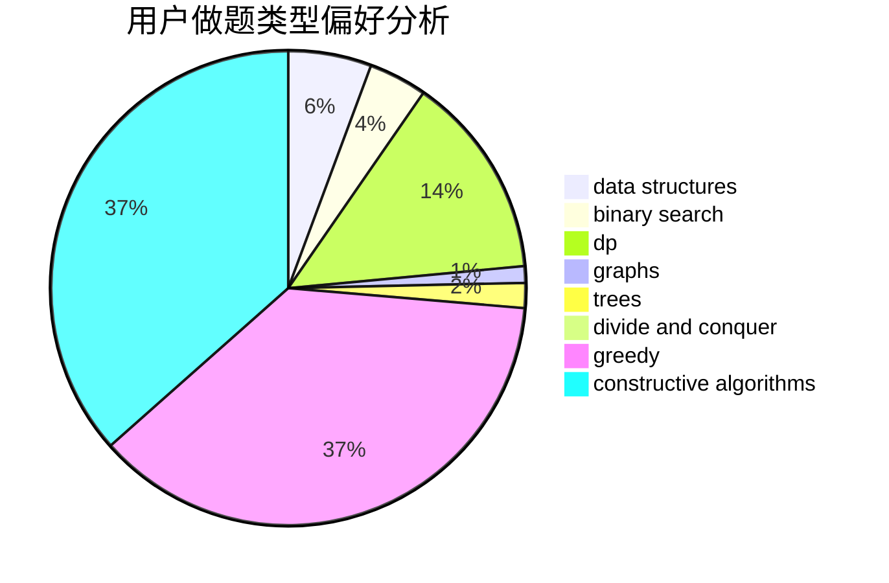
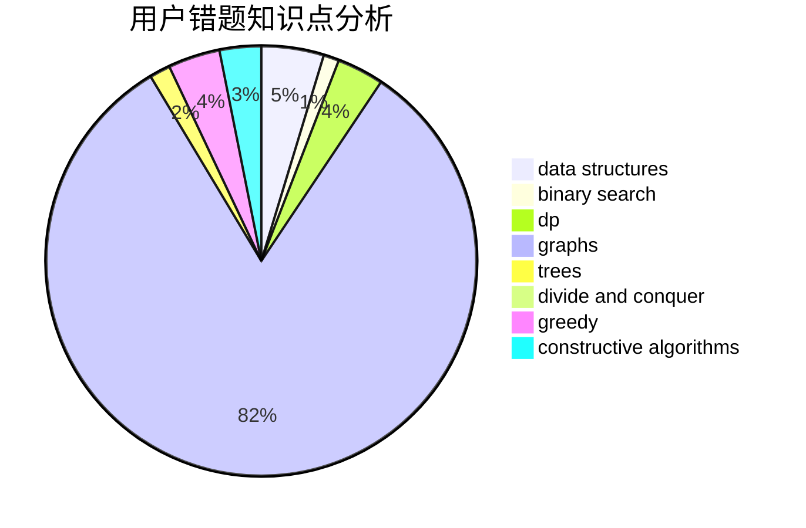

# _Emcikem_

<!-- tabs:start -->

#### **用户提交结果分析**

#### **用户做题类型偏好分析**

#### **用户错题知识点分析**

<!-- tabs:end -->
# 推荐题目
[1492C](https://codeforces.com/contest/1492/problem/C)		binary search,
                        data structures,
                        dp,
                        greedy,
                        two pointers		  
[863B](https://codeforces.com/contest/863/problem/B)		brute force,
                        greedy,
                        sortings		  
[87C](https://codeforces.com/contest/87/problem/C)		dp,
                        games,
                        math		  
[899C](https://codeforces.com/contest/899/problem/C)		constructive algorithms,
                        graphs,
                        math		  
[369A](https://codeforces.com/contest/369/problem/A)		greedy,
                        implementation		  
[830A](https://codeforces.com/contest/830/problem/A)		binary search,
                        brute force,
                        dp,
                        greedy,
                        sortings		  
[396C](https://codeforces.com/contest/396/problem/C)		data structures,
                        graphs,
                        trees		  
[1213D2](https://codeforces.com/contest/1213D/problem/2)		brute force,
                        math,
                        sortings		  
[243D](https://codeforces.com/contest/243/problem/D)		data structures,
                        dp,
                        geometry,
                        two pointers		  
[1245F](https://codeforces.com/contest/1245/problem/F)		bitmasks,
                        brute force,
                        combinatorics,
                        dp		  
