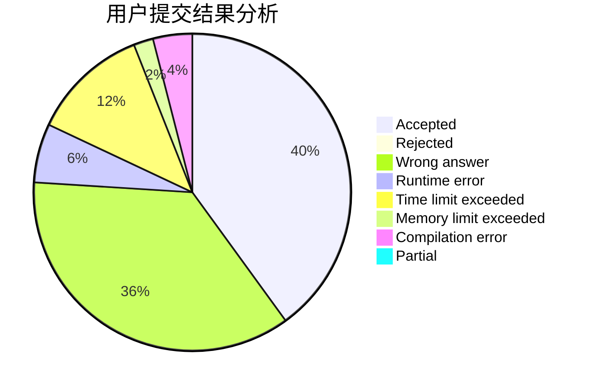
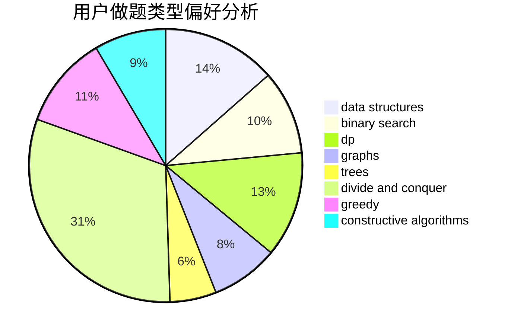
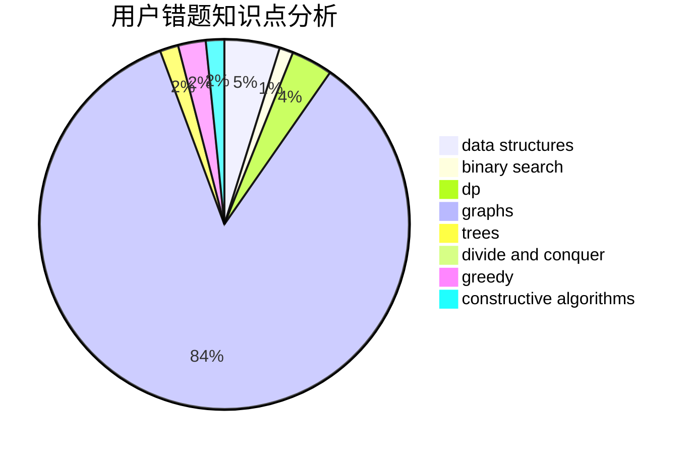

# _Emcikem_

<!-- tabs:start -->

#### **用户提交结果分析**

#### **用户做题类型偏好分析**

#### **用户错题知识点分析**

<!-- tabs:end -->
# 推荐题目
[1500D](https://codeforces.com/contest/1500/problem/D)		data structures,
                        sortings,
                        two pointers		  
[883D](https://codeforces.com/contest/883/problem/D)		binary search,
                        dp,
                        math		  
[8D](https://codeforces.com/contest/8/problem/D)		binary search,
                        geometry		  
[915C](https://codeforces.com/contest/915/problem/C)		dp,
                        greedy		  
[39C](https://codeforces.com/contest/39/problem/C)		dp,
                        sortings		  
[848A](https://codeforces.com/contest/848/problem/A)		constructive algorithms		  
[424B](https://codeforces.com/contest/424/problem/B)		binary search,
                        greedy,
                        implementation,
                        sortings		  
[1218C](https://codeforces.com/contest/1218/problem/C)		dp		  
[264E](https://codeforces.com/contest/264/problem/E)		data structures,
                        dp		  
[1250H](https://codeforces.com/contest/1250/problem/H)		math		  
