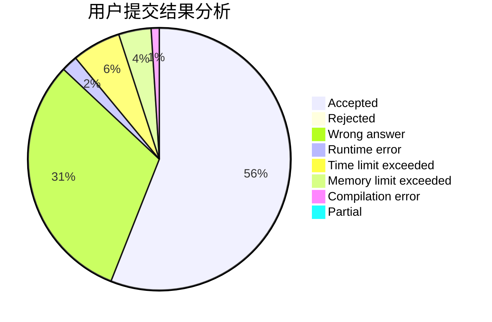
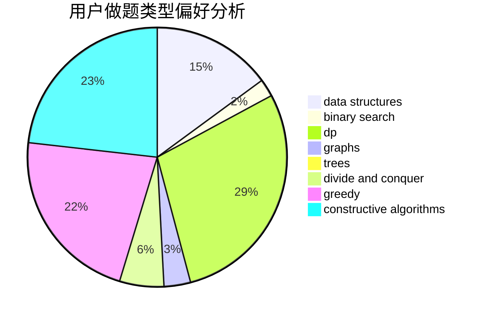
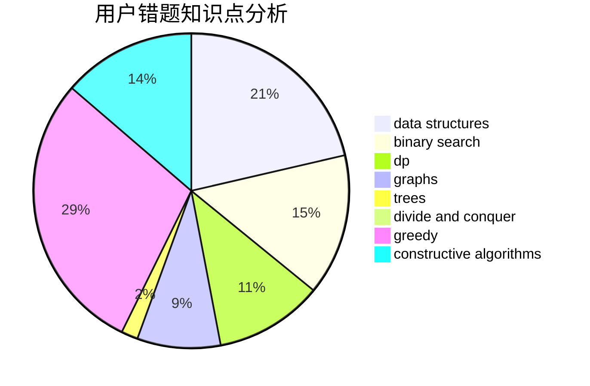

# _Guoyh_

<!-- tabs:start -->

#### **用户提交结果分析**

#### **用户做题类型偏好分析**

#### **用户错题知识点分析**

<!-- tabs:end -->
# 推荐题目
[1304D](https://codeforces.com/contest/1304/problem/D)		constructive algorithms,
                        graphs,
                        greedy,
                        two pointers		  
[25E](https://codeforces.com/contest/25/problem/E)		hashing,
                        strings		  
[550A](https://codeforces.com/contest/550/problem/A)		brute force,
                        dp,
                        greedy,
                        implementation,
                        strings		  
[774G](https://codeforces.com/contest/774/problem/G)		*special problem,
                        number theory		  
[1070I](https://codeforces.com/contest/1070/problem/I)		flows,
                        graph matchings,
                        graphs		  
[643D](https://codeforces.com/contest/643/problem/D)		nan		  
[955A](https://codeforces.com/contest/955/problem/A)		greedy,
                        math		  
[551A](https://codeforces.com/contest/551/problem/A)		brute force,
                        implementation,
                        sortings		  
[388C](https://codeforces.com/contest/388/problem/C)		games,
                        greedy,
                        sortings		  
[764E](https://codeforces.com/contest/764/problem/E)		dsu,graphs,sortings,trees		  
