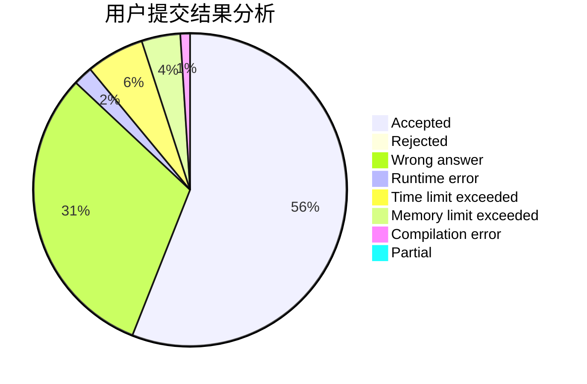
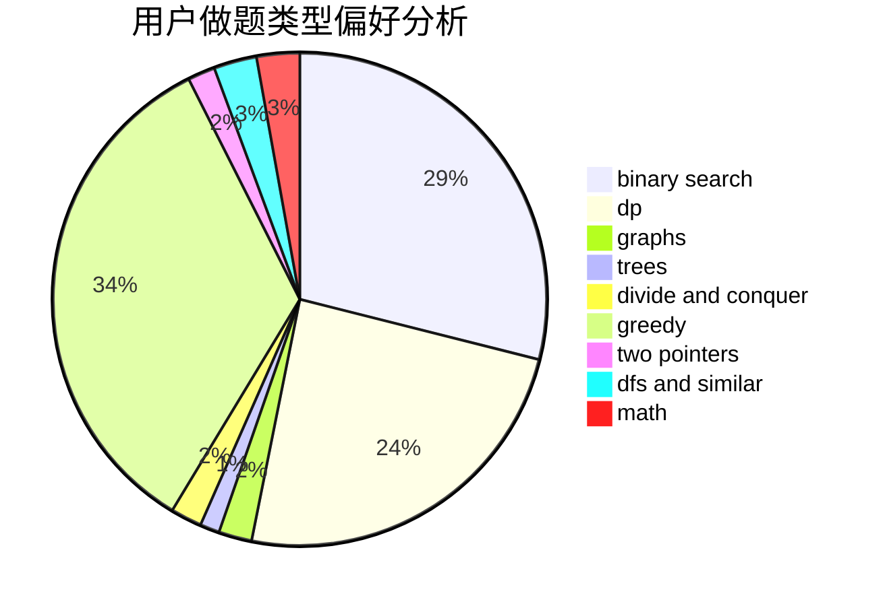

# _Guoyh_

<!-- tabs:start -->

#### **用户提交结果分析**

#### **用户做题类型偏好分析**

<!-- tabs:end -->
# 推荐题目
[13132](https://codeforces.com/contest/1313/problem/2)
[277E](https://codeforces.com/contest/277/problem/E)
[575C](https://codeforces.com/contest/575/problem/C)
[793F](https://codeforces.com/contest/793/problem/F)
[1070L](https://codeforces.com/contest/1070/problem/L)
[670B](https://codeforces.com/contest/670/problem/B)
[977A](https://codeforces.com/contest/977/problem/A)
[576A](https://codeforces.com/contest/576/problem/A)
[417E](https://codeforces.com/contest/417/problem/E)
[784C](https://codeforces.com/contest/784/problem/C)
