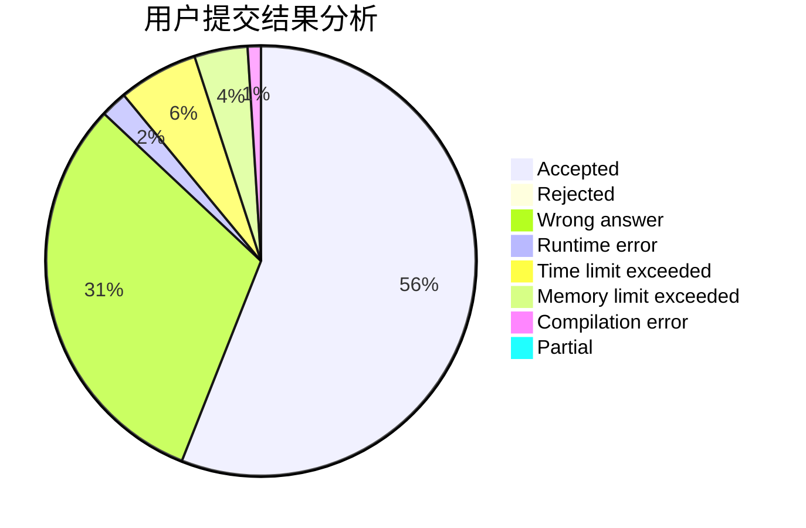
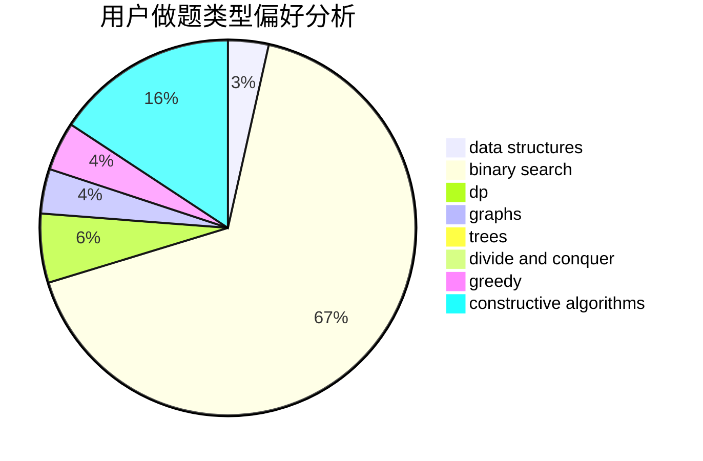
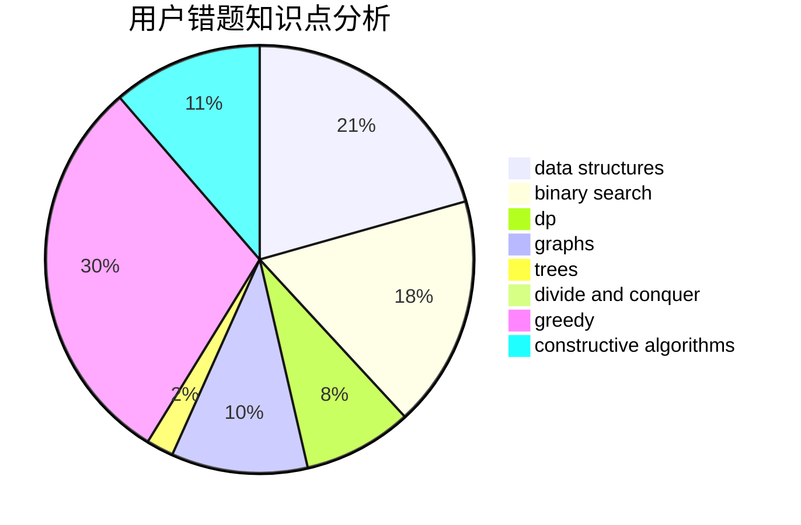

# _Guoyh_

<!-- tabs:start -->

#### **用户提交结果分析**

#### **用户做题类型偏好分析**

#### **用户错题知识点分析**

<!-- tabs:end -->
# 推荐题目
[13132](https://codeforces.com/contest/1313/problem/2)		dsu,graphs,sortings,trees		  
[277E](https://codeforces.com/contest/277/problem/E)		flows,
                        trees		  
[575C](https://codeforces.com/contest/575/problem/C)		bitmasks,
                        brute force,
                        graph matchings		  
[793F](https://codeforces.com/contest/793/problem/F)		data structures,
                        divide and conquer,
                        dp		  
[1070L](https://codeforces.com/contest/1070/problem/L)		constructive algorithms		  
[670B](https://codeforces.com/contest/670/problem/B)		implementation		  
[977A](https://codeforces.com/contest/977/problem/A)		implementation		  
[576A](https://codeforces.com/contest/576/problem/A)		math,
                        number theory		  
[417E](https://codeforces.com/contest/417/problem/E)		constructive algorithms,
                        math,
                        probabilities		  
[784C](https://codeforces.com/contest/784/problem/C)		*special problem,
                        implementation		  
