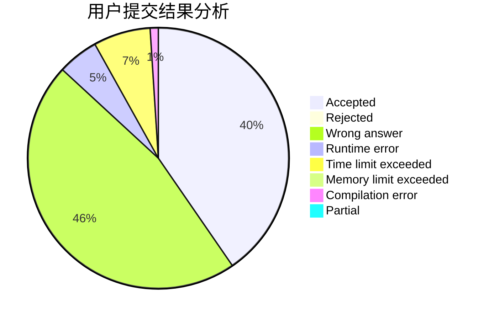
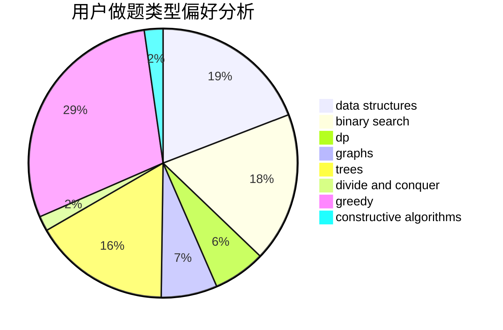
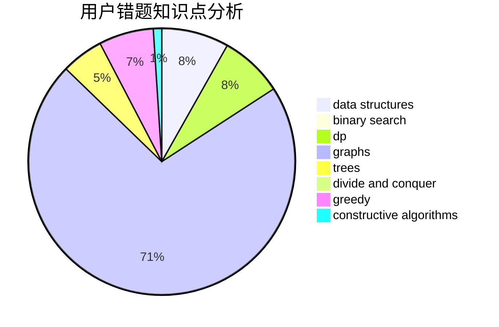

# _Hain_

<!-- tabs:start -->

#### **用户提交结果分析**

#### **用户做题类型偏好分析**

#### **用户错题知识点分析**

<!-- tabs:end -->
# 推荐题目
[1463D](https://codeforces.com/contest/1463/problem/D)		binary search,
                        constructive algorithms,
                        greedy,
                        two pointers		  
[416D](https://codeforces.com/contest/416/problem/D)		greedy,
                        implementation,
                        math		  
[1283A](https://codeforces.com/contest/1283/problem/A)		math		  
[1080B](https://codeforces.com/contest/1080/problem/B)		math		  
[335A](https://codeforces.com/contest/335/problem/A)		binary search,
                        constructive algorithms,
                        greedy		  
[1250F](https://codeforces.com/contest/1250/problem/F)		brute force,
                        implementation		  
[195C](https://codeforces.com/contest/195/problem/C)		expression parsing,
                        implementation		  
[1027E](https://codeforces.com/contest/1027/problem/E)		combinatorics,
                        dp,
                        math		  
[977C](https://codeforces.com/contest/977/problem/C)		sortings		  
[482D](https://codeforces.com/contest/482/problem/D)		combinatorics,
                        dp,
                        trees		  
