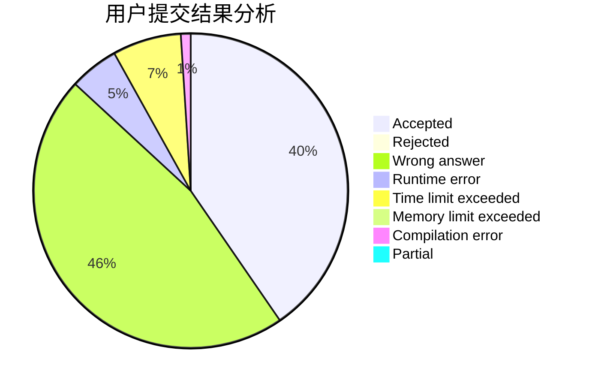
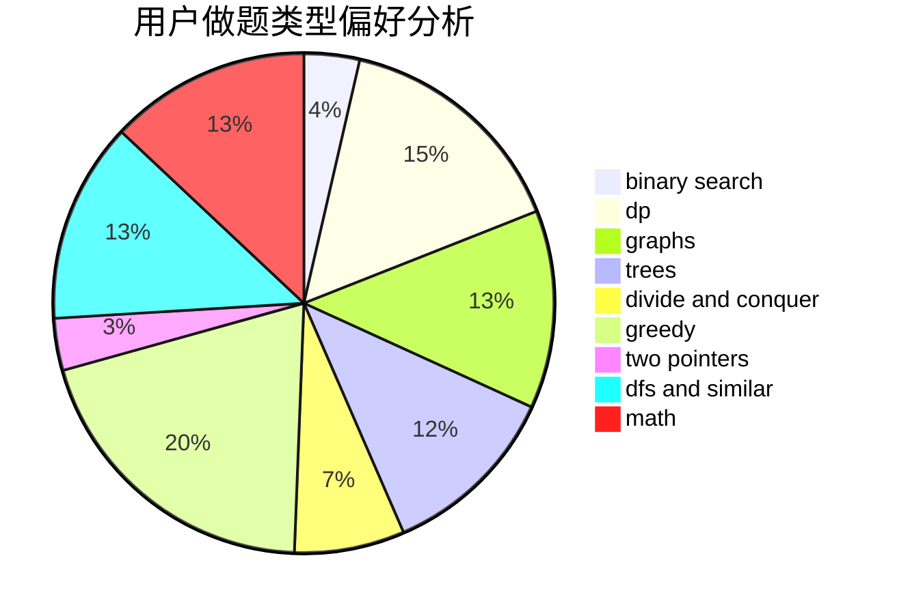

# _Hain_

<!-- tabs:start -->

#### **用户提交结果分析**

#### **用户做题类型偏好分析**

<!-- tabs:end -->
# 推荐题目
[1470E](https://codeforces.com/contest/1470/problem/E)
[441D](https://codeforces.com/contest/441/problem/D)
[1290A](https://codeforces.com/contest/1290/problem/A)
[1080E](https://codeforces.com/contest/1080/problem/E)
[360E](https://codeforces.com/contest/360/problem/E)
[1254E](https://codeforces.com/contest/1254/problem/E)
[218C](https://codeforces.com/contest/218/problem/C)
[1028A](https://codeforces.com/contest/1028/problem/A)
[991A](https://codeforces.com/contest/991/problem/A)
[501C](https://codeforces.com/contest/501/problem/C)
