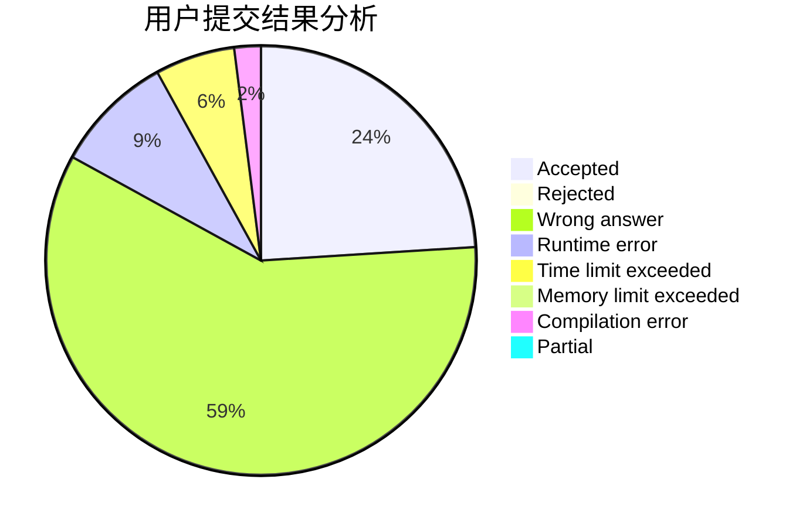
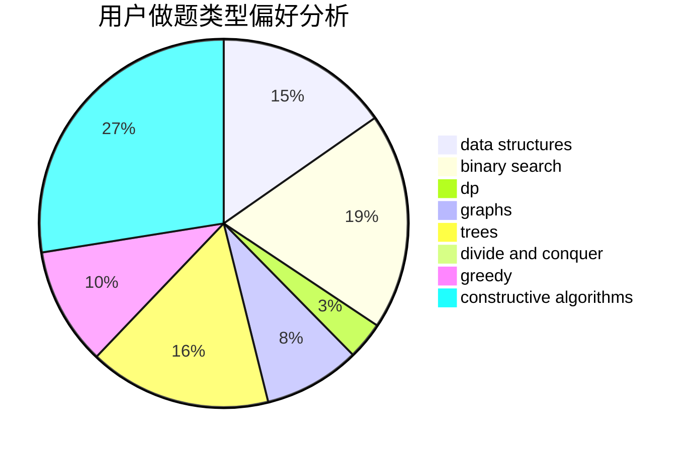
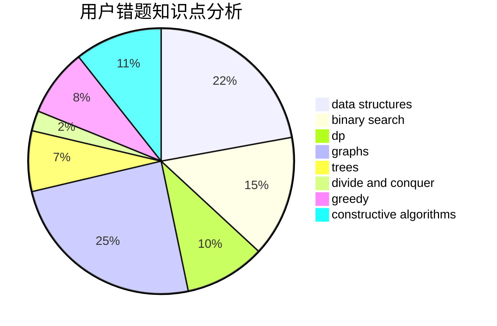

# _Happy_New_Year_

<!-- tabs:start -->

#### **用户提交结果分析**

#### **用户做题类型偏好分析**

#### **用户错题知识点分析**

<!-- tabs:end -->
# 推荐题目
[652E](https://codeforces.com/contest/652/problem/E)		dfs and similar,
                        dsu,
                        graphs,
                        trees		  
[851D](https://codeforces.com/contest/851/problem/D)		dsu,graphs,sortings,trees		  
[1154D](https://codeforces.com/contest/1154/problem/D)		greedy		  
[508C](https://codeforces.com/contest/508/problem/C)		constructive algorithms,
                        greedy		  
[789B](https://codeforces.com/contest/789/problem/B)		brute force,
                        implementation,
                        math		  
[787A](https://codeforces.com/contest/787/problem/A)		brute force,
                        math,
                        number theory		  
[94C](https://codeforces.com/contest/94/problem/C)		dsu,graphs,sortings,trees		  
[888E](https://codeforces.com/contest/888/problem/E)		bitmasks,
                        divide and conquer,
                        meet-in-the-middle		  
[663E](https://codeforces.com/contest/663/problem/E)		dsu,graphs,sortings,trees		  
[412C](https://codeforces.com/contest/412/problem/C)		implementation,
                        strings		  
